# RefPlan6 — HybridCPU.DotNetAot.ScalarControlFlowV2

Audit-updated baseline (2026-08-28):

- Compiler repository: `yuriyyak23/HybridCPU_Compiler_v2`
- Compiler branch: `master`
- Compiler HEAD: `be9295ea3b167d442512d7d4caab5e18888e7271`
- Compiler tree: `7864aed67346e0fca778c8784449a72c23da212e`
- ISE repository: `yuriyyak23/HybridCPU-v2`
- ISE branch: `master`
- ISE HEAD: `38bf0614d8a58e2543b4a956ccc23bb22e1a8170`
- ISE tree: `c3f4d92caff802fd6fe48f0b4a341111506b320e`

Local implementation kickoff supersedes those unavailable external objects for this
worktree. The immutable local baseline is
`baseline/2026-08-28-phase00-kickoff-manifest-v1.json`: branch
`refactor/compiler-core-authority-boundaries`, commit
`ccfa88c0857f681074a480f65e50559395c590eb`, tree
`94f06044497dac7f5966e3e067f645aacc7bc651`. The manifest records the failed local
object lookup and contract re-diff; it does not claim equivalence to the external SHAs.

Before implementation kickoff, record an immutable audit manifest containing the exact
Compiler/ISE SHAs, RefPlan6 file hashes, .NET SDK/Roslyn version, profile version and
target/ABI/image contract versions. If either repository moves, re-diff the affected
contracts instead of assuming the plan still matches the implementation.

## Goal

Extend the existing restricted C# AOT route to the bounded
`HybridCPU.DotNetAot.ScalarControlFlowV2` profile:

C# -> CIL -> bounded method/body world
   -> verified method-local CFG + value-flow fixpoint + SSA/phi
   -> deterministic managed direct-call graph
   -> existing Canonical/Core analyses, scheduling and allocation
   -> authoritative HybridCPU native ABI + frame lowering
   -> existing HCO/object + static linker + restricted `.hcexe`
   -> ISE execution qualification

Required V1 capabilities:

- forward and backward branches;
- verified reducible `for`, `while` and `do/while` shapes;
- loop-carried scalar values through explicit merge/SSA semantics;
- multiple reachable supported managed methods;
- direct static managed calls and bounded call chains;
- deterministic symbols, relocations, link layout and `.hcexe` output;
- `dotnet publish -r hybridcpu` without LLVM/JIT fallback;
- fail-closed unsupported semantics.

Recursion is not part of V1 and remains a separately versioned capability.

## Authority boundary

Compiler owns:

- semantic admission and diagnostics;
- CIL import;
- Canonical IR, CFG, SSA and value flow;
- dependency/liveness/pressure/resource/loop facts;
- scheduling, bundling and register allocation;
- ABI and frame lowering;
- symbols, relocations, static link and image construction;
- deterministic compiler evidence and provenance.

ISE/runtime owns:

- ISA execution and architectural state;
- runtime legality and dynamic rejection;
- replay/freshness;
- runtime lane materialization where it is runtime authority;
- faults;
- publication, commit and retire.

Compiler metadata is never execution authority by itself. ILCompiler is an integration
and body/root presentation boundary, not a second Canonical backend, scheduler, linker
or runtime authority.

## Architectural constraints

- Reuse the existing Canonical/Core backend; do not create a CIL-specific scheduler,
  allocator, object format or linker.
- Extend/version the existing authoritative HybridCPU native ABI contract; do not create
  a parallel ScalarControlFlowV2 ABI.
- Reuse the existing HCO/object/static-link path unless a concrete missing relocation or
  symbol capability is proven.
- Do not introduce a multi-method monolithic HCO container if one-object-per-method plus
  the existing linker is sufficient.
- Do not introduce long-call veneers/trampolines unless the frozen code model cannot
  bound direct-call relocation range; deterministic overflow rejection is valid for V1.
- Do not add an ISA extension merely because calls/frames are new to the compiler.
  Existing call/return/load/store semantics must first be proven or disproven by ISE
  source/tests and an executable nested-call proof.

## V1 profile boundary

Allowed only when explicitly present in the checked-in support matrix and qualification
corpus:

- static, non-generic managed methods;
- exact admitted primitive scalar integer/boolean types and `void`;
- exact admitted branch/comparison CIL forms;
- reducible method-local control flow;
- direct static managed calls whose bodies are available through the active body-world
  contract.

Fail closed for:

- recursive SCCs;
- managed references, heap allocation and GC requirements;
- arrays;
- EH;
- virtual/interface dispatch;
- delegates/function pointers unless separately authorized;
- reflection/dynamic;
- async;
- threading;
- P/Invoke/native interop;
- TLS;
- unsupported generics/value layouts;
- host JIT or LLVM fallback.

High-level C# constructs are not supported merely because they can theoretically lower
to branches. Support is granted only by exact admitted CIL shapes plus execution tests.

## Mandatory correctness pipeline

The implementation must preserve the following correctness barriers:

```text
profile + scalar semantics + target/code-model contract
-> CIL decode + block discovery
-> CFG verification
-> per-block eval-stack/local abstract-state fixpoint
-> SSA/phi + dominance + reducibility/loop facts
-> critical-edge handling + virtual parallel-copy phi lowering
-> invalidate/re-verify affected facts
-> managed method identity + deterministic call graph/SCC rejection
-> pre-RA ABI call classification + call-clobber constraints
-> dependency/liveness/pressure/resource analysis
-> pre-allocation schedule where required by the allocator
-> register allocation
-> spill/reload + physical parallel-copy resolution
-> final frame layout + save/restore + prologue/epilogue + stack addressing
-> invalidate/recompute all affected facts
-> final scheduling + bundling/structural compiler evidence
-> symbols + relocations + deterministic static link
-> entry/startup + `.hcexe`
-> NativeAOT adapter/publish using the same backend authority
-> compiler/loader/ISE execution qualification
```

Modulo scheduling/MII is an optimization capability, not a semantic prerequisite for a
correct reducible loop. A qualified ordinary scheduling path must exist when modulo
scheduling is inapplicable.

## Mandatory mutation rule

Any mutation that changes CFG, instructions, defs/uses, memory effects, call clobbers,
resource usage or code size invalidates every derived fact that depends on it. This
includes at least phi destruction, critical-edge splitting, inserted copies, spills and
reloads, call lowering, prologue/epilogue, save/restore, stack-address materialization
and relocation-sensitive instruction expansion.

Use explicit analysis generations/version stamps or an equally strict pass-manager
invalidation contract. Consumers must not be able to read stale dependency, liveness,
pressure, resource, loop/distance/MII, schedule or bundle/placement facts.

## Phase dependency

```mermaid
flowchart LR
  B[0 Profile + exact semantics + target contract] --> C[1 CFG + fixpoint + SSA/phi + loops]
  C --> G[2 Method identity + call graph + SCC rejection]
  G --> A[3 Pre-RA call ABI + RA + post-RA frame finalization]
  A --> O[4 Existing HCO/symbol/relocation/static link extension]
  O --> N[5 NativeAOT body/root adapter + publish]
  N --> Q[6 ISE execution + determinism + parity qualification]
  Q -. separate capability .-> R[7 Bounded recursion]
```



## Release policy

Every phase remains default-off until its evidence gate closes. Compilation or linking
alone is not feature closure when runtime behavior is involved: required features must
execute correctly on the frozen-compatible ISE.

ScalarControlFlowV2 V1 may become opt-in production only after Phase 6. Recursion is not
a V1 release requirement. A claim that no ISE source changes are needed remains
`UNVERIFIED` until the Phase 3/6 nested-call, stack and loader/contract parity evidence
passes; this does not justify a new ISA in advance.
