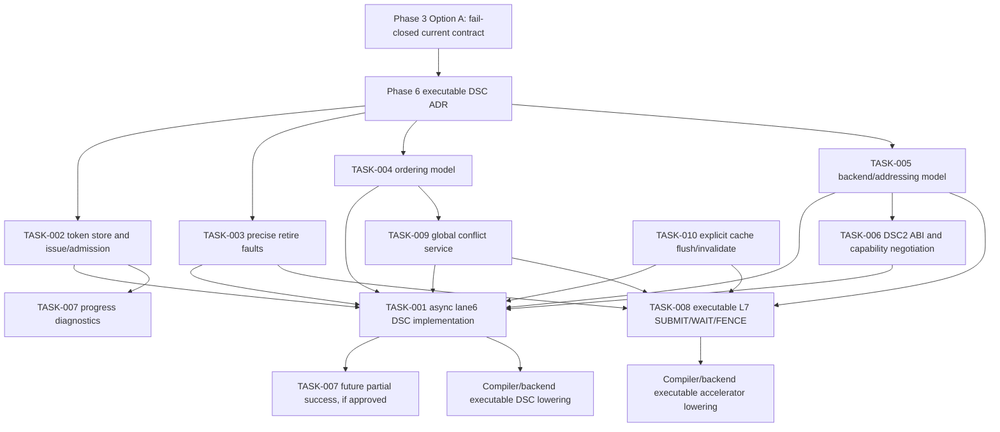

# Audit of "Unresolved Tasks Recommended Solutions" Against HybridCPU_ISE

Audit target: `Documentation/Stream WhiteBook/ExtentionsAnalytic.md`

Repository baseline: `HybridCPU_ISE`, inspected against the current code and the refactoring phase documents.

## 1. Executive Summary

The prior analysis is directionally correct after its own IOMMU/cache correction, but several recommendations must be tightened so they cannot be read as current executable behavior.

Confirmed:

- DSC1 is a fail-closed lane6 typed-slot carrier, not executable ISA.
- `DmaStreamComputeToken` already provides a useful future lifecycle base and all-or-none commit model.
- DSC1 must remain immutable; stride/tile/scatter-gather belongs in DSC2 or capability-gated extensions.
- All-or-none is the only safe current successful completion policy.
- Cache/prefetch surfaces exist, but the safe target is an explicit non-coherent flush/invalidate protocol.

Refined:

- Async token-based DSC is a valid long-term architecture, but it remains future-gated by Phase 6 and cannot be described as current behavior.
- IOMMU-backed burst I/O exists through `IBurstBackend`/`IOMMUBurstBackend`, but `DmaStreamComputeRuntime` does not use it today.
- Current ordering evidence is metadata, resource masks, and optional model conflict APIs, not a global CPU/DMA/accelerator ordering model.
- L7-SDC has descriptor, queue, fence, token, register ABI, fake backend, and commit model surfaces, but `ACCEL_*` carriers remain fail-closed and `WritesRegister = false`.

Replaced/deferred:

- Any claim that executable lane6 DSC, executable external accelerator ISA, async DMA overlap, full coherent DMA/cache, or compiler/backend production lowering already exists must be replaced with a future-gated statement.
- Executable L7 `QUERY_CAPS`/`POLL` can be the first implementation tier only after an ADR defines `rd`/CSR writeback and order semantics.

Most critical risks:

- Accidentally routing `DmaStreamComputeMicroOp.Execute` to `DmaStreamComputeRuntime.ExecuteToCommitPending` would bypass pipeline, retire, replay, ordering, and precise exception semantics.
- Treating `IOMMUBurstBackend` as proof of DSC/L7 IOMMU integration would make descriptor, guard, device ID, and fault mapping claims untrue.
- Treating cache-like surfaces as coherent hierarchy would make DMA visibility and compiler/backend assumptions unsafe.

The updated analysis can be used as the basis for an implementation plan only after the corrections in this audit are applied. It is not itself an implementation authorization; Phase 3 and Phase 6 still keep executable DSC and L7 ISA under explicit architecture gates.

## 2. Code-Based Architecture Baseline

| Area | Implemented status | Key files/classes | Notes |
| ---- | ------------------ | ----------------- | ----- |
| Lane6 DSC carrier | Fail-closed current contract | `Core/Pipeline/MicroOps/DmaStreamComputeMicroOp.cs`: `DmaStreamComputeMicroOp`, `Execute`, `EnsureOwnerDomainGuardAccepted`, `EnsureMandatoryFootprints` | Canonical lane6 typed-slot evidence carrier. Sets `SerializationClass = MemoryOrdered`, memory footprints, and resource masks. `Execute` throws fail-closed. |
| DSC descriptor ABI | Implemented parser/model, execution disabled | `Core/Execution/DmaStreamCompute/DmaStreamComputeDescriptor.cs`; `DmaStreamComputeDescriptorParser.cs`; `DmaStreamComputeValidationResult.cs` | DSC1: magic `DSC1`, ABI v1, 128-byte header, `InlineContiguous`, `AllOrNone`, fixed operation/type/shape set, reserved fields rejected, `ExecutionEnabled => false`. |
| DSC owner/domain guard | Implemented admission authority | `DmaStreamComputeDescriptorParser.Parse(... ownerGuardDecision ...)`; `DmaStreamComputeOwnerBinding`; `DmaStreamComputeOwnerGuardDecision` | Guard must be allowed, from guard plane, match structural owner binding, and avoid replay/certificate reuse. Parser without guard fails owner-domain validation. |
| DSC token model | Implemented model/runtime token | `DmaStreamComputeToken.cs`: `TryAdmit`, `MarkIssued`, `StageDestinationWrite`, `MarkComputeComplete`, `Commit`, `Cancel`, `PublishFault` | States exist from `Admitted` through `Committed`/`Faulted`/`Canceled`. Token is created by helper/model APIs, not normal pipeline issue. |
| DSC fault/retire surface | Implemented model surface, not full pipeline publication | `DmaStreamComputeFaultRecord.CreateRetireException`; `RequiresRetireExceptionPublication`; `CPU_Core.PipelineExecution.Memory.ApplyRetiredDmaStreamComputeTokenCommit`; `CPU_Core.TestSupport.ApplyRetiredDmaStreamComputeTokenCommitForTest` | Fault records can create retire-style exceptions. The production pipeline does not allocate DSC tokens; the exposed commit path is explicit/test-support style, not full issue/retire integration. |
| DSC runtime helper | Implemented explicit helper, model-only relative to ISA | `DmaStreamComputeRuntime.cs`; `DmaStreamAcceleratorBackend.cs` | `ExecuteToCommitPending` creates a token, reads operands, computes, stages writes, and returns `CommitPending`. It is intentionally not called by `DmaStreamComputeMicroOp.Execute`. |
| DSC memory path | Implemented physical helper path only | `DmaStreamAcceleratorBackend.TryReadRange`; `DmaStreamComputeToken.TryCommitAllOrNone`; `Processor.MainMemoryArea.TryReadPhysicalRange/TryWritePhysicalRange` | Current DSC helper reads/writes exact physical main memory. It does not use `IBurstBackend`, `IOMMUBurstBackend`, `DMAController`, `StreamEngine`, or cache coherency. |
| StreamEngine | Implemented separate stream/vector helper | `Core/Execution/StreamEngine/StreamEngine.BurstIO.cs` and related StreamEngine files | Uses `BurstIO`, `IBurstBackend`, optional `MemorySubsystem`, SRF prefetch windows, and synchronous `DMAController.ExecuteCycle` helper paths. It is not DSC descriptor execution. |
| DMAController | Implemented separate cycle-driven DMA channel model | `Memory/DMA/DMAController.cs`: `TransferDescriptor`, `ConfigureTransfer`, `StartTransfer`, `ExecuteCycle`, `PerformBurst` | Separate channel lifecycle. StreamEngine helpers drive it synchronously. Its IOMMU path uses `IOMMU.ReadBurst/WriteBurst(0UL, ...)`, not lane6 DSC device binding. |
| Burst backend | Implemented backend abstraction | `Core/Execution/BurstIO/IBurstBackend.cs`; `IOMMUBurstBackend.cs` | `Read/Write(deviceID, address, buffer)` is implemented. Accelerator registration and accelerator DMA transfer remain fail-closed in `IOMMUBurstBackend`. |
| IOMMU | Implemented memory translation/burst helper | `Memory/MMU/IOMMU.cs`: `ReadBurst`, `WriteBurst`, `DMARead`, `DMAWrite`, `TranslateAndValidateAccess` | Supports device/thread ID plus virtual address translation and burst operations. This proves backend availability, not DSC/L7 executable integration. |
| Scalar MemoryUnit | Implemented scalar memory abstraction | `Core/Memory/MemoryUnit.cs`: `IMemoryBus`, `Execute`, `ResolveArchitecturalAccess` | Compatibility memory execution exists, but comments separate old execution from authoritative retire/publication surfaces. It is not a coherent DMA/cache datapath. |
| AtomicMemoryUnit | Implemented physical main-memory atomic model | `Core/Memory/AtomicMemoryUnit.cs`: `ResolveRetireEffect`, `ApplyRetireEffect`, `NotifyPhysicalWrite` | Uses exact main-memory helpers and reservation invalidation. Useful hook candidate, not full cache coherency. |
| CPU cache/prefetch surfaces | Implemented materialization/prefetch, not coherent hierarchy | `Core/Cache/CPU_Core.Cache.cs`; `CPU_Core.Cache.Assist.cs` | L1/L2 data and VLIW bundle surfaces exist, assist-resident lines exist, domain data flush and VLIW fetch invalidation exist. `SyncSMPChache` is empty; exact execution paths bypass cache materialization. |
| L7-SDC carriers | Fail-closed current contract | `Core/Pipeline/MicroOps/SystemDeviceCommandMicroOp.cs`: `QueryCaps`, `Submit`, `Poll`, `Wait`, `Cancel`, `Fence`, `Execute` | Lane7 system singleton carriers. `Execute` throws fail-closed. `WritesRegister = false`; no architectural write metadata or backend dispatch. |
| L7 descriptor ABI | Implemented model parser | `ExternalAccelerators/Descriptors/AcceleratorDescriptorParser.cs`; `AcceleratorCommandDescriptor.cs` | SDC1 typed sideband for reference MatMul. Guard-backed descriptor validation; accepted message still says execution remains fail-closed. |
| L7 register ABI | Model-only | `ExternalAccelerators/Tokens/AcceleratorRegisterAbi.cs` | Packing helper only. It does not imply pipeline `rd` writeback because carriers do not write registers. |
| L7 token/queue/fence | Model-only | `AcceleratorToken.cs`; `AcceleratorTokenStore.cs`; `Queues/AcceleratorCommandQueue.cs`; `Fences/AcceleratorFenceModel.cs` | Token, queue, wait/fence observation, and guarded lookup surfaces exist, but the lane7 carrier remains fail-closed. |
| L7 backend/commit | Explicit model/test surface | `Backends/ExternalAcceleratorBackends.cs`; `Memory/AcceleratorMemoryModel.cs`; `Commit/AcceleratorCommitModel.cs` | Fake backends are test-only and stage bytes. Commit coordinator can publish staged writes only through explicit model APIs, not `ACCEL_*` instruction execution. |
| L7 conflict manager | Optional model component | `Conflicts/ExternalAcceleratorConflictManager.cs` | Has `NotifyCpuLoad`, `NotifyCpuStore`, `NotifyDmaStreamComputeAdmission`, SRF/assist conflict evidence. Not installed as mandatory global CPU load/store truth. |
| Refactoring phase boundary | Current contract gating | `Documentation/Refactoring/Phases/Phase_03_DMA_Execution_Model_Decision.md`; `Phase_04_StreamEngine_DMA_Separation.md`; `Phase_05_ExternalAccelerator_Contract.md`; `Phase_06_FEATURE_000_Executable_Lane6_DSC_Gate.md`; `Phase_06_Future_Feature_Backlog.md` | Phase 3 selected Option A fail-closed. Phase 4 separates StreamEngine/DMA/DSC/L7. Phase 5 keeps L7 model-only. Phase 6 backlog is not implementation approval. |

## 3. Decision Audit Matrix

| TASK | Previous recommendation | Audit result | Final recommendation | Reason |
| ---- | ----------------------- | ------------ | -------------------- | ------ |
| TASK-001 | Async token-based engine as target; do not wire runtime directly to `Execute` without Phase 6 approval. | Refine | Keep async token-based DSC as Future Architecture only; current contract remains fail-closed. | Code and Phase 3 confirm fail-closed current behavior; prerequisites must be made explicit. |
| TASK-002 | Allocate/admit token at issue/admission boundary; retire observes completion/fault. | Confirm | Use issue/admission allocation for any future executable DSC; no decode allocation. | Matches typed-slot philosophy and current token `Admitted`/`Issued` lifecycle. |
| TASK-003 | Publish executable DSC faults as precise retire exceptions. | Refine | Keep existing fault records; add formal priority, issuing-PC metadata, and real retire publication before executable mode. | Fault surfaces exist, but normal pipeline token allocation and priority ordering do not. |
| TASK-004 | Explicit fence/wait/poll plus normalized footprint conflict manager; no implicit coherency. | Refine | Stage ordering: current conservative metadata, then optional hook, then mandatory global conflict service for executable modes. | Current code has masks/classes and optional L7 conflict APIs, not global CPU load/store integration. |
| TASK-005 | Hybrid backend selection with existing `IOMMUBurstBackend`; descriptors declare address space. | Refine | Use explicit backend/addressing contract; DSC current path remains physical until DSC2 or approved feature path uses `IBurstBackend`. | IOMMU backend exists, but DSC helper does not call it; accelerator DMA methods remain fail-closed. |
| TASK-006 | Keep DSC1 immutable; introduce DSC2 plus extension blocks/capabilities. | Confirm | DSC1 stays fixed; DSC2/capability negotiation for stride/tile/scatter-gather/address-space extensions. | Parser rejects reserved fields and unsupported encodings; this is the correct compatibility boundary. |
| TASK-007 | Keep AllOrNone as current success; progress diagnostic only; partial success future. | Confirm | All-or-none remains current contract; progress can be diagnostic; successful partial completion requires DSC2 async ADR. | Token commit enforces exact staged coverage and rollback. |
| TASK-008 | Phased L7: read-only `QUERY_CAPS`/`POLL` first if approved, then async `SUBMIT`/`WAIT`/`FENCE`/`CANCEL`. | Refine | Defer executable L7 ISA; current contract is model-only. If reopened, start with read-only `QUERY_CAPS`/`POLL` after `rd`/CSR ADR. | Carriers are fail-closed and `WritesRegister = false`; model ABI does not equal executable ISA. |
| TASK-009 | Installable global conflict service mandatory for executable DMA/L7 modes. | Confirm | Keep optional model now; require global conflict service for executable overlap/fences. | Existing conflict manager concepts are useful but not installed into CPU load/store paths. |
| TASK-010 | Non-coherent explicit flush/invalidate protocol over existing cache/prefetch surfaces; coherent DMA deferred. | Refine | Treat current caches as materialization/prefetch surfaces; add explicit data flush/invalidate and separate VLIW invalidation before any coherency claim. | Cache code exists, but exact execution paths bypass it and `SyncSMPChache` is empty. |

## 4. Detailed TASK Review

### ID: TASK-001

Topic: Executable lane6 `DmaStreamComputeMicroOp`

Previous recommendation: Async token-based engine as long-term target; do not connect `DmaStreamComputeRuntime` directly to `DmaStreamComputeMicroOp.Execute` without Phase 6 approval.

Audit result: Refine

Final recommendation: Async token-based lane6 DSC is the correct Future Architecture, not Current Implemented Contract. Phase 3 Option A remains authoritative until a new architecture approval reopens executable DSC.

Code evidence:

- `Core/Pipeline/MicroOps/DmaStreamComputeMicroOp.cs` / `DmaStreamComputeMicroOp.Execute`: direct execution throws fail-closed.
- `Core/Execution/DmaStreamCompute/DmaStreamComputeDescriptorParser.cs` / `ExecutionEnabled`: returns `false`.
- `Core/Execution/DmaStreamCompute/DmaStreamComputeRuntime.cs` / `ExecuteToCommitPending`: explicit runtime/model helper; not wired into micro-op execution.
- `Core/Execution/DmaStreamCompute/DmaStreamAcceleratorBackend.cs` / `TryReadRange`: reads physical main memory, not DMA/IOMMU/cache.
- `Documentation/Refactoring/Phases/Phase_03_DMA_Execution_Model_Decision.md`: Option A selected.
- `Documentation/Refactoring/Phases/Phase_06_FEATURE_000_Executable_Lane6_DSC_Gate.md`: executable lane6 DSC remains an open future gate.

Architecture reasoning:

- Fits HybridCPU only as a future design because long-latency side-effecting work needs token scheduling, completion, ordering, replay, squash, and retire semantics.
- Conflicts with current architecture if implemented by direct synchronous call from `Execute` to `ExecuteToCommitPending`.
- Status: Future architecture decision. Current executable lane6 DSC is unimplemented.

Implementation implications:

- Modify only after approval: `DmaStreamComputeMicroOp`, `DmaStreamComputeRuntime`, `DmaStreamComputeToken`, CPU issue/retire paths.
- Add: `DmaStreamComputeTokenStore`, async engine/queue, backend resolver, retire publication structure, cancellation hooks.
- Preserve compatibility tests that assert current fail-closed behavior until the gate explicitly changes them.

Compiler/backend impact:

- Allowed: preserve/validate DSC1 typed sideband and use explicit runtime/helper paths in tests.
- Forbidden: production lowering that assumes lane6 DSC executes, overlaps, commits, fences, or writes memory through the pipeline.

Testing requirements:

- Existing negative `Execute` tests remain authoritative.
- Future tests: token issue/admission, async progression, cancellation on replay/squash/trap/context switch, all-or-none commit, fault-to-retire publication, ordering litmus tests, compiler conformance.

Documentation updates:

- Keep executable DSC in Future Design / Phase 6.
- Add an explicit warning that async token-based DSC is target architecture, not current behavior.

Open questions:

- Exact pipeline hook for token issue and engine tick.
- Completion event model: poll, interrupt, wait, fence, or retire-only.

### ID: TASK-002

Topic: Token allocation / lifecycle / commit-retire boundary

Previous recommendation: Allocate/admit token on issue/admission boundary; token store owns lifetime; retire observes completion/fault.

Audit result: Confirm

Final recommendation: If lane6 DSC becomes executable, allocate tokens at issue/admission after typed-slot, descriptor, owner/domain, footprint, and resource acceptance. Do not allocate at decode. Do not defer allocation until memory/retire.

Code evidence:

- `DmaStreamComputeToken.cs` / `DmaStreamComputeTokenState`: `Admitted`, `Issued`, `ReadsComplete`, `ComputeComplete`, `CommitPending`, `Committed`, `Faulted`, `Canceled`.
- `DmaStreamComputeToken.TryAdmit`: creates/admission-gates a token from validation result.
- `DmaStreamComputeRuntime.ExecuteToCommitPending`: currently creates token in helper/model path.
- `DmaStreamComputeMicroOp.cs`: carries owner/thread/context and normalized read/write ranges, but does not allocate pipeline tokens.
- `CPU_Core.TestSupport.ApplyRetiredDmaStreamComputeTokenCommitForTest`: exposes commit as test-only retire-authoritative seam.

Architecture reasoning:

- Decode is speculative and must not allocate durable DMA tokens.
- Issue/admission is the first point where typed lane, guard, footprint, resource masks, quota/backpressure, and replay authority can be checked together.
- Execute/memory-stage allocation would be too late to model backpressure and scheduling.

Implementation implications:

- Add a token store with token ID ownership, guard binding, active-token lookup, cancellation by context/domain, and retire observation.
- Extend token metadata with issuing PC/bundle/slot, issue cycle, completion cycle, and cancellation reason.
- Connect replay/squash/trap/context-switch paths to token cancellation.

Compiler/backend impact:

- Allowed: assume descriptor identity and footprints are preserved through decode metadata.
- Forbidden: assume descriptor decode alone has allocated or reserved a DMA token.

Testing requirements:

- No token allocation on squashed decode-only bundles.
- Admission failure classification: telemetry rejection versus architectural fault.
- Token uniqueness across threads/domains.
- Commit after cancel/fault is rejected and does not mutate memory.

Documentation updates:

- Update Phase 6 gate to name issue/admission as the preferred allocation point if Option B is approved.
- Document that current token creation is helper/model-only.

Open questions:

- Token ID namespace: per-core, per-pod, per-domain, or global monotonic.

### ID: TASK-003

Topic: Precise exception / fault priority

Previous recommendation: Executable DSC faults become precise retire publications; backend faults stay token records until retire.

Audit result: Refine

Final recommendation: Keep existing fault record APIs, but do not claim precise architectural exceptions until the pipeline can attach token faults to issuing instruction age, slot, bundle, and retire priority.

Code evidence:

- `DmaStreamComputeToken.cs` / `DmaStreamComputeFaultRecord.RequiresRetireExceptionPublication`: returns true.
- `DmaStreamComputeFaultRecord.CreateRetireException`: maps domain faults, translation/permission/alignment/DMA/partial/replay/memory faults, and unsupported/disabled faults to exception types.
- `DmaStreamComputeValidationResult.cs`: exposes descriptor decode, unsupported ABI/op/type/shape, carrier decode, reserved field, range, alignment, alias, owner/domain, quota/backpressure/token-cap, and execution-disabled fault classes.
- `CPU_Core.PipelineExecution.Memory.ApplyRetiredDmaStreamComputeTokenCommit`: explicit commit publication helper exists.
- No code evidence of normal pipeline DSC token allocation, multi-slot DSC fault priority, or automatic retire publication.

Architecture reasoning:

- The fault taxonomy is a good foundation, but precise exception semantics require ordering against scalar load/store, atomics, other slots, traps, replay, and retire windows.
- Current runtime helper can produce retire-style exceptions, but that is not equivalent to architectural precise exception integration.

Implementation implications:

- Add a fault priority table for descriptor decode, unsupported ABI, translation, permission, domain, owner context, alignment, alias overlap, partial completion, memory fault, execution disabled, and cancellation/replay faults.
- Add issuing instruction metadata to tokens and fault records.
- Add retire publication structures and priority resolution in the pipeline.

Compiler/backend impact:

- Allowed: treat DSC faults as possible architectural exceptions only in approved executable mode.
- Forbidden: rely on precise exception ordering for current fail-closed DSC.

Testing requirements:

- Descriptor fault versus scalar memory fault in the same VLIW bundle.
- Runtime memory fault versus commit guard fault.
- Domain/owner mismatch priority.
- Faulted token cannot commit; canceled token cannot publish memory.

Documentation updates:

- Move existing `CreateRetireException` references under "model/retire-style surface" until real pipeline integration lands.
- Add a fault priority table before implementing executable mode.

Open questions:

- Exact cross-slot priority policy for lane6 versus scalar memory slots.

### ID: TASK-004

Topic: Memory ordering

Previous recommendation: Explicit fence/wait/poll plus normalized footprint conflict manager; no implicit full coherency.

Audit result: Refine

Final recommendation: Use a staged ordering model: current conservative scheduling metadata; installable footprint conflict hook; mandatory global conflict service only when executable DMA/L7 overlap is enabled.

Code evidence:

- `DmaStreamComputeMicroOp.cs`: `SerializationClass = MemoryOrdered`, read/write memory ranges, resource masks for DMA channel, StreamEngine, load, store, and memory-domain bucket.
- `SystemDeviceCommandMicroOp.cs`: L7 `SUBMIT`/descriptor commands are `MemoryOrdered`; `WAIT`, `CANCEL`, `FENCE` are `FullSerial`; `QUERY_CAPS`/`POLL` are `CsrOrdered`.
- `ExternalAcceleratorConflictManager.cs`: optional `NotifyCpuLoad`, `NotifyCpuStore`, `NotifyDmaStreamComputeAdmission`, SRF/assist conflict notifications, and commit validation.
- `MemoryUnit.cs` / `AtomicMemoryUnit.cs`: current scalar paths do not call a mandatory global conflict service.
- `Documentation/Refactoring/Phases/Phase_04_StreamEngine_DMA_Separation.md`: L7 conflict notifications do not imply a global CPU load/store hook.

Architecture reasoning:

- Metadata and resource masks are evidence for scheduling and future conflicts; they do not prove a global memory ordering model.
- Full serialization is safe as an MVP fallback but would erase intended stream/DMA overlap if used as the final model.
- Footprint-based conflicts match descriptor normalization and typed-slot philosophy.

Implementation implications:

- Add a `GlobalMemoryConflictService` or equivalent installable hook.
- Register active DSC/L7/DMA read/write footprints.
- Hook CPU loads/stores/atomics only behind an executable-mode feature gate.
- Define policy responses: stall, replay, serialize, reject, or trap.

Compiler/backend impact:

- Allowed: emit explicit wait/fence only when the executable feature contract defines it.
- Forbidden: assume current `MemoryOrdered` metadata gives async DMA/load-store ordering.

Testing requirements:

- Overlapping CPU load versus active DSC/L7 write.
- CPU store versus active accelerator read/write footprint.
- Non-overlapping operations proceed without unnecessary serialization.
- Fence waits/drains/faults as specified.
- Absent hook preserves current behavior.

Documentation updates:

- Separate current `SerializationClass`/resource-mask facts from future ordering guarantees.
- Add a litmus-test matrix to the Phase 6 implementation plan.

Open questions:

- Whether executable MVP uses stall/replay or conservative rejection on conflicts.

### ID: TASK-005

Topic: Addressing / IOMMU

Previous recommendation: Hybrid explicit backend selection: physical backend plus existing `IOMMUBurstBackend`; descriptors explicitly declare address space.

Audit result: Refine

Final recommendation: Adopt explicit backend/addressing as the target model, but state that current DSC helper memory remains physical. `IOMMUBurstBackend` is available for future DSC2/executable paths only after descriptor, guard, device ID, and fault mapping are approved.

Code evidence:

- `IBurstBackend.cs`: `Read(ulong deviceID, ulong address, Span<byte>)`, `Write(...)`, `RegisterAcceleratorDevice`, `InitiateAcceleratorDMA`.
- `IOMMUBurstBackend.cs`: `Read`/`Write` delegate to `Memory.IOMMU.ReadBurst/WriteBurst`; accelerator registration/transfer throw fail-closed helpers.
- `Memory/MMU/IOMMU.cs`: `ReadBurst`, `WriteBurst`, `DMARead`, `DMAWrite`, translation/validation helpers.
- `DmaStreamAcceleratorBackend.cs`: DSC runtime reads with `_mainMemory.TryReadPhysicalRange`.
- `DmaStreamComputeToken.cs`: commit writes with `Processor.MainMemoryArea.TryWritePhysicalRange`.
- `StreamEngine.BurstIO.cs`: separate StreamEngine helper uses `IBurstBackend` and synchronous `DMAController` helper paths with `CPU_DEVICE_ID = 0`.
- `DMAController.cs`: `UseIOMMU` exists, but `PerformBurst` uses `IOMMU.ReadBurst/WriteBurst(0UL, ...)`.

Architecture reasoning:

- It is wrong to say IOMMU is absent.
- It is also wrong to say lane6 DSC or L7 executable DMA already uses the IOMMU backend.
- The correct target is explicit: physical and IOMMU-translated address spaces are descriptor-visible and guard/device-bound.

Implementation implications:

- Add a physical `IBurstBackend` wrapper or resolver for exact main memory.
- Add `AddressSpace` and device/translation domain fields in DSC2, not by reusing DSC1 reserved bits.
- Map IOMMU translation/permission failures to `DmaStreamComputeTokenFaultKind.TranslationFault`/`PermissionFault`.
- Keep `IOMMUBurstBackend.RegisterAcceleratorDevice` and `InitiateAcceleratorDMA` fail-closed until a real device protocol exists.

Compiler/backend impact:

- Allowed: select physical or IOMMU-translated only when descriptor ABI/capability says so.
- Forbidden: silently fall back from IOMMU to physical or assume DSC1 addresses are virtual/IOMMU-translated.

Testing requirements:

- Backend resolver selects physical versus IOMMU explicitly.
- Device ID mismatch rejects before memory access.
- IOMMU translation and permission failures become token faults.
- No silent fallback from IOMMU to physical memory.

Documentation updates:

- Replace "add IOMMU" with "integrate existing IOMMU-backed burst backend into approved DSC/L7 executable paths."
- Document current DSC helper as physical memory only.

Open questions:

- Device ID binding model for lane6 versus external devices.
- ASID/domain encoding in DSC2.

### ID: TASK-006

Topic: Descriptor ABI v2

Previous recommendation: DSC1 immutable; add DSC2 ABI with explicit version/layout and extension blocks/capabilities for stride/tile/scatter-gather.

Audit result: Confirm

Final recommendation: Keep DSC1 unchanged and strict. Add DSC2 or capability-gated extension blocks only with a new parser path and deterministic footprint normalization.

Code evidence:

- `DmaStreamComputeDescriptorParser.cs`: fixed magic/version/header; rejects dirty flags/reserved fields; supports only `InlineContiguous`.
- `DmaStreamComputeDescriptor.cs`: current shape/range/partial enums are narrow: `Contiguous1D`, `FixedReduce`, `InlineContiguous`, `AllOrNone`.
- `DmaStreamComputeValidationResult.cs`: unsupported ABI/range/shape/type/operation are explicit rejection surfaces.

Architecture reasoning:

- Reusing DSC1 reserved fields would silently break compatibility and parser truth.
- Complex addressing must normalize into explicit read/write footprints before scheduling, conflict, IOMMU, or cache logic can be trusted.

Implementation implications:

- Add `DmaStreamComputeDescriptorV2` or equivalent typed model.
- Add stride/tile/scatter-gather footprint normalizer.
- Add capability negotiation before compiler/backend emission.
- Keep DSC1 parser behavior unchanged.

Compiler/backend impact:

- Allowed: emit DSC1 only for current supported contiguous forms.
- Forbidden: encode stride/tile/scatter-gather in DSC1 reserved fields or rely on future extension blocks without capability approval.

Testing requirements:

- DSC1 rejects non-v1 encodings.
- DSC2 parser positive/negative tests for stride/tile/scatter-gather.
- Deterministic normalized footprints, overflow/alignment/alias/domain tests.

Documentation updates:

- Split Current ABI (DSC1) and Future ABI (DSC2) sections.
- State that parser-only DSC2 work does not imply executable DSC.

Open questions:

- Binary extension block format and maximum normalized range count.

### ID: TASK-007

Topic: Partial completion

Previous recommendation: Keep `AllOrNone` as current successful completion; expose progress only as diagnostics; successful partial completion future-gated.

Audit result: Confirm

Final recommendation: All-or-none remains the current architectural success rule. Partial progress may be telemetry/poll evidence, not successful memory visibility. Successful partial completion requires DSC2, async tokens, retry/rollback semantics, and compiler contract.

Code evidence:

- `DmaStreamComputeDescriptor.cs`: `PartialCompletionPolicy.AllOrNone`.
- `DmaStreamComputeDescriptorParser.cs`: rejects non-`AllOrNone`.
- `DmaStreamComputeToken.StageDestinationWrite`: staged writes must be inside normalized write footprint.
- `DmaStreamComputeToken.MarkComputeComplete`: requires exact staged coverage before `CommitPending`.
- `DmaStreamComputeToken.TryCommitAllOrNone`: snapshots backups and rolls back on write failure.

Architecture reasoning:

- Current code already prevents successful partial visibility.
- Exposing partial success would create compiler-visible non-atomic memory semantics and retry ambiguity.

Implementation implications:

- Keep exact staged coverage and rollback.
- Add optional progress counters/records only as non-authoritative diagnostics.
- Define future partial policy in DSC2 only.

Compiler/backend impact:

- Allowed: assume all-or-none for current DSC helper/future v1 executable contract.
- Forbidden: rely on partial memory visibility or successful partial completion.

Testing requirements:

- Missing staged write coverage faults.
- Rollback on write failure leaves memory unchanged.
- Partial progress reporting does not set success or publish memory.
- DSC2 partial-success descriptors reject until feature enabled.

Documentation updates:

- Mark progress as diagnostic/model evidence only.
- Keep all-or-none in Current Contract.

Open questions:

- Future partial retry/resume semantics if the feature is ever approved.

### ID: TASK-008

Topic: External accelerator executable ISA

Previous recommendation: Keep current fail-closed; if approved, implement read-only `QUERY_CAPS`/`POLL` first, then async `SUBMIT`/`WAIT`/`FENCE`/`CANCEL`.

Audit result: Refine

Final recommendation: Defer executable L7 ISA. Current contract is model-only. The minimal safe future path is an ADR for `rd`/CSR result publication, then read-only `QUERY_CAPS`/`POLL`; full submit/wait/fence/cancel requires token store, queue, backend dispatch, commit/retire, ordering, and cache/conflict integration.

Code evidence:

- `SystemDeviceCommandMicroOp.cs`: all `ACCEL_*` carriers are lane7 system singleton carriers; `Execute` throws fail-closed; `WritesRegister = false`.
- `AcceleratorRegisterAbi.cs`: model result packing only.
- `AcceleratorCommandDescriptor.cs` / `AcceleratorDescriptorParser.cs`: accepted SDC1 descriptor remains guard-backed typed sideband; execution remains fail-closed.
- `AcceleratorCommandQueue.cs`: queue/admission result cannot publish architectural memory or exceptions.
- `AcceleratorFenceModel.cs`: model-side fence; comments say lane7 carrier remains fail-closed until separate architecture decision.
- `AcceleratorCommitModel.cs`: commit coordinator can publish through explicit model API, not instruction `Execute`.
- `ExternalAcceleratorBackends.cs`: fake backends are test-only and stage data; backend results cannot directly publish architectural memory.
- `Documentation/Refactoring/Phases/Phase_05_ExternalAccelerator_Contract.md`: L7 executable ISA remains future architecture.

Architecture reasoning:

- A register ABI model does not become architectural `rd` writeback while carriers say `WritesRegister = false`.
- Queue/fence/backend/commit helpers are useful design foundations, but model-only APIs cannot be documented as executable ISA.

Implementation implications:

- Do not alter `SystemDeviceCommandMicroOp.Execute` without L7 ADR.
- First executable tier must define register destination encoding, CSR/order class, privilege/guard model, and exact result word semantics.
- Full submit tier must integrate token lifecycle, queue capacity, backend dispatch, staged writes, commit/retire exceptions, conflicts, and cache invalidation.

Compiler/backend impact:

- Allowed: use model APIs in tests and architecture exploration.
- Forbidden: emit production `ACCEL_*` expecting `rd` writeback, backend execution, queueing, wait/fence, or memory publication.

Testing requirements:

- Existing fail-closed `ACCEL_*` tests remain.
- Future `QUERY_CAPS`/`POLL`: register writeback only, no memory side effects.
- Future `SUBMIT`: returns token/status, does not publish computed result.
- Future commit/fault tests tie memory visibility and exceptions to retire/order boundary.

Documentation updates:

- State `QUERY_CAPS`/`POLL` are not executable today despite register ABI model.
- Label fake backends test-only and commit coordinator model-only.

Open questions:

- Register operand encoding and `rd` writeback for L7.
- Whether polling is CSR-like, register-like, or memory-mapped.

### ID: TASK-009

Topic: Global conflict / load-store hook

Previous recommendation: Installable `GlobalMemoryConflictService` mandatory for executable DSC/L7 modes; absent in current fail-closed baseline.

Audit result: Confirm

Final recommendation: Keep the current conflict manager optional/model-only. For executable DSC/L7, promote the concept into an installable global conflict service with CPU load/store/atomic hooks and active token footprint registration.

Code evidence:

- `ExternalAcceleratorConflictManager.cs`: active footprint table, `TryReserveOnSubmit`, `NotifyCpuLoad`, `NotifyCpuStore`, `NotifyDmaStreamComputeAdmission`, `ValidateBeforeCommit`, `ReleaseTokenFootprint`.
- `AcceleratorCommandQueue.cs`: placeholder conflict acceptance is explicit and not global CPU truth.
- `MemoryUnit.cs` and `AtomicMemoryUnit.cs`: no mandatory calls into L7 conflict manager before every memory access.
- `Phase_04_StreamEngine_DMA_Separation.md`: L7 conflict notifications do not imply a global CPU load/store hook.

Architecture reasoning:

- Optional conflict APIs are safe for model tests.
- Executable overlap cannot be safe without a global view of CPU, atomics, DSC, DMAController, SRF/assist warming, and external accelerators.
- The installable-hook approach avoids changing scalar memory behavior before executable features are enabled.

Implementation implications:

- Add or generalize into `GlobalMemoryConflictService`.
- Register active DSC/L7/DMA footprints with owner/domain tags.
- Hook scalar loads/stores and atomic writes/reservations behind feature gates.
- Define conflict action policy.

Compiler/backend impact:

- Allowed: emit explicit wait/fence only once conflict service semantics are approved.
- Forbidden: assume current optional `ExternalAcceleratorConflictManager` protects CPU load/store ordering.

Testing requirements:

- Absent service preserves current scalar tests.
- Overlap detection for CPU load/store versus active DMA/accelerator write.
- DMA write invalidates overlapping atomic reservations.
- Domain-scoped conflict and mapping-epoch drift tests.

Documentation updates:

- Describe current conflict manager as optional model component.
- Describe mandatory conflict service as executable-mode prerequisite.

Open questions:

- Conflict response policy: stall, replay, serialize, reject, or exception.

### ID: TASK-010

Topic: Cache / coherency model

Previous recommendation: Non-coherent explicit flush/invalidate protocol over existing cache/prefetch surfaces; coherent DMA deferred.

Audit result: Refine

Final recommendation: Treat current cache code as cache/prefetch materialization, not coherent hierarchy. Add explicit range flush/invalidate APIs and a memory/coherency observer before any DMA/cache visibility claim. Keep VLIW fetch invalidation separate from data-cache invalidation. Coherent DMA is a future ADR.

Code evidence:

- `CPU_Core.Cache.cs`: L1/L2 data cache-like arrays, L1/L2 VLIW bundle cache-like arrays, `GetDataByPointer`, `PrefetchVLIWBundle`, `InvalidateVliwFetchState`, `FlushDomainFromDataCache`.
- `CPU_Core.Cache.cs` / `MaterializeCacheDataLine`: comments say exact execution surfaces still use fail-closed bound-memory helpers instead of cache materializer.
- `CPU_Core.Cache.cs` / `SyncSMPChache`: empty stub.
- `CPU_Core.Cache.Assist.cs`: assist-resident data lines, carrier budgets, reclamation.
- `DmaStreamComputeToken.TryCommitAllOrNone`: writes physical main memory with no data-cache invalidation hook.
- `StreamEngine.BurstIO.cs`: invalidates SRF prefetch windows on StreamEngine writes, not general data cache coherency.
- `AcceleratorCommitModel.cs`: model commit invalidation plan exists for SRF/cache windows, but not as global CPU cache coherence.

Architecture reasoning:

- Existing surfaces are real and should not be ignored.
- They do not prove coherent CPU/DMA/accelerator hierarchy, snooping, writeback, or cache-line state protocol.
- Non-coherent explicit protocol fits current implementation and fail-closed philosophy.

Implementation implications:

- Add `InvalidateDataCacheRange(address, length, domainTag)` and `FlushDataCacheRange(...)`.
- Add `MemoryCoherencyObserver.OnCpuWrite/OnDmaWrite/OnFence` or equivalent.
- Connect DSC commit and future L7 commit success to observer invalidation.
- Keep VLIW/code invalidation separate through `InvalidateVliwFetchState`.

Compiler/backend impact:

- Allowed: rely on explicit fences/flush/invalidate only after approved ABI/runtime support.
- Forbidden: assume coherent DMA, automatic cache snooping, or automatic flush of CPU store buffers/cache lines.

Testing requirements:

- DMA write invalidates overlapping L1/L2 data and assist-resident lines.
- Non-overlapping cache lines survive.
- Domain flush still works.
- VLIW fetch invalidation is separate and not used for data-only DMA.
- No coherent-DMA documentation claim without tests.

Documentation updates:

- Replace "cache absent" with "cache/prefetch surfaces exist."
- Replace "coherent cache hierarchy" with "non-coherent explicit protocol until future ADR."

Open questions:

- Whether current data cache is read-materialized/no-writeback or can contain dirty CPU store data. This decides whether initial `FlushDataCacheRange` is no-op or writeback.

## 5. Corrected Final Recommendations

| TASK | Final selected solution | Status | Implementation phase |
| ---- | ----------------------- | ------ | -------------------- |
| TASK-001 | Async token-based executable lane6 DSC only after Phase 6 approval; current carrier stays fail-closed. | Future gated | Phase 6A design, Phase 6D implementation after gates |
| TASK-002 | Token allocation at issue/admission with token store lifecycle and cancel/replay hooks. | Design required | Phase 6B infrastructure |
| TASK-003 | Precise DSC fault publication at retire with explicit priority table and issuing metadata. | Design required | Phase 6A/6D |
| TASK-004 | Staged memory ordering: metadata now, installable hook next, mandatory conflict service for executable overlap. | Design required | Phase 6E |
| TASK-005 | Explicit physical versus IOMMU-translated backend selection; current DSC helper remains physical. | Design required | Phase 6C |
| TASK-006 | Preserve DSC1; introduce DSC2/capability-gated extension blocks and footprint normalizer. | Design required | Phase 6B/6C, executable use blocked by TASK-001/004 |
| TASK-007 | Keep all-or-none as current success; progress diagnostic only; partial success future DSC2 mode. | Current contract plus Future gated | Current for all-or-none, future Phase 6+ for partial success |
| TASK-008 | Keep L7-SDC model-only; defer executable ISA; first possible tier is read-only `QUERY_CAPS`/`POLL` after ADR. | Future gated | Separate L7 ADR, then Phase 6G |
| TASK-009 | Optional model conflict manager now; global conflict service mandatory for executable DSC/L7. | Design required | Phase 6E |
| TASK-010 | Non-coherent explicit flush/invalidate over existing cache/prefetch surfaces; coherent DMA future. | Design required | Phase 6F |

## 6. Dependency Graph

Before executable lane6 DSC:

- Phase 6 approval of Option B.
- Token store and issue/admission allocation.
- Runtime step decomposition or async engine.
- Completion model and `CommitPending`/retire boundary.
- Precise fault priority and cancellation semantics.
- Ordering/conflict model.
- Explicit physical/IOMMU backend selection.
- Cache invalidation/flush policy.
- Compiler/backend contract and conformance tests.

Before async DMA overlap:

- Token scheduler/engine.
- Completion observation and ordering rules.
- CPU load/store/atomic conflict hooks.
- Fence/wait/poll semantics.
- Replay/squash/trap/context-switch cancellation.

Before external accelerator ISA:

- L7 ADR for register/CSR result publication.
- `ACCEL_*` writeback and `Execute` semantics.
- Token store, queue/backpressure, backend dispatch.
- Guarded memory portal and staged write commit/retire.
- Global conflict service and cache invalidation.
- Test-only fake backend kept separate from production protocol.

Before cache/coherency claims:

- Range-based data-cache invalidate.
- Data flush/writeback decision.
- Assist-resident and SRF invalidation rules.
- Separate VLIW fetch invalidation.
- Memory/coherency observer wired to DSC/L7/DMA/atomic writes.
- Coherent DMA/snooping ADR if claiming true coherency.

Compiler/backend lowering is blocked by:

- Current Phase 3 Option A fail-closed contract.
- Missing executable DSC/L7 approval.
- Missing token lifecycle and retire publication.
- Missing ordering/conflict/cache protocol.
- Missing DSC2/SDC executable capability negotiation for future encodings.

## 7. Required Corrections to Previous Analysis

Apply these corrections to `ExtentionsAnalytic.md` before using it as an implementation-plan seed:

1. Executable DSC wording:
   - Replace any wording that sounds like async lane6 DSC is selected current behavior.
   - Use: "Async token-based DSC is the target Future Architecture; current `DmaStreamComputeMicroOp.Execute` remains fail-closed under Phase 3 Option A."

2. IOMMU wording:
   - Replace "IOMMU must be added" or "IOMMU is absent" with: "`IBurstBackend` and `IOMMUBurstBackend` exist and delegate burst Read/Write to `Memory.IOMMU`, but current DSC runtime/helper does not use them."
   - Add: "`IOMMUBurstBackend.RegisterAcceleratorDevice` and `InitiateAcceleratorDMA` are fail-closed."
   - Add: "`DMAController` IOMMU paths are separate and currently use device ID `0UL` in the StreamEngine helper path."

3. Cache/prefetch wording:
   - Replace "cache absent" with: "L1/L2 data and VLIW cache-like surfaces plus assist-prefetch materialization exist."
   - Add: "Exact execution memory paths may bypass cache materialization; current code does not prove coherent hierarchy."

4. Cache coherency wording:
   - Replace any coherent-DMA implication with: "Current target is non-coherent explicit flush/invalidate; true coherent DMA is future architecture."
   - Add separate bullets for data-cache invalidation, data flush/writeback, assist/SRF invalidation, and VLIW fetch invalidation.

5. L7-SDC wording:
   - Replace any "model queue/fence/register ABI is executable ISA" implication.
   - Add: "`SystemDeviceCommandMicroOp.Execute` fails closed, `WritesRegister = false`, and fake backends are test-only."
   - State that `QUERY_CAPS`/`POLL` require an ADR before becoming executable because they need architectural result publication.

6. Ordering wording:
   - Clarify that `SerializationClass`, resource masks, and normalized footprints are scheduling/conflict evidence only.
   - Add: "No mandatory global CPU load/store hook is installed today."

7. Partial completion wording:
   - Keep all-or-none as current success contract.
   - Progress evidence is diagnostic only and must not be treated as committed memory visibility.

8. Descriptor ABI wording:
   - Do not reuse DSC1 reserved fields for v2 behavior.
   - Add an explicit DSC2/capability negotiation gate and normalized footprint requirement.

9. Compiler/backend assumptions:
   - Add a hard prohibition on production lowering to executable lane6 DSC or executable `ACCEL_*` under the current contract.
   - Add prohibitions on assuming DSC1 stride/tile/scatter, IOMMU-translated DSC addresses, partial success, or coherent DMA/cache visibility.

10. StreamEngine/DMA/DSC/L7 separation:
   - Preserve Phase 4 separation language.
   - Do not use StreamEngine `BurstIO` or `DMAController` synchronous helper paths as proof of DSC async execution.

## 8. Final Architecture Position

Current Implemented Contract:

- `DmaStreamComputeMicroOp` is a lane6 typed-slot descriptor carrier with fail-closed `Execute`.
- DSC1 descriptor parsing, owner/domain guard validation, normalized footprints, explicit runtime helper, token staging, and all-or-none physical commit are implemented model/runtime surfaces.
- `StreamEngine`, `DMAController`, DSC, and L7-SDC are architecturally separate.
- `IBurstBackend`/`IOMMUBurstBackend` and `Memory.IOMMU` exist, but are not current DSC executable integration.
- Cache/prefetch materialization surfaces exist, but not coherent CPU/DMA/accelerator hierarchy.
- L7-SDC carriers, register ABI, queue, fence, fake backends, conflict manager, and commit coordinator remain model-only relative to instruction execution.

Future Architecture:

- Async token-based executable lane6 DSC.
- Issue/admission token allocation and token scheduler.
- Precise retire fault publication and priority.
- Explicit ordering/fence/wait/poll semantics.
- Explicit physical/IOMMU backend selection.
- DSC2 descriptor ABI and capability negotiation.
- Optional future partial-success mode.
- Executable L7 external accelerator ISA.
- Global memory conflict service.
- Explicit non-coherent cache flush/invalidate, with coherent DMA only after a separate ADR.

Decisions that can be locked immediately:

- Keep Phase 3 Option A for current code.
- Use issue/admission as the future token allocation point.
- Keep DSC1 immutable.
- Keep `AllOrNone` as the current successful completion policy.
- Treat IOMMU/cache surfaces as existing but not integrated/coherent.
- Keep L7 model-only until ADR.

Decisions requiring a separate Architecture Decision Record:

- Executable lane6 DSC enablement.
- Async scheduler/completion model.
- Fault priority across VLIW slots and token completions.
- Physical versus IOMMU descriptor ABI and device ID binding.
- Global conflict/load-store/atomic hook policy.
- L7 register ABI and executable `ACCEL_*` semantics.
- Cache flush/writeback/invalidate semantics and any coherent DMA model.
- Partial successful completion.

Claims that must not move into WhiteBook Current Implemented Contract without code and tests:

- "lane6 DSC is executable."
- "async DMA overlap is architecturally supported."
- "DSC memory access is IOMMU-translated."
- "external accelerator `ACCEL_*` is executable ISA."
- "`QUERY_CAPS`/`POLL` write architectural registers."
- "Fake/test accelerator backend is production device protocol."
- "global CPU load/store conflict manager is installed."
- "cache hierarchy is coherent for DMA/accelerators."
- "compiler/backend may production-lower to executable DSC/L7."
- "partial completion is a successful architectural mode."
