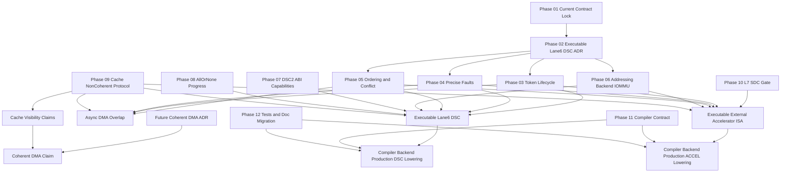

# Phase 13 - Dependency Graph And Execution Order

Status:
Planning dependency graph. Documentation only. Implementation-ready only after individual gates.

Scope:
Summarize what blocks executable lane6 DSC, async DMA, external accelerator ISA, cache/coherency claims, and compiler/backend lowering.

Current code evidence:
- Phase 3 Option A keeps lane6 DSC fail-closed.
- Phase 5 keeps L7-SDC model-only.
- Phase 6 backlog lists executable DSC, async overlap, executable fences, external accelerator ISA, global conflict hook, and cache/coherency as future features.
- Phase 12 traceability covers Ex1 phases 00-13 and remains the conformance/documentation migration gate.
- Corrected final recommendations in `Documentation\Stream WhiteBook\ExtentionsAnalytic_Audit.md` define TASK-001 through TASK-010 dependencies.

Architecture decision:
Future gates must execute in dependency order. Parser/model surfaces can be built earlier only if they are explicitly marked model-only or parser-only and do not change current ISA behavior.

This graph is a planning/documentation gate only. It does not approve executable DSC/L7/DSC2/coherent DMA or compiler/backend production lowering.

Dependency graph:

Non-goals:
- Do not treat the graph as implementation approval.
- Do not bypass gates because a downstream phase has useful model code.
- Do not merge cache visibility and coherent DMA; they are separate claims.

Required design gates:
Executable lane6 DSC is blocked by:
- phase 02 ADR;
- phase 03 token store and issue/admission;
- phase 04 precise retire faults;
- phase 05 ordering/conflict service;
- phase 06 explicit backend/addressing;
- phase 07 DSC2 descriptor/capability work for any DSC2 feature, with parser-only DSC2 remaining non-executable evidence;
- phase 08 all-or-none/progress contract;
- phase 09 non-coherent cache protocol;
- phase 11 compiler contract;
- phase 12 tests and migration.

Async DMA overlap is blocked by:
- token scheduler and completion model;
- conflict service;
- CPU load/store/atomic hooks;
- fence/wait/poll semantics;
- replay/squash/trap/context-switch cancellation;
- cache flush/invalidate protocol.

External accelerator ISA is blocked by:
- L7 ADR for `rd` or CSR publication;
- token/queue/backpressure model;
- backend dispatch and production device protocol;
- staged write commit/retire;
- precise faults;
- global conflict service;
- cache invalidation/flush;
- compiler/backend contract.

Cache/coherency claims are blocked by:
- non-coherent range flush/invalidate protocol;
- assist/SRF/prefetch invalidation;
- separate VLIW fetch invalidation;
- observer hooks for CPU/DMA/DSC/L7/atomic writes;
- future coherent-DMA ADR before any coherence claim.

Compiler/backend lowering is blocked by:
- executable DSC/L7 implementation;
- capability discovery;
- ordering/fence/wait/poll semantics;
- IOMMU/backend contract;
- cache protocol;
- conformance tests;
- compiler/backend conformance;
- documentation migration.

Downstream evidence non-inversion:
The following downstream surfaces must not satisfy upstream executable gates:
- parser-only DSC2 descriptors, capability grants, and normalized footprints;
- model token stores, retire observations, progress diagnostics, and helper/runtime tokens;
- L7 fake backend, capability registry, queue, fence, token, register ABI, and commit model APIs;
- IOMMU backend infrastructure, addressing resolver decisions, and no-fallback resolver tests;
- conflict/cache observers, passive conflict observations, and explicit non-coherent invalidation fan-out;
- compiler sideband emission, descriptor preservation, and carrier projection.

These surfaces may remain useful test/model evidence only when they are explicitly labeled parser-only, model-only, test-only, or sideband-only. They must not satisfy upstream executable gates.

Implementation plan:
Recommended order:
1. Preserve current contract and fail-closed tests.
2. Approve executable lane6 DSC ADR if the project chooses to proceed.
3. Implement token store and issue/admission.
4. Implement precise fault metadata and retire publication.
5. Implement backend/addressing resolver and no-fallback tests.
6. Implement conflict service and ordering litmus tests.
7. Implement non-coherent cache flush/invalidate protocol.
8. Add DSC2 parser/capability work as parser-only or after executable gates, depending on risk.
9. Enable executable lane6 DSC MVP behind feature gate.
10. Consider L7 read-only tier ADR, then full L7 only after shared token/order/cache foundations.
11. Enable compiler/backend lowering only after conformance and documentation migration.

Affected files/classes/methods:
This graph references the same surfaces as phases 01 through 12:
- lane6 DSC carrier, parser, runtime, token, token store, pipeline issue/retire;
- memory unit, atomics, DMA, StreamEngine, conflict service, cache/assist/SRF;
- burst backends and IOMMU;
- L7 carriers, register ABI, queues, fences, backends, commit model;
- compiler/backend and tests;
- documentation.

Testing requirements:
Use phase 12 as the gate. No downstream feature exits until its positive, negative, compatibility, conformance, and documentation claim-safety tests pass.

Phase13 guard coverage:
- `HybridCPU_ISE.Tests/tests/Ex1Phase13DependencyOrderTests.cs` verifies the graph names major future claims, keeps blockers explicit, rejects implementation approval, preserves Phase12 as migration gate, and prevents downstream evidence inversion.

Documentation updates:
Keep this dependency graph as the planning index. Any completed future feature must update the graph only after implementation and tests land.

Compiler/backend impact:
Compiler/backend production lowering is last-mile work. It must not be used as the forcing function for architecture behavior that is not yet implemented.

Compatibility risks:
Implementing out of order can create untestable claims: executable without precise faults, overlap without conflict service, IOMMU without authority binding, cache visibility without invalidation, or compiler lowering without runtime semantics.

Exit criteria:
- Dependencies are explicit.
- Blocking conditions are listed for each major future claim.
- Execution order does not contradict corrected final recommendations.

Blocked by:
No blocker for documentation. Implementation remains blocked by each phase-specific gate.

Enables:
A safe execution sequence for future HybridCPU-v2 DSC/L7/cache/compiler refactoring.
