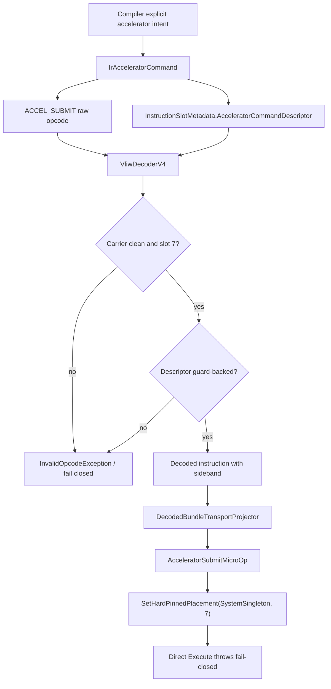

# Lane Placement And Carrier Flow

This is a carrier/projection flow. The terminal state is fail-closed direct
execution, not backend dispatch or architectural writeback.

## Code anchors

- `HybridCPU_Compiler/Core/IR/Model/IrAcceleratorModels.cs`
- `HybridCPU_Compiler/API/Threading/HybridCpuThreadCompilerContext.cs`
- `HybridCPU_Compiler/Core/IR/Bundling/HybridCpuBundleLowerer.cs`
- `HybridCPU_ISE/Core/Contracts/CompilerTransport/InstructionSlotMetadata.cs`
- `HybridCPU_ISE/Core/Decoder/VliwDecoderV4.cs`
- `HybridCPU_ISE/Core/Decoder/DecodedBundleTransportProjector.cs`
- `HybridCPU_ISE/Core/Pipeline/MicroOps/SystemDeviceCommandMicroOp.cs`
- `HybridCPU_ISE.Tests/tests/L7SdcHardPinnedPlacementTests.cs`
- `HybridCPU_ISE.Tests/tests/L7SdcInstructionTransportSidebandTests.cs`
