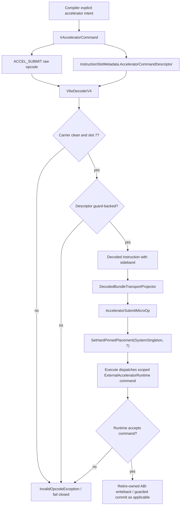

# Lane Placement And Carrier Flow

This is a carrier/projection flow for the current scoped L7 runtime contour.
Dirty carriers and missing descriptors fail closed; accepted carriers dispatch
only the implemented command surface, with register writeback and commit still
owned by runtime/retire rules.

## Code anchors

- `HybridCPU_Compiler/Core/IR/Model/IrAcceleratorModels.cs`
- `HybridCPU_Compiler/API/Threading/HybridCpuThreadCompilerContext.cs`
- `HybridCPU_Compiler/Core/IR/Bundling/HybridCpuBundleLowerer.cs`
- `HybridCPU_ISE/NonRTL/Core/Contracts/CompilerTransport/InstructionSlotMetadata.cs`
- `HybridCPU_ISE/CloseToRTL/Core/Frontend/Decode/VliwDecoderV4Bridge/VliwDecoderV4.cs`
- `HybridCPU_ISE/NonRTL/Core/Decoder/DecodedBundleTransportProjector.cs`
- `HybridCPU_ISE/CloseToRTL/Core/Pipeline/MicroOps/Lane7Accelerator/SystemDeviceCommandMicroOp.cs`
- `HybridCPU_ISE.Tests/tests/L7SdcHardPinnedPlacementTests.cs`
- `HybridCPU_ISE.Tests/tests/L7SdcInstructionTransportSidebandTests.cs`
