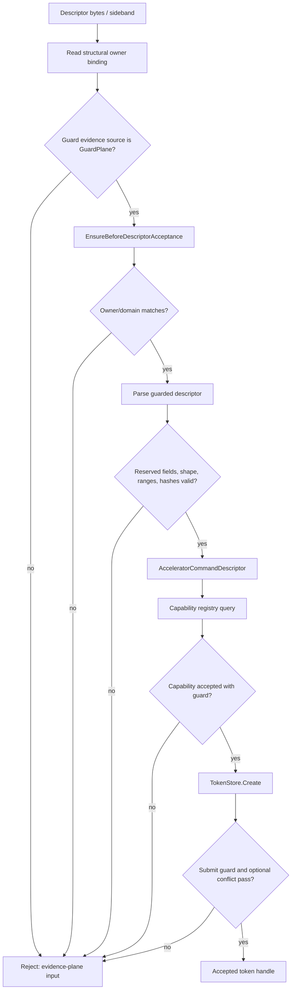

# Descriptor Authority Admission

This diagram is the explicit model admission contour. Token creation here is not
`ACCEL_SUBMIT` instruction execution and does not authorize production backend
dispatch, architectural `rd` writeback, or memory publication.

## Code anchors

- `HybridCPU_ISE/Core/Execution/ExternalAccelerators/Descriptors/AcceleratorDescriptorParser.cs`
- `HybridCPU_ISE/Core/Execution/ExternalAccelerators/Auth/AcceleratorOwnerDomainGuard.cs`
- `HybridCPU_ISE/Core/Execution/ExternalAccelerators/Capabilities/AcceleratorCapabilityRegistry.cs`
- `HybridCPU_ISE/Core/Execution/ExternalAccelerators/Tokens/AcceleratorTokenStore.cs`
- `HybridCPU_ISE/Core/Execution/ExternalAccelerators/Conflicts/ExternalAcceleratorConflictManager.cs`
- `HybridCPU_ISE.Tests/tests/L7SdcDescriptorParserTests.cs`
- `HybridCPU_ISE.Tests/tests/L7SdcCapabilityIsNotAuthorityTests.cs`
- `HybridCPU_ISE.Tests/tests/L7SdcOwnerDomainGuardTests.cs`
