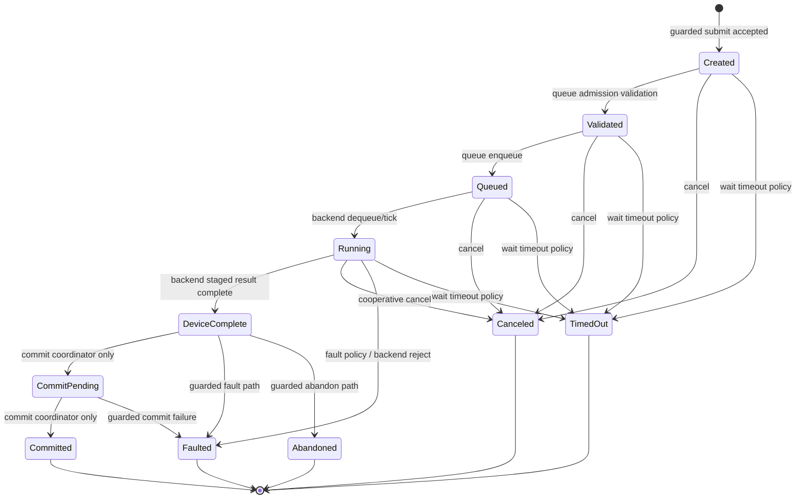

# Token Lifecycle

This is the L7-SDC token lifecycle used by the current scoped runtime contour.
`SystemDeviceCommandMicroOp.Execute(...)` can reach it through guarded submit,
poll, wait, cancel, fence, and status commands. `DeviceComplete`,
`CommitPending`, progress/status observations, and wait/poll results do not
publish memory by themselves; register writeback is conditional on the runtime
ABI result and carrier destination register.

## Code anchors

- `HybridCPU_ISE/NonRTL/Core/Execution/ExternalAccelerators/Tokens/AcceleratorToken.cs`
- `HybridCPU_ISE/NonRTL/Core/Execution/ExternalAccelerators/Tokens/AcceleratorTokenStore.cs`
- `HybridCPU_ISE/NonRTL/Core/Execution/ExternalAccelerators/Tokens/AcceleratorTokenStatusWord.cs`
- `HybridCPU_ISE/NonRTL/Core/Execution/ExternalAccelerators/Commit/AcceleratorCommitModel.cs`
- `HybridCPU_ISE.Tests/tests/L7SdcTokenLifecycleTests.cs`
- `HybridCPU_ISE.Tests/tests/L7SdcPollWaitCancelFenceTests.cs`
- `HybridCPU_ISE.Tests/tests/L7SdcCommitTests.cs`
