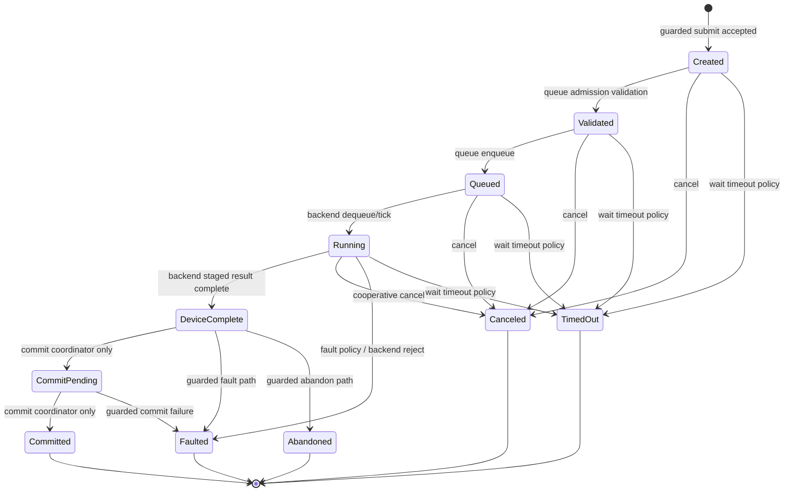

# Token Lifecycle

This is the explicit L7-SDC model token lifecycle. It is not reached by
`SystemDeviceCommandMicroOp.Execute(...)`, which remains fail-closed.
`DeviceComplete`, `CommitPending`, progress/status observations, and wait/poll
model results do not publish memory or architectural registers.

## Code anchors

- `HybridCPU_ISE/Core/Execution/ExternalAccelerators/Tokens/AcceleratorToken.cs`
- `HybridCPU_ISE/Core/Execution/ExternalAccelerators/Tokens/AcceleratorTokenStore.cs`
- `HybridCPU_ISE/Core/Execution/ExternalAccelerators/Tokens/AcceleratorTokenStatusWord.cs`
- `HybridCPU_ISE/Core/Execution/ExternalAccelerators/Commit/AcceleratorCommitModel.cs`
- `HybridCPU_ISE.Tests/tests/L7SdcTokenLifecycleTests.cs`
- `HybridCPU_ISE.Tests/tests/L7SdcPollWaitCancelFenceTests.cs`
- `HybridCPU_ISE.Tests/tests/L7SdcCommitTests.cs`
