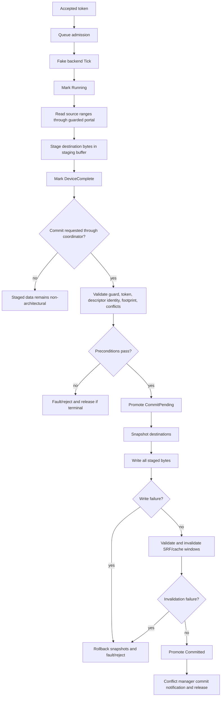

# Backend Staging Commit

This is the staged backend and commit contour behind the current scoped L7
runtime. `ACCEL_SUBMIT` admits and stages work; it does not directly publish
memory. Rejected commits do not publish current retire exceptions. Fake/test
backend completion, staged data, commit coordination, rollback, and SRF/cache
invalidation prove only the tested contour; they are not a universal production
protocol, pipeline retire publication model, or global coherency model.

## Code anchors

- `HybridCPU_ISE/NonRTL/Core/Execution/ExternalAccelerators/Backends/ExternalAcceleratorBackends.cs`
- `HybridCPU_ISE/NonRTL/Core/Execution/ExternalAccelerators/Memory/AcceleratorMemoryModel.cs`
- `HybridCPU_ISE/NonRTL/Core/Execution/ExternalAccelerators/Commit/AcceleratorCommitModel.cs`
- `HybridCPU_ISE/NonRTL/Core/Execution/ExternalAccelerators/Conflicts/ExternalAcceleratorConflictManager.cs`
- `HybridCPU_ISE.Tests/tests/L7SdcBackendTests.cs`
- `HybridCPU_ISE.Tests/tests/L7SdcCommitTests.cs`
- `HybridCPU_ISE.Tests/tests/L7SdcRollbackTests.cs`
- `HybridCPU_ISE.Tests/tests/L7SdcSrfCacheInvalidationTests.cs`
