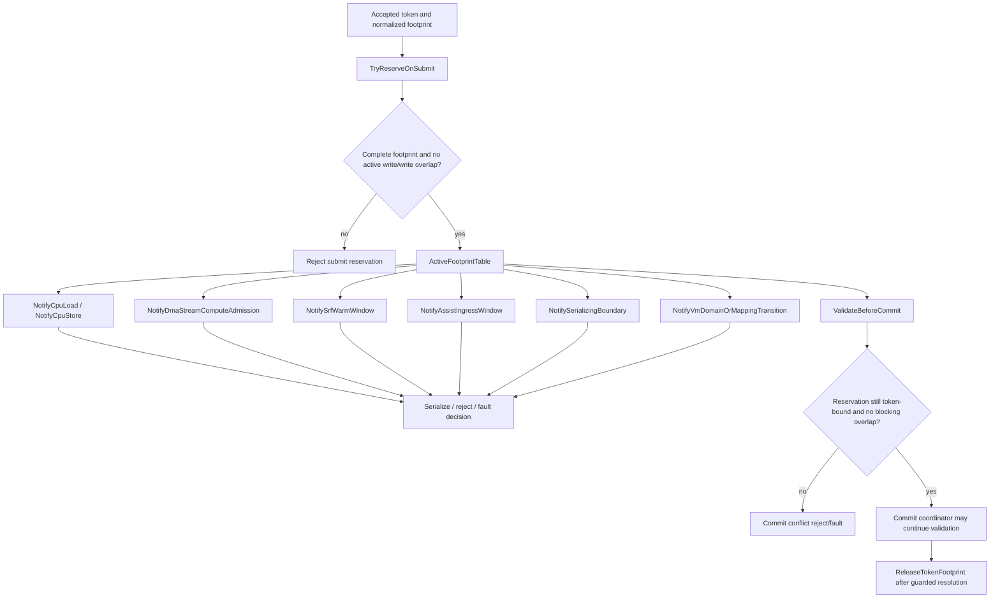

# Conflict Manager

This diagram describes an explicit conflict-manager model instance. It is not a
global CPU load/store hook and does not publish memory by itself.
It is absent/passive current evidence under Ex1 Phase05, not an installed global
conflict authority for executable overlap.

## Code anchors

- `HybridCPU_ISE/Core/Execution/ExternalAccelerators/Conflicts/ExternalAcceleratorConflictManager.cs`
- `HybridCPU_ISE/Core/Execution/ExternalAccelerators/Commit/AcceleratorCommitModel.cs`
- `HybridCPU_ISE/Core/Execution/ExternalAccelerators/Fences/AcceleratorFenceModel.cs`
- `HybridCPU_ISE.Tests/tests/L7SdcConflictManagerTests.cs`
- `HybridCPU_ISE.Tests/tests/L7SdcDmaStreamComputeConflictTests.cs`
- `HybridCPU_ISE.Tests/tests/L7SdcSrfAssistConflictTests.cs`
