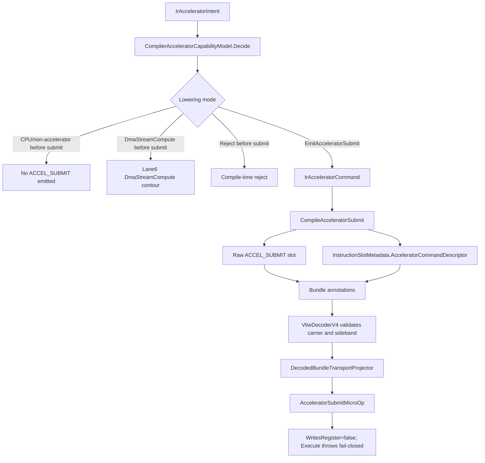

# Compiler To ISE Transport

This diagram shows sideband preservation and carrier projection. It is not
production executable lowering; Phase11/Phase12/Phase13 keep production lowering
last-mile and gated by executable semantics plus conformance.

Emitted sideband does not make `ACCEL_SUBMIT` executable and does not create
architectural `rd` writeback in the current implementation.

## Code anchors

- `HybridCPU_Compiler/Core/IR/Model/IrAcceleratorModels.cs`
- `HybridCPU_Compiler/API/Threading/HybridCpuThreadCompilerContext.cs`
- `HybridCPU_Compiler/Core/IR/Bundling/HybridCpuBundleLowerer.cs`
- `HybridCPU_ISE/Core/Contracts/CompilerTransport/InstructionSlotMetadata.cs`
- `HybridCPU_ISE/Core/Decoder/VliwDecoderV4.cs`
- `HybridCPU_ISE/Core/Decoder/DecodedBundleTransportProjector.cs`
- `HybridCPU_ISE.Tests/CompilerTests/L7SdcCompilerPhase12Tests.cs`
