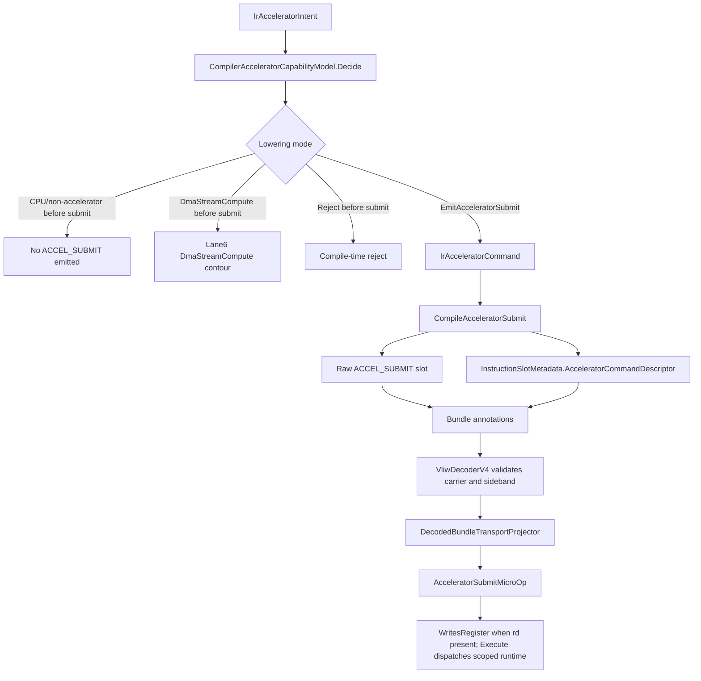

# Compiler To ISE Transport

This diagram shows sideband preservation and carrier projection into the current
scoped L7 runtime contour. It is not broad production executable lowering;
compiler/backend, documentation migration, and dependency-order gates keep
production lowering beyond the tested commands last-mile and gated by executable
semantics plus conformance.

Emitted sideband admits only the current guarded SDC1 submit contour. It does
not create unconditional architectural `rd` writeback, arbitrary backend
execution, or production compiler/backend lowering.

## Code anchors

- `HybridCPU_Compiler/Core/IR/Model/IrAcceleratorModels.cs`
- `HybridCPU_Compiler/API/Threading/HybridCpuThreadCompilerContext.cs`
- `HybridCPU_Compiler/Core/IR/Bundling/HybridCpuBundleLowerer.cs`
- `HybridCPU_ISE/NonRTL/Core/Contracts/CompilerTransport/InstructionSlotMetadata.cs`
- `HybridCPU_ISE/CloseToRTL/Core/Frontend/Decode/VliwDecoderV4Bridge/VliwDecoderV4.cs`
- `HybridCPU_ISE/NonRTL/Core/Decoder/DecodedBundleTransportProjector.cs`
- `HybridCPU_ISE.Tests/CompilerTests/L7SdcCompilerPhase12Tests.cs`
