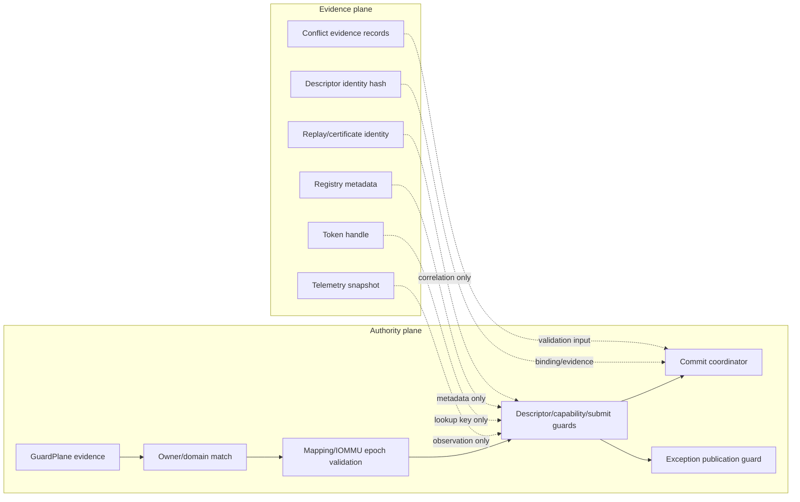

# Telemetry Evidence Not Authority

This diagram is the Ex1 non-inversion rule in L7 form: evidence can explain or
bind model decisions, but it cannot satisfy upstream executable gates.

## Code anchors

- `HybridCPU_ISE/Core/Execution/ExternalAccelerators/Auth/AcceleratorOwnerDomainGuard.cs`
- `HybridCPU_ISE/Core/Execution/ExternalAccelerators/Telemetry/AcceleratorTelemetry.cs`
- `HybridCPU_ISE/Core/Execution/ExternalAccelerators/Tokens/AcceleratorTokenHandle.cs`
- `HybridCPU_ISE/Core/Execution/ExternalAccelerators/Capabilities/AcceleratorCapabilityRegistry.cs`
- `HybridCPU_ISE/Core/Execution/ExternalAccelerators/Commit/AcceleratorCommitModel.cs`
- `HybridCPU_ISE.Tests/tests/L7SdcEvidenceIsNotAuthorityTests.cs`
- `HybridCPU_ISE.Tests/tests/L7SdcTelemetryTests.cs`
- `HybridCPU_ISE.Tests/tests/L7SdcCapabilityIsNotAuthorityTests.cs`
