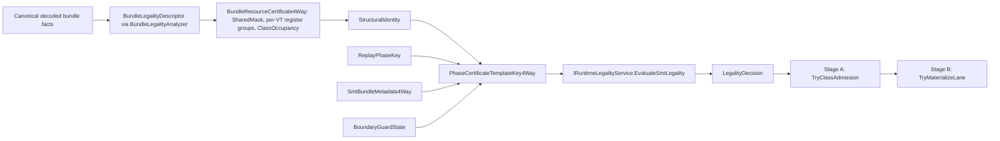

# Certificate Semantics and Legality Evidence

## Goal of this chapter

This chapter closes the paper-facing certificate story for the active typed-slot SMT path. It explains how decoded bundle facts become a legality descriptor, how runtime certificates carry structural identity, and how replay reuse is admitted without reverting to a mask-first explanation.

The goal is not to make raw masks disappear from implementation. Raw masks remain useful storage primitives. The architectural claim is narrower and stronger: reviewer-facing legality should be explained through descriptors, certificates, structural identity, and `LegalityDecision`, not raw mask layout.

## Paper-facing legality descriptor

`BundleLegalityDescriptor` is the paper-facing legality descriptor for one decoded bundle. It is produced by `BundleLegalityAnalyzer` from canonical decode output and intentionally excludes cluster issue preparation, narrow-vs-wide admission preparation, and scheduler-local artifacts.

It carries:

- bundle address and serial identity;
- occupied and empty slot masks as bundle-local occupancy facts;
- `DecodedBundleTypedSlotFacts`;
- per-slot `DecodedSlotLegality`;
- optional `DecodedBundleDependencySummary`;
- decode-fault state when canonical decode failed and the runtime continues through the fallback materializer contour.

This descriptor is not the final runtime decision maker. It is the decoded-bundle legality evidence surface that feeds later runtime legality. The final active typed-slot SMT decision remains a `LegalityDecision` returned through `IRuntimeLegalityService`.

## Runtime certificate semantics

`BundleResourceCertificate4Way` is the active SMT runtime certificate substrate. Its fields should be described by their legality role:

- `SharedMask` carries shared non-register resource state;
- `RegMaskVT0..RegMaskVT3` carry per-VT register-group hazard state;
- `ClassOccupancy` carries typed-slot class occupancy state;
- `StructuralIdentity` carries the opaque replay/template compatibility identity.

The important review rule is: the certificate may store masks, but the repository-facing semantics are certificate identity and legality authority, not raw mask layout. `StructuralIdentity` is the canonical comparison seam for replay/template compatibility.

`BundleResourceCertificateIdentity4Way` folds the legality-relevant certificate shape into:

- structural bundle shape;
- packed class vector;
- lane topology signature;
- compact resource profile;
- operation count.

That identity is not a flat hazard hash. `BundleResourceCertificateIdentity4Way.Create(...)` incorporates `SharedMask` together with `RegMaskVT0..VT3`, so replay/template compatibility preserves the distinction between shared structural state and per-VT register-group state.

That identity dominates ad hoc mask peeking in the active scheduler story.

## Legality evidence chain

The diagram is intentionally staged. Decoded facts and descriptors are evidence.
Certificates are runtime-local legality witnesses inside the checker-owned
service, and `LegalityDecision` is the active checker-owned verdict surface.
Stage B only materializes a lane after Stage A has admitted the candidate.

## Replay-aware legality reuse

For the active SMT path, replay reuse is keyed by `PhaseCertificateTemplateKey4Way`, which combines:

- `ReplayPhaseKey`;
- `BundleResourceCertificate4Way.StructuralIdentity`;
- `SmtBundleMetadata4Way`;
- `BoundaryGuardState`.

This is the reusable legality envelope. A replay witness can be reused only
when the live template key matches. If the key does not match, the legality
service falls back to the current structural witness rather than treating stale
replay evidence as authoritative.

Invalidation is also part of the evidence story. `InvalidatePhaseMismatch(...)`, `RefreshSmtAfterMutation(...)`, and `ReplayPhaseInvalidationReason` keep cache reuse observable and bounded by concrete invalidation causes. Determinism claims should therefore stay inside this replay/evidence envelope.

## What this chapter is not claiming

This chapter does not claim that:

- raw masks are absent from implementation;
- compiler hints outrank runtime legality;
- typed-slot facts are already mandatory for canonical execution;
- replay evidence is a hardware-rooted security proof;
- Stage B can reopen or widen Stage A legality.

Runtime legality remains the authority. Witness semantics explain why the
runtime decision is allowed to reuse or reject structural evidence; they do not
replace the runtime decision.

## What is authoritative in code

Primary authority sources:

- `HybridCPU_ISE/Core/Legality/BundleLegalityAnalyzer.cs`
- `HybridCPU_ISE/Core/Legality/BundleLegalityDescriptor.cs`
- `HybridCPU_ISE/Core/Legality/DecodedSlotLegality.cs`
- `HybridCPU_ISE/Core/Pipeline/Certificates/BundleResourceCertificate4Way.cs`
- `HybridCPU_ISE/Core/Pipeline/Certificates/ReplayPhaseSubstrate.Interfaces.cs`
- `HybridCPU_ISE/Core/Pipeline/Certificates/ReplayPhaseSubstrate.Implementations.cs`
- `HybridCPU_ISE/Core/Pipeline/Safety/SafetyVerifier.SmtLegality.cs`
- `HybridCPU_ISE/Core/Pipeline/Safety/SafetyVerifier.RuntimeLegality.cs`
- `HybridCPU_ISE/Core/Pipeline/Scheduling/MicroOpScheduler.Admission.cs`

Representative proof surfaces:

- `HybridCPU_ISE.Tests/tests/Phase09CertificateSemanticsDocumentationTests.cs`
- `HybridCPU_ISE.Tests/tests/Phase09LegalityPredicateDocumentationTests.cs`
- `HybridCPU_ISE.Tests/tests/Phase09RuntimeLegalityServiceReachabilityProofTests.cs`
- `HybridCPU_ISE.Tests/tests/Phase09SafetyVerifierGuardMatrixProofTests.cs`
- `HybridCPU_ISE.Tests/tests/Phase09ReplayCertificateCoordinatorProofTests.cs`

## Current limitations

- This chapter closes the certificate/evidence explanation for Phase 02, but the wider machine-state tuple and cycle-step relation live in `Documentation/operational-semantics.md`.
- The active runtime remains simulated ISE code; proof signing is simulated scaffolding, not a hardware-rooted attestation path.
- Inter-core compatibility legality surfaces still exist and should not be mistaken for the active typed-slot SMT mainline.

## Open questions / future work

- Decide whether future external publication should render the legality evidence diagram as a stable figure asset.
