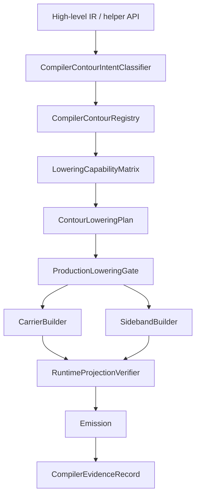

# Архитектурный аудит компилятора HybridCPU-v2 и план его рефакторинга

## Диагноз и основные инварианты

Текущий компилятор HybridCPU-v2 верифицируется не как полноценный production-backend семантического понижения, а как **слой carrier-building, sideband-transport, typed-helper emission и compiler/runtime handoff**, поверх которого окончательная допустимость, проекция, токенизация, публикация памяти и публикация регистров принадлежат времени исполнения. Это прямо видно из корневого `README.md`, где зафиксированы native VLIW-only frontend, фиксированная машина `W=8`, 4-way SMT, typed-slot scheduling в два этапа, `LegalityDecision`/`LegalityAuthoritySource`, sideband как отдельный канал от raw carrier, а также текущая репозитарная классификация на current, helper-only, parser-only, future-gated и rejected поверхности. fileciteturn4file0L11-L19 fileciteturn4file0L24-L39 fileciteturn5file0L1-L17

Критический инвариант репозитория состоит в **неинверсии**: носитель не равен исполнению, sideband не равен production lowering, дескриптор не равен командному успеху, токен не равен публикации памяти, а телеметрия, replay-отпечатки, сертификаты и parser acceptance не равны полномочию. Этот же принцип повторён в WhiteBook по compiler/runtime contract, в Stream WhiteBook и в Virtualization/SecureCompute WhiteBook. fileciteturn7file0L10-L38 fileciteturn100file0L71-L75 fileciteturn70file0L43-L50 fileciteturn74file0L37-L45 fileciteturn80file0L44-L55

Ниже — сжатая классификация состояния компилятора.

| Категория | Что подтверждено | Статус |
|---|---|---|
| Реально работает | native VLIW pipeline, fixed 8-slot / 256-byte bundle carrier, typed-slot preflight, descriptor sideband publication for DSC/L7, positive helper emission for `MTILE_*` и `VLOAD/VSTORE`, scoped DSC1 runtime contour, scoped L7 `ACCEL_*` contour | current / executable in bounded contours fileciteturn87file0L20-L28 fileciteturn92file0L36-L95 fileciteturn139file0L37-L98 fileciteturn90file0L52-L114 fileciteturn133file0L5-L18 fileciteturn60file0L12-L20 |
| Частично работает | compiler-side typed-slot facts emitting/validation, но runtime mainline остаётся в режиме `ValidationOnly`; есть bounded scheduler fallback по размеру программы, но это fallback алгоритма расписания, а не скрытое contour-lowering | current, но требует терминологической очистки fileciteturn82file0L83-L94 fileciteturn84file0L98-L101 fileciteturn95file0L91-L101 fileciteturn92file0L55-L67 |
| Helper-only | `StreamEngine`, `VectorALU`, `BurstIO`, SRF, compiler helper ABI вокруг MTILE и vector transfer — как транспорт/typed ingress, но не как самостоятельное полномочие исполнения или публикации | helper-only / transport-only fileciteturn100file0L16-L27 fileciteturn101file0L23-L42 fileciteturn102file0L37-L46 fileciteturn103file0L19-L40 fileciteturn104file0L26-L33 fileciteturn105file0L35-L47 |
| Parser-only | DSC2, часть VMX compatibility inventory, многие vector/mask/advanced contours вне открытых helper ABI; parser awareness не открывает execution | parser-only / fail-closed beyond admitted slices fileciteturn133file0L54-L62 fileciteturn74file0L35-L45 fileciteturn5file0L8-L17 |
| Future-gated | production DSC lowering, production L7 backend protocol, successful VMX backend execution, secure backend execution, controlled secure compiler emission, FP4/quantized LLM matmul path | future-gated / не доказано для current mainline fileciteturn140file0L105-L120 fileciteturn76file0L77-L90 fileciteturn79file0L9-L15 fileciteturn80file0L17-L25 fileciteturn70file0L29-L35 |
| Должно оставаться запрещённым | hidden fallback после runtime rejection; смешение MatrixTile с VectorALU/DSC/L7; смешение DSC со `StreamEngine`; VMX compatibility как backend authority; SecureCompute policy как secure execution | rejected / fail-closed fileciteturn59file0L33-L38 fileciteturn106file0L33-L42 fileciteturn104file0L28-L33 fileciteturn74file0L53-L76 fileciteturn81file0L5-L10 |

В сжатом виде частные диагнозы таковы. **VMX** в текущем дереве — frozen compatibility frontend и projection layer, а не production backend virtualization. **SecureCompute** — policy/admission/evidence hardening without backend execution or retire publication. **MatrixTile** — положительный typed helper ABI для ровно четырёх инструкций (`MTILE_LOAD`, `MTILE_STORE`, `MTILE_MACC`, `MTRANSPOSE`), но не общий matrix compiler, не universal GEMM и не FP4/LLM path. **DmaStreamCompute** — есть descriptor carrier и bounded DSC1 runtime contour, но production compiler/backend lowering ещё ограждён capability gate. **L7-SDC** — есть explicit accelerator intent и scoped `ACCEL_SUBMIT`/`ACCEL_*`, но нет universal accelerator compiler и production backend protocol. fileciteturn60file0L12-L20 fileciteturn80file0L17-L25 fileciteturn121file0L19-L25 fileciteturn133file0L5-L18 fileciteturn59file0L33-L38

## Карта текущего компилятора и граница полномочий

### Карта слоёв, файлов и интерфейсов

| Layer / file / API | Роль | Вход | Выход | Authority | Carrier | Sideband | Может имплицировать execution | Может имплицировать production lowering | Текущий статус |
|---|---|---|---|---|---|---|---|---|---|
| `CompilerContract` | версия контракта, typed-slot staging, declared compiler/runtime handshake | версия и компиляторные policy flags | versioned contract surface | нет, только декларация | нет | нет | нет | нет | current handshake surface fileciteturn9file0L11-L24 |
| `Processor.CompilerBridge` | runtime-side хранение compiler contract version, emitted facts, agreement summary | compiled program metadata | handshake/evidence storage | нет, authority остаётся у runtime legality | нет | да, как diagnostics/evidence | нет | нет | current bridge/evidence surface fileciteturn10file0L17-L55 fileciteturn10file0L95-L139 |
| `HybridCpuThreadCompilerContext` | пользовательская точка сборки carrier, helper APIs, cached canonical compile | helper ABI / raw op API | instruction buffer, annotations, compiled program | нет | да | да | нет | нет | current compiler entrypoint fileciteturn11file0L17-L47 fileciteturn11file0L144-L182 fileciteturn91file0L9-L23 |
| `HybridCpuCanonicalCompiler` | canonical pipeline: IR → schedule → bundling → agreement → lowering → serialization → optional memory emission | raw instructions + annotations | `HybridCpuCompiledProgram` + program image | нет, но публикует structural evidence | да | да, для descriptor-backed bundles | нет | нет | production entrypoint for carrier generation, not runtime authority fileciteturn92file0L12-L15 fileciteturn92file0L36-L95 |
| `InstructionSlotMetadata` | typed per-slot transport for VT/placement/descriptor sideband | IR annotation / slot metadata | slot sideband | нет | нет | да | нет | нет | current transport/evidence surface fileciteturn9file0L15-L23 fileciteturn15file0L13-L22 |
| `TypedSlotBundleFacts` | compiler/runtime structural agreement vocabulary | materialized bundle | class counts, per-slot class, pinning mask | нет | нет | да, как structural facts | нет | нет | current validation surface; not mandatory for correctness yet fileciteturn82file0L83-L94 fileciteturn95file0L8-L18 fileciteturn95file0L91-L101 |
| `IrAdmissibilityAgreement` | compiler-side structural admissibility summary | bundle admission results | agreement counters and classifications | нет | нет | да | нет | нет | current preflight summary, runtime does not lose final authority fileciteturn14file0L5-L24 fileciteturn109file0L10-L18 |
| `CompilerBackendLoweringContract` | production-lowering gate for DSC/L7 | capability state + requirements | allow/reject decision | частично: authority only over compiler claim classification, not runtime execution | нет | нет | нет | да, но только как gate evaluator | current anti-overclaim contract fileciteturn140file0L8-L16 fileciteturn140file0L143-L217 fileciteturn141file0L3-L10 |
| `CompilerMatrixTileEmissionLowerer` | typed helper lowering for four MTILE ops with runtime round-trip validation | MTILE helper request | direct MTILE carrier + runtime projection/materialization evidence | нет | да | нет | нет | нет | current scoped helper emission only fileciteturn117file0L14-L20 fileciteturn117file0L52-L79 |
| `IrAcceleratorIntent` + `CompilerAcceleratorCapabilityModel` | contour intent for L7 external accelerator lowering decision | semantic accelerator request + capability model | pre-submit decision and, when admitted, `ACCEL_SUBMIT` carrier | нет | да | да, descriptor sideband | нет | нет | current bounded pre-submit chooser fileciteturn58file0L5-L25 fileciteturn63file0L33-L40 fileciteturn63file0L172-L209 |
| DSC descriptor parser/emitter | structural parse/validation of `DSC1`, sideband preservation, runtime handoff | descriptor bytes / typed descriptor | parsed descriptor / validation result | нет | для compiler — только через dedicated carrier | да | нет | нет | descriptor-preservation + scoped runtime contour fileciteturn42file0L16-L31 fileciteturn133file0L16-L18 |
| VMX projection layer | compatibility decode/projection/no-emission gate | VMX-compatible payload | projection, deny, or compatibility result | нет | нет как backend emission authority | да, как compatibility metadata | нет | нет | compatibility-only / fail-closed backend absence fileciteturn74file0L35-L59 fileciteturn76file0L9-L21 |
| SecureCompute policy/admission layer | policy/admission/evidence contour | policy descriptors, visibility, domain, buffer rules | admission/evidence outcome | нет as backend owner | нет | да, как policy evidence | нет | нет | policy/admission only; secure emission closed fileciteturn80file0L17-L25 fileciteturn81file0L11-L25 |

### Компиляторная граница полномочий

Компилятор **может** объявить версию контракта, собрать raw carrier, вложить sideband, эмитировать typed-slot facts, запросить semantic intent и выполнить pre-submit выбор между допустимыми contour-путями до runtime admission. Компилятор **не может** переопределить runtime legality, породить полноценный runtime token как архитектурное доказательство, опубликовать память, опубликовать `rd`, опубликовать `MatrixRegisterFile`, превратить parser success или projection success в execution, а также скрыть runtime rejection за внутренним fallback. Это буквально согласовано в compiler/runtime contract, typed-slot documentation, stream whitebook и backend-lowering contract. fileciteturn7file0L10-L38 fileciteturn84file0L9-L21 fileciteturn100file0L71-L75 fileciteturn140file0L175-L217

| Compiler artifact | Evidence | Authority | Can execute | Can allocate token | Can publish memory | Can write `rd` | Can retire | Примечание |
|---|---|---|---|---|---|---|---|---|
| raw `VLIW_Instruction` / `VLIW_Bundle` | да | нет | нет | нет | нет | нет | нет | carrier only; scheduler policy not encoded in payload fileciteturn87file0L9-L18 fileciteturn87file0L147-L156 |
| `TypedSlotBundleFacts` | да | нет | нет | нет | нет | нет | нет | validation/agreement surface; current mode `ValidationOnly` fileciteturn95file0L91-L101 fileciteturn13file0L15-L29 |
| `InstructionSlotMetadata` | да | нет | нет | нет | нет | нет | нет | transport for placement and descriptors fileciteturn15file0L13-L22 |
| DSC descriptor sideband | да | нет | нет | нет | нет | нет | нет | descriptor preserved; runtime validation and token remain final authority fileciteturn133file0L16-L18 |
| L7 descriptor sideband | да | нет | нет | нет | нет | нет | нет | descriptor alone cannot publish `rd` or backend success fileciteturn70file0L43-L50 |
| MatrixTile helper descriptor/policy ABI | да | нет | нет | нет | нет | нет | нет | helper ABI round-trips through runtime MTILE legality, but does not itself confer execution authority fileciteturn117file0L52-L79 |
| VMX payload / projection | да | нет | нет | нет | нет | нет | нет | recognition/projection are not backend execution or publication fileciteturn74file0L37-L59 |
| SecureCompute policy result | да | нет | нет | нет | нет | нет | нет | policy accepted ≠ secure backend execution ≠ retire publication fileciteturn80file0L22-L25 fileciteturn81file0L25-L44 |
| compiler capability model | да | нет | нет | нет | нет | нет | нет | guides pre-submit choice only; cannot assert runtime success fileciteturn63file0L172-L209 |
| production lowering contract | да | частично, как claim-gate | нет | нет | нет | нет | нет | blocks overclaiming descriptor/parser/model/token evidence as production lowering fileciteturn140file0L143-L217 |

### Актуальная таксономия intent

Ниже предлагается repository-faithful таксономия, которая не смешивает carrier shape и semantic owner.

| Intent | Semantic owner | Legal lowering target | Required sideband | Runtime authority | Allowed status | Forbidden fallback |
|---|---|---|---|---|---|---|
| `Scalar` | scalar ISA/runtime contour | direct scalar carrier | нет | runtime legality + retire | current fileciteturn92file0L36-L95 | — |
| `BranchControl` | branch/control contour | lane7 `BranchControl` carrier | нет | runtime legality + retire | current fileciteturn82file0L21-L33 | not `SystemSingleton` alias |
| `LsuMemory` | ordinary load/store contour | lane4-5 LSU carrier | нет | runtime legality + commit/retire | current fileciteturn101file0L11-L19 | not MTILE/DSC |
| `Vector` | vector execution contour | vector carrier or typed helper ABI for `VLOAD/VSTORE` | shape ABI for helper rows | runtime legality + vector retire | current in bounded slices fileciteturn89file0L188-L225 fileciteturn90file0L54-L114 | not MatrixTile fallback fileciteturn104file0L28-L33 |
| `StreamTransport` | `StreamEngine` orchestration | helper/runtime ingress only | `StreamExecutionRequest` facts | runtime stream ingress | helper-only fileciteturn105file0L5-L18 | not DSC / not L7 / not MTILE authority fileciteturn105file0L35-L47 |
| `MatrixTileLocal` | MatrixTile runtime contour | direct `MTILE_*` carrier through typed helper ABI | tile descriptor + memory/policy ABI | runtime MTILE legality + retire publication | current for four rows only fileciteturn121file0L19-L25 fileciteturn130file0L7-L16 | no `VectorALU`, no DSC, no L7 fileciteturn130file0L31-L32 fileciteturn104file0L31-L33 |
| `DscStreamCompute` | DSC runtime contour | `DmaStreamCompute` lane6 carrier + typed descriptor sideband | DSC descriptor | runtime parser/guard/token/commit | current only for scoped DSC1 contour fileciteturn133file0L20-L31 | no `StreamEngine`, no VectorALU, no MatrixTile, no L7 fileciteturn133file0L54-L62 |
| `L7ExternalAccelerator` | lane7 system-device contour | `ACCEL_*` carrier + typed descriptor sideband | `AcceleratorCommandDescriptor` for submit | runtime guard/token/register ABI/commit | current in bounded command contour fileciteturn60file0L12-L20 fileciteturn61file0L23-L45 | no DSC fallback, no legacy custom accelerator fallback fileciteturn60file0L39-L58 fileciteturn65file0L13-L21 |
| `VirtualizationCompat` | compatibility frontend | projection-only / no-emission gate | compatibility payload | neutral runtime owner, when any admitted slice exists | compatibility-only fileciteturn74file0L35-L59 | never VMX backend execution fileciteturn75file0L61-L72 |
| `SecureComputePolicy` | secure policy/admission contour | policy/admission/evidence only | policy descriptor/evidence | secure runtime policy owners | bounded policy current | never secure backend execution or retire publication fileciteturn80file0L22-L25 |
| `Assist` | non-retiring warming contour | non-architectural assist carrier | optional helper metadata | runtime assist policy | current as non-publication path fileciteturn106file0L48-L53 | not vector/DSC/MTILE/L7 authority |
| `Reject` | compiler boundary | no emission | optional diagnostics | runtime or compiler boundary | current | no hidden fallback |

## Матрица текущих lowering-путей

| Source intent | Current compiler API | Carrier | Sideband | Runtime projection | Runtime execution | Commit / retire publication | Production lowering status | Main blockers |
|---|---|---|---|---|---|---|---|---|
| scalar ALU | `CompileInstruction(...)` | direct scalar opcode | none | direct decode/classification | yes | retire-owned scalar publication | current | — fileciteturn92file0L45-L95 |
| load/store | `CompileInstruction(...)` | direct LSU opcode | none | direct decode | yes | commit/retire according to memory contour | current bounded ISA | broader cache/TLB/coherency contours remain gated fileciteturn86file0L83-L94 |
| vector elementwise | raw vector carrier through native VLIW frontend | direct vector opcode | none | `StreamExecutionRequest` ingress | yes for admitted vector families | vector retire path | partial/current | unsupported stream-control forms fail closed fileciteturn114file0L79-L93 fileciteturn105file0L31-L33 |
| stream movement | `CompileVload` / `CompileVstore` helper ABI | direct `VLOAD` / `VSTORE` carrier | typed shape ABI at compile time; no runtime descriptor sideband | runtime vector transfer micro-op projection | yes | memory-visible vector publication | current scoped helper emission | no gather/scatter/segment promotion by alias fileciteturn89file0L188-L225 fileciteturn90file0L77-L91 |
| `MTILE_LOAD` | `CompileMtileLoad` | direct `MTILE_LOAD` | no descriptor sideband; helper ABI only | MTILE runtime IR projection + materialization | yes | retire publishes tile image | current scoped helper emission | canonical descriptor, default page size, non-empty shape, stride fit in 13 bits fileciteturn117file0L52-L79 fileciteturn117file0L200-L216 fileciteturn118file0L142-L156 |
| `MTILE_STORE` | `CompileMtileStore` | direct `MTILE_STORE` | helper ABI | MTILE runtime projection | yes | retire-owned all-or-none memory commit | current scoped helper emission | same transport/shape limits; no generic StreamEngine write authority fileciteturn132file0L22-L30 fileciteturn132file0L39-L46 |
| `MTILE_MACC` | `CompileMtileMacc` | direct `MTILE_MACC` | accumulator policy ABI | MTILE runtime projection | yes | accumulator tile publishes only at retire | current scoped helper emission | integer source type only; runtime widening accumulator policy only; not universal GEMM fileciteturn118file0L18-L56 fileciteturn120file0L90-L121 |
| `MTRANSPOSE` | `CompileMtranspose` | direct `MTRANSPOSE` | transpose policy ABI | MTILE runtime projection | yes | destination tile publishes only at retire | current scoped helper emission | exact alias policy required; no vector transpose fallback fileciteturn118file0L58-L89 fileciteturn120file0L124-L141 |
| DSC1 `Copy/Add/Mul/Fma/Reduce` | `CompileDmaStreamCompute(...)` | lane6 `DmaStreamCompute` carrier | DSC descriptor sideband | descriptor parse + guard + token | yes in DSC1 scoped contour | token enters `CommitPending`; guarded all-or-none commit | not production lowering | executable carrier+backend address space+queue/token/fence+order/cache/fault+staged commit gate must all be explicit for production claim fileciteturn133file0L20-L31 fileciteturn140file0L105-L112 |
| `ACCEL_SUBMIT` | `CompileAcceleratorSubmit(...)` | lane7 `ACCEL_SUBMIT` | typed accelerator descriptor sideband | descriptor/guard/capability projection | yes in scoped contour | token handle/register ABI; memory only through later guarded commit path | not production lowering | result publication, backend protocol, queue/token/fence, virtual handle contract, staged commit boundary fileciteturn63file0L27-L40 fileciteturn61file0L62-L76 fileciteturn140file0L113-L120 |
| `ACCEL_POLL` and related `ACCEL_*` | no raw direct emission; command family executed in runtime contour | lane7 `ACCEL_*` carriers | descriptor required only for submit | guarded runtime observation/control path | yes for bounded Phase 08 / 08A path | conditional register ABI; guarded memory commit only via coordinator/fence policy | not production backend protocol | same L7 blockers as above; descriptorless submit remain fail-closed fileciteturn60file0L12-L20 fileciteturn61file0L23-L45 |
| VMX compatibility opcode | compatibility decode/projection boundary | compatibility vocabulary only | compatibility payload | projection/deny | no backend execution admitted | no retire publication unless neutral route/fence opened, which is not current | no-emission / compatibility-only | absent neutral owner/backend/publication fence for backend success fileciteturn74file0L53-L76 fileciteturn76file0L77-L93 |
| SecureCompute policy request | policy/admission layer | no backend carrier in current compiler | policy and evidence metadata | policy projection/admission | no secure backend execution | no completion/retire publication | no-emission for execution | backend owner RFC, completion path, retire path, release gate fileciteturn80file0L17-L25 fileciteturn79file0L9-L15 |
| FP4 / quantized LLM matmul | не доказано | — | — | — | — | — | future-gated / should remain closed | repo-backed L7 descriptor ABI today admits only `Float32`, `Float64`, `Int32`; current MatrixTile helper proof covers no FP4 path fileciteturn70file0L22-L35 |
| unsupported accelerator | explicit accelerator intent may choose pre-submit CPU/non-accelerator path | no `ACCEL_SUBMIT` emitted | none | none | none | none | rejected / pre-submit reroute only | post-submit fallback forbidden fileciteturn63file0L172-L209 fileciteturn65file0L50-L70 |

## Аудит специальных контуров

### MatrixTile

MatrixTile в текущем репозитории — **не пустой**, но и **не общий матричный backend**. Положительный helper ABI открыт только для четырёх инструкций: `MTILE_LOAD`, `MTILE_STORE`, `MTILE_MACC`, `MTRANSPOSE`. Контракт явно отмечает: helper rows эмитируют **direct MatrixTile opcodes**, runtime legality остаётся финальной, alias promotion запрещён, fallback запрещён, а legacy optional-disabled contract не считается authority для положительного helper emission. fileciteturn121file0L17-L25 fileciteturn121file0L47-L61

При этом MatrixTile остаётся отдельной execution plane: memory-path (`MTILE_LOAD`/`MTILE_STORE`) владеет `MatrixTileMemory` и lane6 `MatrixTileStreamClass`, compute-path (`MTILE_MACC`/`MTRANSPOSE`) владеет `MatrixTileCompute`, а архитектурное tile state принадлежит `MatrixTileArchitecturalTileRegisterFile`; публикация результата совершается на retire, а не на execute, not on SRF, not on StreamEngine completion. fileciteturn130file0L17-L26 fileciteturn131file0L7-L14 fileciteturn131file0L18-L27 fileciteturn132file0L11-L30

| Instruction | Compiler helper | Carrier emitted | Descriptor emitted | Runtime projection | Executable current | Production lowering | Ограничения и вывод |
|---|---|---|---|---|---|---|---|
| `MTILE_LOAD` | `CompileMtileLoad` | да | нет runtime sideband; helper ABI only | да | да | нет | canonical descriptor only; default page size only; non-empty shape; row-stride ≤ 13 bits; retire publishes tile, not StreamEngine fileciteturn117file0L81-L109 fileciteturn117file0L200-L216 fileciteturn118file0L142-L156 |
| `MTILE_STORE` | `CompileMtileStore` | да | нет runtime sideband; helper ABI only | да | да | нет | store transport stages writes, but commit is retire-owned all-or-none; no generic stream write authority fileciteturn132file0L22-L30 fileciteturn132file0L39-L46 |
| `MTILE_MACC` | `CompileMtileMacc` | да | нет runtime sideband; accumulator policy ABI at compile surface | да | да | нет | integer source type only; exact runtime widening accumulator policy required; not universal GEMM, not FP4 path fileciteturn118file0L18-L56 fileciteturn120file0L90-L121 |
| `MTRANSPOSE` | `CompileMtranspose` | да | нет runtime sideband; transpose policy ABI at compile surface | да | да | нет | runtime alias policy must match exactly; default helper policy is `OutOfPlaceOrSquareInPlaceOnly`; no vector-transpose fallback fileciteturn118file0L58-L89 fileciteturn120file0L124-L141 |

По негативным границам доказано следующее. Raw ingress для MatrixTile отклоняется в пользу typed helper ABI; compiler-owned MatrixTile source не ссылается на `VLOAD`, `VSTORE`, `VDOT`, `DmaStreamCompute`, `CompileAccelerator`, VMX или external backend fragments; прямой fallback запрещён и тестами, и контрактом. fileciteturn139file0L159-L193 fileciteturn139file0L195-L227

Существенная тонкость: в дереве всё ещё присутствует `CompilerMatrixTileOptionalDisabledAbiContract`, но он сам себя маркирует как no-emission boundary: `CompilerEmissionAllowed=false`, `RuntimeExecutable=false`, absence of decoder/registry/execution semantics, plus explicit bans on scalar/vector/lane6/lane7/VMX/external fallback. Поэтому этот слой должен трактоваться как **архивная и отрицательная boundary-модель**, а не как актуальная положительная authority-поверхность. fileciteturn123file0L36-L72 fileciteturn123file0L98-L115

Итог по MatrixTile: current executable contour доказан только для четырёх текущих MTILE rows; общий matrix compiler, broad GEMM lowering, FP4/quantized path, general matrix optimizer — **не доказано** и должно оставаться **future-gated**. fileciteturn121file0L19-L25 fileciteturn70file0L22-L35

### DmaStreamCompute

DSC в основной ветви — это не generic DMAController fallback и не stream-helper alias, а выделенный lane6 contour: typed `DmaStreamCompute` carrier, typed descriptor sideband, explicit runtime parser, owner/domain guard, token lifecycle, staged destination buffers, `CommitPending`, guarded commit и all-or-none publication. WhiteBook фиксирует, что compiler helper эмитирует carrier и descriptor sideband, но validation, token allocation, commit и coverage checks принадлежат runtime. fileciteturn133file0L5-L18

Парсер `DmaStreamComputeDescriptorParser` принимает именно `DSC1`: magic `"DSC1"`, ABI version `1`, операции `Copy/Add/Mul/Fma/Reduce`, datatypes `Int8/16/32/64`, `Float32/64`, a shape set of `Contiguous`, `BroadcastScalar`, `FixedReduce`, `UnaryMap`, `BinaryMap`, non-zero and aligned ranges, `AllOrNone` completion policy, exact owner/context/core/pod/device/domain fields. fileciteturn42file0L16-L31

Токеновая модель подтверждает главные границы publication. Токен после чтения и staging переходит через `MarkComputeComplete()` в `CommitPending` только при **exact staged write coverage**; commit повторно проверяет fresh guard, exact coverage и затем делает `TryCommitAllOrNone`, где каждый write предварительно snapshot-ится, а при частичном write-failure производится rollback и success не публикуется. Это именно тот барьер, который запрещает называть descriptor preservation production lowering. fileciteturn135file0L5-L25 fileciteturn135file0L44-L90 fileciteturn135file0L116-L177 fileciteturn135file0L200-L282

| Requirement | Current status | Evidence | Production blocker | Refactor action |
|---|---|---|---|---|
| executable carrier | есть в scoped DSC1 contour | `DmaStreamComputeMicroOp.Execute(...)` enters runtime helper fileciteturn133file0L7-L15 | сам по себе carrier ещё не production claim | formalize as `ScopedExecutableTestPath` |
| backend address space | частично, contour-local | runtime reads exact physical ranges through DSC backend fileciteturn133file0L35-L43 | no approved production backend-address-space contract | explicit backend-domain ABI |
| queue/token/fence contract | token lifecycle есть, queue/async ISA lifecycle нет | token admission/issue/commit exist; no queue or architectural async overlap fileciteturn134file0L64-L95 fileciteturn133file0L54-L64 | required by `CompilerBackendLoweringContract` | split runtime token from production queue ABI |
| order/cache/fault contract | guarded all-or-none commit есть; coherence claim нет | no coherent DMA/cache claim; memory faults rollback fileciteturn133file0L54-L64 fileciteturn135file0L116-L177 | required for production lowering | explicit order/cache/fault contract |
| AllOrNone publication | есть | `AllOrNone` policy + exact coverage + rollback on failure fileciteturn133file0L27-L29 fileciteturn135file0L15-L25 | must be lifted into production gate evidence | preserve as mandatory gate |
| staged commit boundary | есть | `CommitPending` + guarded `Commit(...)` fileciteturn133file0L35-L46 fileciteturn135file0L24-L25 fileciteturn135file0L61-L89 | production claim still blocked until contract externalized | encode as `CommitRetireContract` gate |
| no partial success | есть | partial completion faults and exact coverage checks fileciteturn134file0L182-L199 fileciteturn135file0L72-L79 | must remain hard gate | negative tests must stay mandatory |
| no hidden fallback | есть | no fallback to `StreamEngine`, `VectorALU`, DMAController, MatrixTile, assist, or L7-SDC fileciteturn133file0L54-L62 | semantic drift risk if compiler overgrows | add `NoFallbackVerifier` |

Вывод по DSC: current compiler path — это **descriptor carrier + scoped executable runtime contour**, но не production compiler/backend lowering. Именно поэтому `CompilerBackendLoweringContract` требует для future DSC production lowering шесть явных capability groups: `ExecutableCarrier`, `BackendAddressSpace`, `QueueTokenFenceContract`, `OrderCacheFaultContract`, `AllOrNoneRetirePublication`, `StagedCommitBoundary`. fileciteturn140file0L105-L112

### L7-SDC

L7-SDC в текущей архитектуре — lane7 `SystemSingleton` contour для external-accelerator commands, а не universal accelerator ABI и не alias старых custom accelerators. Документация и тесты фиксируют, что compiler emits L7-SDC only from explicit accelerator intent; raw direct emission всех `ACCEL_*` carriers через general instruction APIs отклоняется; после native `ACCEL_SUBMIT` runtime rejection остаётся L7 rejection и не может быть спрятан за backdoor fallback. fileciteturn59file0L5-L9 fileciteturn63file0L116-L170 fileciteturn65file0L50-L70

Текущий executable command set — `ACCEL_QUERY_CAPS`, `ACCEL_SUBMIT`, `ACCEL_POLL`, `ACCEL_WAIT`, `ACCEL_CANCEL`, `ACCEL_FENCE`, `ACCEL_STATUS`. При этом `WritesRegister` объявляется только при наличии `DestinationRegister`, а retire реально пишет `rd` только если `AcceleratorRegisterAbiResult.WritesRegister` истинно; descriptorless submit, compatibility-denied path и faulted command не публикуют архитектурную запись регистра. Память публикуется только через explicit `AcceleratorCommitCoordinator`, а не через сам submit. fileciteturn60file0L12-L20 fileciteturn61file0L23-L45 fileciteturn61file0L57-L76

| Command / path | Compiler-visible | Can emit | Requires descriptor | Runtime authority | Can write `rd` | Can publish memory | Production status | Main blockers |
|---|---|---|---|---|---|---|---|---|
| `ACCEL_QUERY_CAPS` | как compatibility/runtime contour, не через raw API | current runtime carrier family | нет submit-descriptor | runtime capability guard | условно, при `rd` и ABI result | нет | bounded executable | no universal capability ABI fileciteturn60file0L12-L20 fileciteturn61file0L62-L72 |
| `ACCEL_SUBMIT` | да, через `CompileAcceleratorSubmit` | да | да | descriptor/guard/capability/feature switch/token model | да, условно | нет напрямую | scoped executable only | production backend protocol, virtual handle contract, staged commit boundary fileciteturn63file0L27-L40 fileciteturn61file0L62-L72 fileciteturn140file0L113-L120 |
| `ACCEL_POLL` | runtime contour | current | нет | guarded observation | условно | нет | scoped executable | no broad async semantics fileciteturn61file0L25-L36 |
| `ACCEL_WAIT` | runtime contour | current | нет | guarded observation/timeout | условно | нет; explicit no staged-write publication by wait | scoped executable | no universal completion ABI fileciteturn61file0L29-L35 |
| `ACCEL_CANCEL` | runtime contour | current | нет for control path | guarded token policy | условно | нет | scoped executable | cannot discard `DeviceComplete`/`CommitPending` obligations fileciteturn61file0L31-L35 |
| `ACCEL_FENCE` | runtime contour | current | нет | guarded fence/commit policy | условно | да, но только via `AcceleratorCommitCoordinator` for completed tokens | scoped executable | no global fence/coherency/open publication protocol fileciteturn61file0L33-L45 |
| `ACCEL_STATUS` | runtime contour | current | нет | guarded token/status query | условно | нет | scoped executable | control-plane only fileciteturn61file0L33-L36 |
| unsupported external accelerator | yes, as rejected or pre-submit CPU path | no submit emitted | n/a | pre-submit capability model | no | no | rejected / pre-submit reroute only | compile-side chooser must stop before submit fileciteturn63file0L172-L209 |
| FP4 / quantized future path | не доказано | no current evidence | would require new descriptor/class/datatype gate | none currently | none | none | future-gated | current SDC1 supports only Matrix/ReferenceMatMul/MatMul with `Float32`/`Float64`/`Int32` fileciteturn70file0L22-L35 |

Итог по L7: компилятор может выбрать `EmitAcceleratorSubmit` только после explicit intent и capability acceptance; unsupported provider shape/capability до submit переводят путь в CPU/non-accelerator lowering, но **после submit fallback запрещён**. L7 therefore is not universal accelerator compiler, not GPU/NPU ABI, not MatrixTile fallback и не DSC fallback. fileciteturn63file0L172-L209 fileciteturn60file0L54-L60 fileciteturn65file0L13-L21

### VMX / Virtualization

Virtualization WhiteBook однозначно квалифицирует VMX как **frozen compatibility frontend**, а не как virtualization architecture. VMX vocabulary — это ABI/projection layer; она не должна владеть execution domains, trap policy, completion publication, memory authority, capability grants, migration payloads, SecureCompute authority или host evidence. fileciteturn73file0L7-L12

| VMX surface | Compiler recognition | Projection | Backend execution | Retire publication | Current status | Required neutral owner | Must remain rejected |
|---|---|---|---|---|---|---|---|
| VMX opcode recognition | да | n/a | нет | нет | compatibility vocabulary only | n/a | no backend inference fileciteturn75file0L7-L18 |
| VMCS field access | да | generated/read-only/denied slices only | нет mutable backend | нет | compatibility projection | explicit neutral value source | yes for mutable store fileciteturn76file0L27-L35 |
| `VMREAD` | да | partial admitted read-only projection | no backend state machine | no production retire claim | current partial projection only | completion/memory/execution neutral owners depending on field | privileged/control/host fields denied without owner fileciteturn74file0L53-L60 fileciteturn76file0L52-L60 |
| `VMWRITE` | да | no | no | no | denied/fail-closed | neutral write owner absent | yes fileciteturn74file0L64-L71 fileciteturn76file0L35-L36 |
| `VMCALL` | да | admitted-denied trap projection | successful backend absent | no positive publication path opened | fail-closed backend-wise | neutral hypercall backend owner absent | yes for backend success claim fileciteturn74file0L57-L60 fileciteturn76file0L36-L41 fileciteturn76file0L61-L69 |
| VM exit / intercept | compatibility mapper only | projection vocabulary | no independent owner | fenced | compatibility-only | neutral trap result and publication fence | yes without fence fileciteturn74file0L73-L76 fileciteturn76file0L38-L41 |
| guest control fields | recognized | mostly denied | no | no | denied unless explicit owner/value source | neutral privileged/control owner | yes by default fileciteturn74file0L64-L71 fileciteturn76file0L84-L90 |
| host / privileged fields | recognized | denied | no | no | denied | neutral host or privileged owner absent | yes fileciteturn74file0L66-L71 |
| nested VMX | vocabulary and neutral nested descriptors only | compatibility bridge only | no production nested backend | no | future work | neutral nested services | yes for VMX-owned nesting authority fileciteturn76file0L46-L47 |
| VMX-owned SecureCompute | recognized as forbidden boundary | no positive ownership | no | no | explicitly forbidden | none — SecureCompute has separate owners | yes fileciteturn76file0L21-L22 fileciteturn81file0L5-L10 |

Компилятор здесь может распознать, классифицировать, декодировать и прогонять no-emission regression gate, но не вправе производить backend emission. Это дополнительно фиксируется `VirtualizationNoEmissionRegressionGate`: emission запрещается, если есть host-owned evidence, native lane token, unvalidated descriptor, либо поверхность не является generated compatibility projection. fileciteturn78file0L5-L12 fileciteturn78file0L21-L50

### SecureCompute

SecureCompute WhiteBook фиксирует, что репозиторий закрывает фазы 00–12 в рамках bounded gate classes, включая secure memory/private-domain policy и secure I/O/shared-buffer policy, но **secure backend execution, completion publication from a secure backend, retire publication, nested secure execution and compiler secure emission remain closed**. Следующий точный gate — Phase 13, secure hypercall backend owner RFC. fileciteturn79file0L9-L15 fileciteturn80file0L17-L27

| SecureCompute surface | Compiler-visible | Policy / admission | Backend execution | Completion publication | Retire publication | Current status | Required gate |
|---|---|---|---|---|---|---|---|
| secure memory / private-domain policy | да | да | нет | нет | нет | current bounded policy | future backend owner + publication gate fileciteturn80file0L19-L24 |
| secure I/O / shared-buffer policy | да | да | нет | нет | нет | current bounded policy | same fileciteturn80file0L22-L25 |
| secure hypercall recognition | частично | yes as policy/planning surface | no backend owner | no | no | future-gated | Phase 13 RFC fileciteturn79file0L13-L15 |
| migration classification | yes | yes | no | no | no | current policy/evidence only | restore/revalidation and release gate fileciteturn81file0L31-L40 |
| compiler secure emission | no positive gate open | no | no | no | no | closed | backend owner + typed request/result ABI + completion + retire + release approval fileciteturn80file0L24-L25 fileciteturn80file0L44-L55 |
| nested SecureCompute | compatibility denied | no | no | no | no | closed | future architecture gate fileciteturn80file0L54-L56 |

Особенно важна граница VMX/SecureCompute: VMX, VMCS, VMREAD, VMWRITE и `VmxCaps` остаются compatibility vocabulary only; они не materialize SecureCompute descriptors, grants, evidence, backend owners или migration authority. Поэтому compiler secure emission пока **должна оставаться закрытой**. fileciteturn81file0L5-L10 fileciteturn80file0L44-L56

### Vector / Stream

Stream/Vector WhiteBook разделяет семантические planes. `StreamEngine` — orchestrator, `VectorALU` — typed compute helper, `BurstIO` — transport-only, SRF — transient stream buffer, `DmaStreamCompute` — отдельный descriptor/token/commit contour, MatrixTile — отдельный tile contour, L7 — separate command contour. Важнейшая формула этого пакета: **shared lanes or buffers do not merge semantic authority**. fileciteturn100file0L11-L27 fileciteturn101file0L5-L18

| Surface | Compiler role | Runtime owner | Helper | Architectural publication | Forbidden interpretation | Refactor action |
|---|---|---|---|---|---|---|
| `StreamExecutionRequest` | validated ingress projection for vector-stream runtime | stream ingress validator | no | no by itself | VT hints/control helpers do not become owner authority | keep as ingress object, not intent authority fileciteturn114file0L8-L18 fileciteturn114file0L79-L93 |
| `StreamEngine` | compiler may indirectly feed stream-shaped carriers | `StreamEngine` runtime contour | yes | no standalone publication | not scheduler class, not MTILE/DSC/L7 authority | classify under `StreamTransportIntent` only fileciteturn105file0L35-L47 |
| `VectorALU` | no direct compiler slot target | vector execution path | yes | no | not MatrixTile, not DSC, not L7, no standalone slot class | keep helper-only status explicit fileciteturn104file0L26-L33 |
| `BurstIO` | transport helper | owning contour-specific backend | yes | no | transport completion ≠ commit; backend availability ≠ MTILE/DSC/L7 authority | rename docs/tests around transport-only completion if needed fileciteturn103file0L19-L40 |
| SRF | compiler never treats as architectural state | stream/matrix transport runtime | no | no | `Valid`/`Dirty`/bypass hits are not architectural evidence | add explicit negative tests in compiler suite fileciteturn102file0L37-L46 |
| vector transfer helper ABI | compiler-owned positive helper emission for `VLOAD`/`VSTORE` | runtime opcode registry and micro-op projection | yes | yes, via vector memory contour | helper ABI ≠ authority for broader vector lowering | place under `ScopedHelperEmission` class fileciteturn89file0L206-L225 fileciteturn90file0L221-L280 |

Отсюда следуют три жёстких вывода: `VectorALU` не является fallback для MatrixTile, `StreamEngine` не является authority для DSC или MatrixTile, а SRF state не является architectural state. fileciteturn104file0L28-L33 fileciteturn105file0L37-L47 fileciteturn102file0L43-L46

## Модель production lowering и conformance

### Предлагаемая шкала `CompilerEmissionClass`

С учётом уже существующего `CompilerBackendLoweringContract` целесообразно ввести отдельную репозитарную шкалу, которая будет описывать не только capability-state для DSC/L7, но и общий статус любого compiler surface.

| Emission class | Allowed outputs | Forbidden claims | Required tests | Promotion gate |
|---|---|---|---|---|
| `StructuralMetadataOnly` | IR annotations, facts, diagnostics | execution, retire, production lowering | structural agreement tests | none |
| `CarrierPreservation` | raw opcode carrier | runtime success, legality ownership | golden carrier + decode cleanliness | decoder/runtime handoff |
| `DescriptorPreservation` | typed descriptor sideband | token, commit, backend success | parser + sideband preservation + reject tests | runtime descriptor verifier |
| `ScopedHelperEmission` | direct helper-generated carrier with typed ABI | general compiler support, universal lowering | golden carrier, no-fallback, malformed-input, round-trip projection tests | runtime handoff package |
| `ScopedExecutableTestPath` | bounded executable contour | production backend claim | end-to-end bounded execution + negative tests | explicit scope ledger |
| `ExperimentalLowering` | execution under research gate | production support, back-compat promise | feature-gated conformance matrix | ADR + release hold |
| `ProductionLowering` | compiler claim of production executable lowering | none beyond declared scope | full conformance suite | `ProductionLoweringGate` |

Эта шкала опирается на уже реализованный backend contract: descriptor-only, parser-only, model-only и token/handle evidence не могут быть production lowering; production claim разрешается только при capability-complete state и полном наборе required requirements. fileciteturn140file0L105-L120 fileciteturn140file0L163-L217 fileciteturn141file0L3-L10

### Предлагаемый `ProductionLoweringGate`

Предлагаемый gate должен сводить в один пакет уже рассеянные по коду и документации требования:

```text
ProductionLoweringGate:
  CarrierConformance
  DescriptorConformance
  SidebandConformance
  RuntimeProjectionConformance
  LegalityRejectionPreservation
  TokenLifecycleContract
  MemoryFootprintContract
  CommitRetireContract
  ReplayEvidenceContract
  NoFallbackContract
  NegativeTestCoverage
```

Для DSC это соответствует существующему набору `ExecutableCarrier`, `BackendAddressSpace`, `QueueTokenFenceContract`, `OrderCacheFaultContract`, `AllOrNoneRetirePublication`, `StagedCommitBoundary`; для L7 — `ExecutableCarrier`, `ResultPublication`, `ProductionBackendProtocol`, `QueueTokenFenceContract`, `VirtualHandleContract`, `OrderCacheFaultContract`, `StagedCommitBoundary`. fileciteturn140file0L105-L120

## Целевая архитектура рефакторинга

Целевое состояние компилятора — переход от instruction/helper emission к **contour-aware lowering architecture**. Предлагаемый минимальный состав подсистем таков.

| Компонент | Обязанность |
|---|---|
| `CompilerContourIntentClassifier` | классифицирует не opcode shape, а semantic owner contour |
| `CompilerContourRegistry` | хранит инвентарь contour surfaces, их статус и allowed claims |
| `LoweringCapabilityMatrix` | связывает contour с capability-state и required gates |
| `EmissionClass` | даёт явную квалификацию claim-класса любой compiler surface |
| `ProductionLoweringGate` | решает, может ли конкретный lowering path рекламироваться как production |
| `ContourLoweringPlan` | собирает конкретный lowering route без скрытых альтернатив |
| `SidebandBuilder` | строит только transport/evidence sideband |
| `DescriptorAbiValidator` | валидирует compile-time ABI без подмены runtime authority |
| `RuntimeProjectionVerifier` | требует round-trip через runtime-owned projection/materialization там, где это необходимо |
| `NoFallbackVerifier` | запрещает межконтурные аварийные понижения |
| `CompilerRejectionReason` | делает compiler-side rejects словарно явными |
| `CompilerEvidenceRecord` | хранит compiler outputs как evidence, но не as authority |



Смысл этой схемы в том, что `Classifier` определяет **контур владения смыслом**, `Registry` фиксирует статус поверхности, `Capability` соотносит её с допустимым claim-классом, `Plan` выбирает только разрешённое понижение, `Gate` отделяет production lowering от helper/pathological/test surfaces, а `RuntimeProjectionVerifier` не позволяет compiler-side evidence объявляться runtime authority. Возвратных стрелок от `RuntimeProjection` назад в `Plan` не должно быть: runtime rejection не должен запускать скрытый compiler fallback. Этот вывод непосредственно согласуется с compiler/runtime contract, stream contour separation, L7 no-fallback rule и backend-lowering contract. fileciteturn7file0L22-L38 fileciteturn106file0L84-L89 fileciteturn65file0L50-L70 fileciteturn140file0L175-L217

## Фазовый план, тесты, риски и практическая карта

### Поэтапный план рефакторинга

| Фаза | Содержание | Ключевой результат |
|---|---|---|
| `Audit freeze` | зафиксировать все current/helper/parser/future/rejected surfaces в коде и документации | репозиторий перестаёт делать неявные claims |
| `Intent classifier` | ввести `CompilerContourIntent` и `CompilerRejectionReason` | separation of semantic owner from opcode shape |
| `Emission class model` | пометить каждую API/поверхность классом `EmissionClass` | helper emission отделён от production lowering |
| `MatrixTile refactor` | вынести `MatrixTileEmissionPlan`, `MatrixTileNumericPolicy`, `MatrixTileShapePolicy`, `MatrixTileAliasPolicy` | MatrixTile becomes explicit contour, not “matrix-like opcode family” |
| `DSC lowering gate` | отделить descriptor preservation от production claim; формализовать blockers из `CompilerBackendLoweringContract` | DSC will no longer be misread as production backend lowering |
| `L7 lowering gate` | формализовать pre-submit/post-submit boundary, virtual handle/result publication, no-fallback preservation | L7 remains scoped contour until real backend protocol exists |
| `VMX no-emission hardening` | создать `VirtualizationCompatIntent`; добавить hard tests against backend emission | VMX cannot silently regain substrate authority |
| `SecureCompute no-emission hardening` | создать `SecureComputePolicyIntent`; запретить compiler secure emission without backend owner/completion/retire gates | policy/admission separated from execution |
| `Unified conformance suite` | свести negative/positive matrices across contours | one place to prove “no evidence→authority inversion” |
| `Documentation and ADR alignment` | обновить README/WhiteBook; добавить ADR “Compiler is not runtime authority” | единый язык полномочий по всему репозиторию |

### Тестовая матрица

| Test area | Positive tests | Negative tests | Expected evidence |
|---|---|---|---|
| Carrier/sideband handshake | compiler contract version, agreement summary preserved | stale contract rejected on store/emission | `CompilerContract` + bridge + agreement summary fileciteturn97file0L20-L49 fileciteturn97file0L116-L136 |
| MatrixTile | golden carrier + runtime projection round-trip | raw MatrixTile emission rejected; unsupported page size rejected; no Vector/DSC/L7 fragments in compiler surface | helper ABI remains scoped and no-fallback fileciteturn139file0L37-L98 fileciteturn139file0L100-L156 fileciteturn139file0L159-L227 |
| Vector transfer | direct `VLOAD/VSTORE` helper emission works | raw/surrogate emission rejected; malformed recovered carrier fails closed | typed helper ABI only fileciteturn90file0L52-L114 fileciteturn90file0L150-L218 |
| DSC | parser/descriptor/runtime contour | descriptor-only is not production lowering; partial success rejected; no fallback to `StreamEngine`/`VectorALU`/MTILE/L7 | all-or-none commit boundary preserved fileciteturn133file0L33-L46 fileciteturn135file0L15-L25 fileciteturn135file0L116-L177 |
| L7-SDC | explicit intent emits `ACCEL_SUBMIT` with descriptor sideband | descriptorless submit rejected; raw direct `ACCEL_*` compiler emission rejected; runtime rejection not rewritten as fallback | scoped submit path only fileciteturn63file0L27-L40 fileciteturn63file0L116-L170 fileciteturn65file0L13-L21 |
| VMX | admitted read-only projection slices | VMX opcode recognition is not backend execution; VMCS projection is not VMCS authority; VMWRITE denied | compatibility-only proof | fileciteturn74file0L47-L76 fileciteturn76file0L77-L93 |
| SecureCompute | policy admission of bounded phases | policy admitted but no execution; shared-buffer admission but no retire; no compiler secure emission | policy/admission evidence only | fileciteturn80file0L17-L25 fileciteturn81file0L25-L44 |
| Cross-contour authority | bounded positives per contour | compiler sideband preservation is not runtime authority; parser-only is not execution; runtime rejection is preserved, not rewritten | anti-inversion evidence ledger | fileciteturn100file0L71-L75 fileciteturn70file0L67-L78 |

### Реестр рисков

| Risk | Severity | Why dangerous | Mitigation | Test required |
|---|---|---|---|---|
| helper emission mistaken for production lowering | высокая | превращает bounded contour в ложное обещание compiler support | `EmissionClass` + explicit docs | matrix/l7/dsc claim tests |
| parser acceptance mistaken for execution | высокая | ломает authority boundary | `RuntimeProjectionVerifier` | parser-only negative suite |
| MatrixTile mistaken for general GEMM | высокая | открывает ложный фронт для FP4/LLM claims | separate `MatrixTileNumericPolicy` | no-FP4/no-GEMM test |
| FP4 added as dtype shortcut | высокая | обходит ABI/gate discipline | dedicated future-gated contour only | explicit rejection tests |
| VMX compatibility mistaken for VMX authority | высокая | рискует вернуть legacy backend semantics | hard no-emission gate | VMX no-backend tests |
| SecureCompute policy mistaken for execution | высокая | policy result would be misread as backend owner | secure emission gate | policy≠execution tests |
| L7 treated as universal accelerator ABI | высокая | ломает scoped contour model | separate capability matrix | unsupported accelerator tests |
| DSC treated as DMAController fallback | средняя/высокая | скрыто сливает transport и commit authority | no-fallback verifier | DSC cross-contour tests |
| SRF treated as architectural state | средняя | transport artifacts leak into architecture claims | explicit SRF non-authority docs/tests | SRF non-publication tests |
| compiler fallback after runtime rejection | критическая | уничтожает split authority philosophy | ban reverse arrow from runtime reject to alternate compiler lowering | runtime rejection preservation suite |

### Практическая карта текущих и рекомендуемых путей

| User / compiler intent | Current recommended compiler path | Current status | Must reject | Future path | Notes |
|---|---|---|---|---|---|
| scalar add | direct scalar carrier | current | нет | stable | standard scalar contour |
| memory load/store | direct LSU carrier | current | нет | broaden only via explicit memory contracts | not MTILE/DSC |
| vector elementwise | direct vector ingress / stream runtime | partial/current | unsupported control/helper shortcuts | broaden via vector conformance only | `StreamEngine` helper-only |
| stream memory move | `CompileVload` / `CompileVstore` helper ABI | current bounded | raw `VLOAD/VSTORE` emission | future gather/scatter as separate gates | no surrogate emission fileciteturn90file0L150-L198 |
| `MTILE_LOAD` | `CompileMtileLoad` | current bounded | raw emission, non-default page size shortcut | future only through MatrixTile gate | not VectorALU/DSC/L7 |
| `MTILE_STORE` | `CompileMtileStore` | current bounded | raw emission, generic stream commit interpretation | future via MatrixTile commit gate | retire-owned memory publication |
| `MTILE_MACC` | `CompileMtileMacc` | current bounded | general GEMM / FP4 shortcut / VectorALU fallback | future matrix compiler with distinct numeric ABI | integer-only current helper proof |
| `MTRANSPOSE` | `CompileMtranspose` | current bounded | vector transpose fallback | future through explicit transpose policy extension | alias policy exact-match required |
| memory range `Copy/Add/Mul/Fma/Reduce` | `CompileDmaStreamCompute` | scoped DSC1 current | descriptor-only as production lowering | capability-complete DSC production gate | no hidden fallback |
| external MatMul | `CompileAcceleratorSubmit` with explicit intent and admitted capability | scoped current | descriptorless submit; post-submit fallback | future broader accelerator protocol | current L7 limited to `ReferenceMatMul` |
| GPU/NPU-like command | reject / no current compiler path | rejected | yes | dedicated future L7 or non-L7 contour | not proven |
| FP4 / quantized LLM matmul | reject / future-gated | not proven | yes | separate ABI + gate | do not smuggle via MTILE dtype or current L7 descriptor |
| `VMREAD` | compatibility decode/projection only | partial read-only projection | backend execution claim | future only with neutral owners per field | no VMCS authority |
| `VMWRITE` | reject | denied | yes | future only with neutral write owner | currently fail-closed |
| `VMCALL` | compatibility decode to admitted-denied trap route | fail-closed backend-wise | backend success claim | future only with neutral backend owner + publication fence | current route remains denied |
| SecureCompute memory policy | policy/admission path only | current bounded policy | execution claim | future secure backend owner gate | not compiler emission |
| SecureCompute shared buffer | policy/admission path only | current bounded policy | retire/publication claim | future secure backend publication gate | policy result ≠ retire |
| unsupported custom accelerator | reject or pre-submit CPU/non-accelerator path | rejected/current boundary | yes | only through future explicit contour | never hidden fallback |

### Open questions и ограничения

Некоторые свойства я квалифицирую как **не доказано**, а не как отсутствие навсегда. Это относится прежде всего к будущему FP4/quantized path, к гипотетическому production L7 backend protocol, к secure compiler emission и к любым broad matrix optimizer claims. В репозитории есть сильные bounded proofs текущих контуров, но для этих направлений нет подтверждённого current code/test closure. fileciteturn70file0L22-L35 fileciteturn79file0L13-L15 fileciteturn140file0L105-L120

### Главный диагноз компилятора

**HybridCPU-v2 compiler today = carrier + sideband + typed helper emission layer, not yet contour-aware production compiler.** Это подтверждается canonical compiler pipeline, `ValidationOnly` staging для typed-slot facts, bounded helper ABI для MatrixTile и vector transfer, scoped DSC1/L7 runtime contours и строгими no-emission границами для VMX и SecureCompute. fileciteturn92file0L12-L15 fileciteturn13file0L15-L29 fileciteturn139file0L37-L98 fileciteturn90file0L221-L280 fileciteturn76file0L77-L93 fileciteturn80file0L22-L25

### Главная цель рефакторинга

**Перевести компилятор от instruction/helper emission к contour-aware lowering architecture with explicit conformance gates.** Практически это означает ввести intent classifier, emission classes, единый production-lowering gate, verifier of runtime projection, verifier of no-fallback и единый словарь claim-статусов для каждой поверхности. fileciteturn140file0L143-L217 fileciteturn106file0L84-L89

### Главная формула запрета

**Compiler must never convert evidence into authority.**  
Descriptor is not execution.  
Sideband is not production lowering.  
Parser success is not runtime admission.  
Helper emission is not full production compiler support.  
Runtime rejection must not be hidden by compiler fallback.  
VMX compatibility is not VMX execution.  
SecureCompute policy is not secure execution.  
MatrixTile unsupported is not VectorALU/DSC/L7 fallback. fileciteturn7file0L10-L38 fileciteturn100file0L71-L75 fileciteturn70file0L46-L50 fileciteturn65file0L50-L70 fileciteturn74file0L39-L45 fileciteturn80file0L44-L55