# HybridCPU-v2 VMX Final Architecture

**Статус документа:** целевая окончательная архитектура VMX-модели HybridCPU-v2.  
**Назначение:** зафиксировать принципиальную модель, границы ответственности, запретные зависимости и критерии architectural freeze.  
**Не является:** описанием legacy VMX, Intel VMX-клоном, перечнем текущих временных workaround-ов или списком уже закрытых задач.

---

## 1. Ключевой тезис

VMX в HybridCPU-v2 не является архитектурной осью.

VMX — это:

- compatibility frontend;
- frozen ABI;
- набор CSR/VMCS/opcode aliases;
- generated projection surface;
- retire-owned compatibility publication protocol.

Source of truth — не VMX, не VMCS, не VmxCaps, не NPT/EPT/VPID, не Shadow VMCS.

Source of truth — generic runtime substrate:

- domain descriptors;
- capability grants;
- evidence policies;
- execution domains;
- memory domains;
- I/O domains;
- completion fabric;
- sideband records;
- migration/checkpoint policies;
- root-runtime authority.

VMX vocabulary допустим только на ABI/projection boundary.

---

## 2. Нормативная архитектурная пирамида

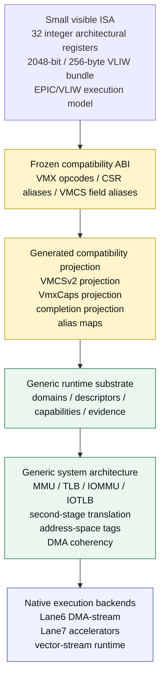

VMX не может ссылаться вниз как владелец состояния. VMX может только запросить projection/admission и получить retire-owned publication.

---

## 3. Запрещённая архитектура

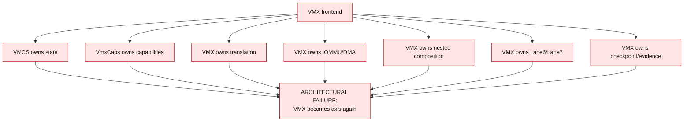

Любой путь, где VMX/VMCS/VmxCaps/NPT/VPID/ShadowVMCS становится authoritative owner, является axis regression.

---

## 4. Разрешённая архитектура VMX operation

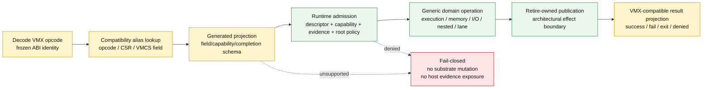

Canonical path:

```text
VMX instruction / CSR / VMCS access
  -> compatibility alias/projection
  -> descriptor/capability/evidence/runtime validation
  -> generic domain operation
  -> retire-owned publication
  -> VMX-compatible result projection
```

Ни один compatibility opcode не имеет права напрямую:

- читать или писать authoritative VMCS state;
- читать CSR как authority;
- вызывать IOMMU/DMA/TLB backend;
- создавать nested state;
- публиковать completion/evidence;
- сериализовать checkpoint;
- раскрывать host-owned evidence.

---

## 5. Ownership matrix

| Область | Source of truth | VMX роль | Запрещено |
|---|---|---|---|
| VMX opcode ABI | Frozen ABI alias table | decode/projection label | opcode owns semantics |
| VMCS fields | Generated VMCS field projection schema | compatibility aliases | VMCS owns state |
| VmxCaps | Capability projection schema | CSR alias / read-only projection | VmxCaps owns grants |
| Capabilities | typed `CapabilityGrant` graph | projected bitmask only | mask-derived authority |
| Execution | `ExecutionDomainDescriptor` | VM-entry/exit vocabulary projection | VMLAUNCH/VMRESUME owns transition |
| Memory | `MemoryDomainDescriptor`, address-space tags, epochs | EPT/NPT/VPID aliases only | VMCS/EPT/VPID owns identity |
| I/O | `IoDomainDescriptor` | compatibility labels only | VMX binds IOMMU |
| DMA | `DmaAuthorityService`, windows, token/fence namespaces | no direct authority | VMX owns DMA tokens |
| Lane6/Lane7 | neutral lane descriptors and host evidence tables | exit labels / projection only | VMCS stores native handles |
| Nested | `NestedDomainDescriptor`, composition service | VMCS12/VMCS02 projection only | Shadow VMCS as owner |
| Completion | completion fabric / retire boundary | VM-exit projection | frontend publishes completion |
| Migration | domain checkpoint image | VMX metadata denied/recomputed | serializing host evidence |
| Observability | evidence policy + root access policy | guest-visible counters only | raw host counters via VMREAD |

---

## 6. VMCSv2 as generated projection

VMCSv2 is not a substrate object.

VMCSv2 is a generated compatibility projection over generic substrate fields.

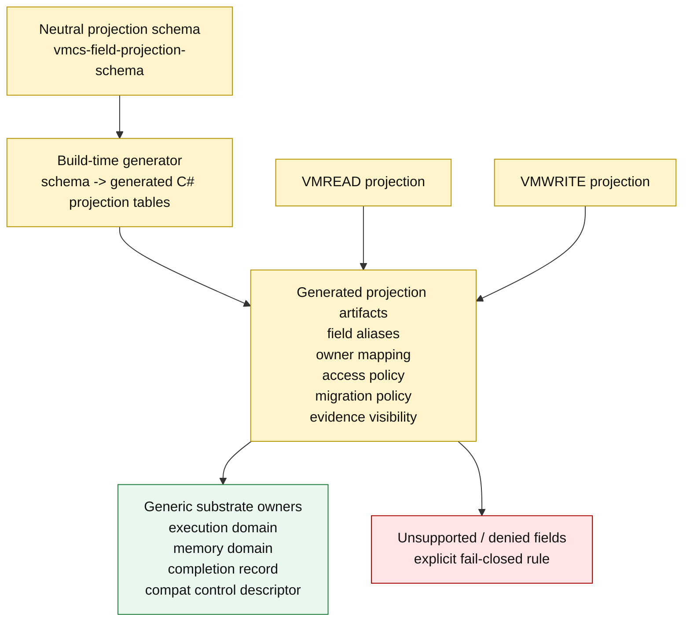

Каждый VMCS field обязан иметь:

- exact source;
- target substrate owner;
- access policy;
- evidence visibility class;
- migration policy;
- write behavior;
- unsupported/denied semantics.

Если field не имеет owner или explicit denied rule, он не существует.

---

## 7. VMREAD / VMWRITE final flow

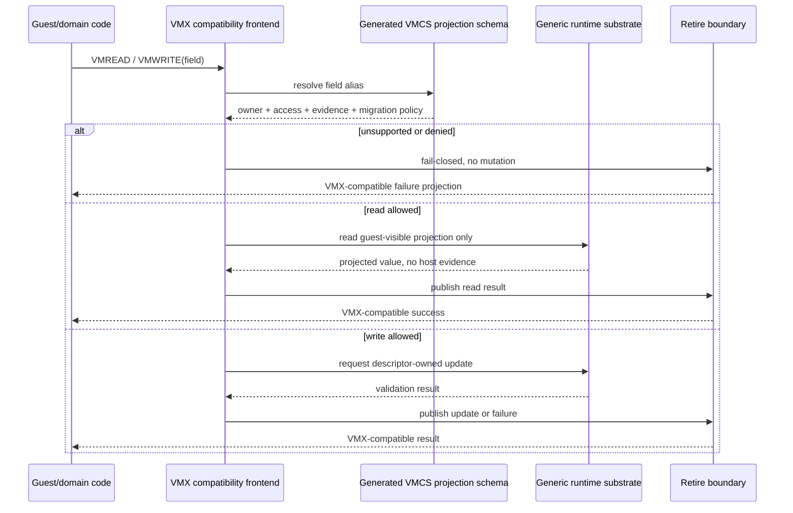

VMWRITE never mutates substrate directly. It requests a descriptor-owned update through runtime admission.

---

## 8. VmxCaps final model

VmxCaps is not a capability source.

VmxCaps is a CSR alias/projection of typed grants.

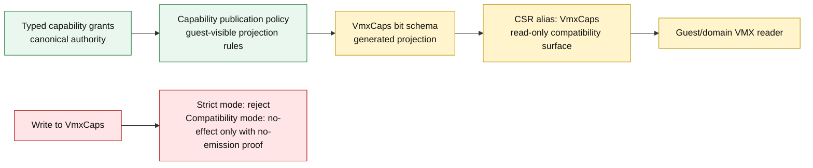

Rules:

- no `ulong mask` may create authority;
- bitmap projections may exist only as guest-compatible read models;
- missing typed grant means fail-closed;
- `EffectiveCaps` is cache/projection only;
- `HasEffectiveCapability` is forbidden in security/admission decisions;
- VmxCaps write cannot mutate grants, descriptors, evidence, completion, memory epochs, lane state or migration state.

---

## 9. Runtime admission model

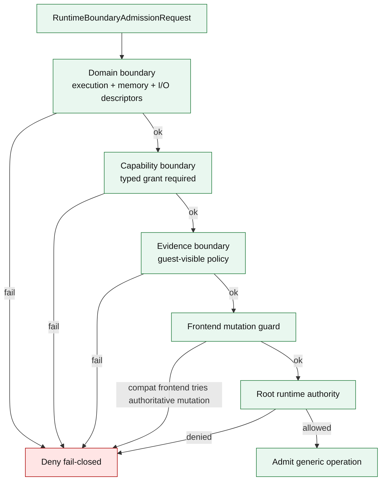

Admission is runtime-owned legality.

Frontend legality is never sufficient for execution.

---

## 10. Execution domain model

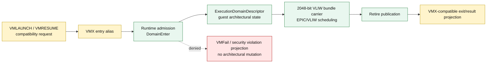

Execution domain owns:

- guest PC/SP/flags projection;
- architectural integer register state;
- domain execution policy;
- traps/intercepts as generic domain events.

VMX owns only compatibility names for entry/exit.

---

## 11. Memory architecture

Memory is not VMX-owned.

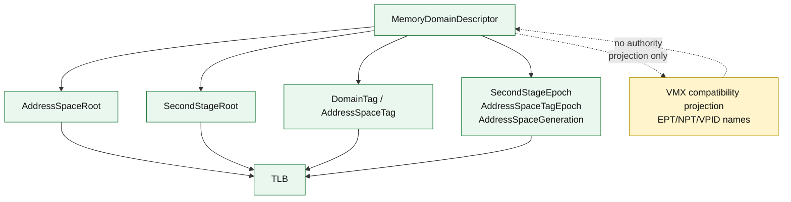

Final memory terms:

- `AddressSpaceRoot`;
- `SecondStageRoot`;
- `DomainTag`;
- `AddressSpaceTag`;
- `AddressSpaceGeneration`;
- `SecondStageEpoch`;
- `AddressSpaceTagEpoch`.

Compatibility-only terms:

- `EPT`;
- `NPT`;
- `VPID`;
- `VMCS epoch`;
- `VMCS identity`.

These terms must not be canonical substrate identity.

Epoch wraparound is fail-closed and requires domain flush or rebuild.

---

## 12. Translation invalidation

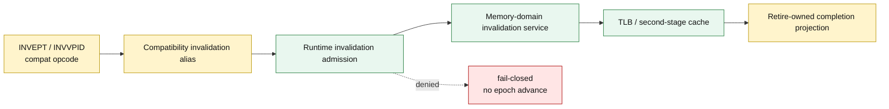

Invalidation authority belongs to memory-domain/address-space-tag services.

VMX invalidation opcodes are aliases.

---

## 13. I/O, DMA, IOMMU, IOTLB

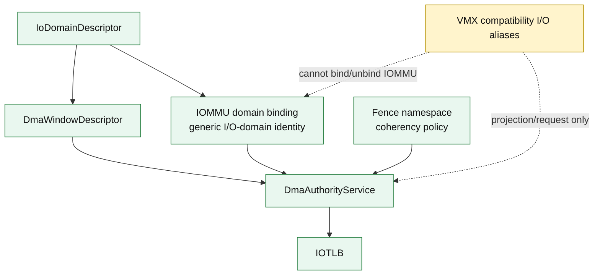

Rules:

- VMX cannot call `BindVmx`, `ApplyVmx`, `InvalidateVmx`, `UnbindVmx`;
- IOTLB invalidation is generic;
- dirty accounting is domain-owned;
- DMA windows are descriptor-owned;
- token/fence namespaces are not VMX-owned.

---

## 14. Lane6 / Lane7 / vector-stream

Lane state is split into guest-visible virtual state and host-owned evidence.

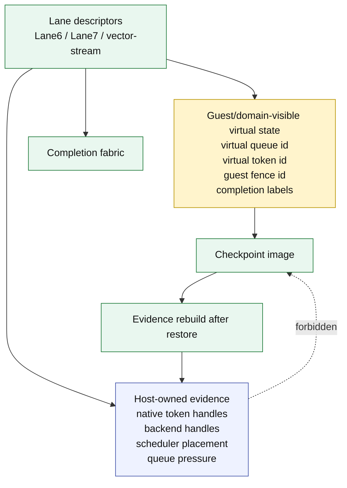

Rules:

- VMCS never stores Lane6/Lane7 authoritative state;
- native tokens and backend handles are never guest-visible;
- VMFUNC cannot bypass descriptor validation;
- lane completion routes through completion fabric;
- migration serializes only virtual/domain-visible state;
- restore rebuilds host evidence.

---

## 15. Nested virtualization

Nested VMX is compatibility projection over generic nested domain composition.

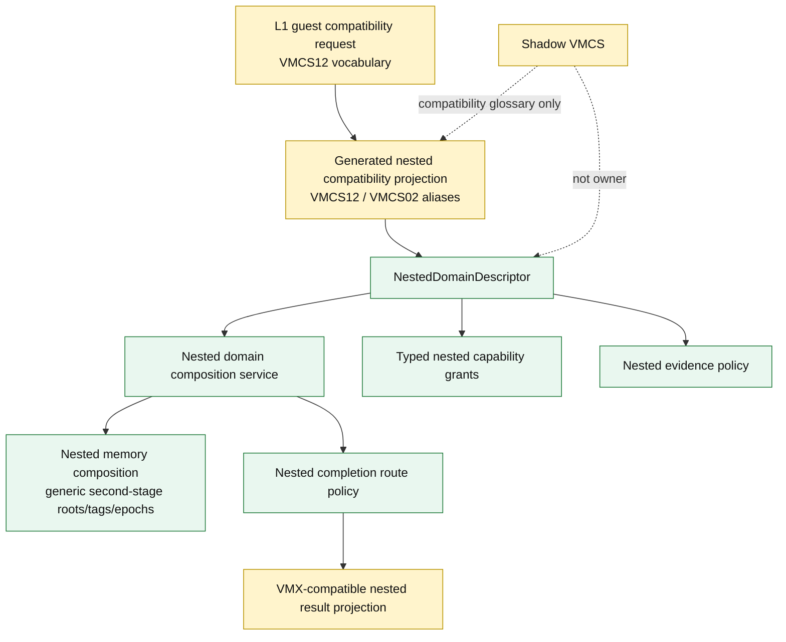

Nested final rules:

- `VMCS12`, `VMCS02`, `ShadowVmcs` are projection vocabulary only;
- nested enablement requires typed grants;
- nested gates are runtime-validated evidence, not mask bits;
- nested memory composition uses generic memory domains;
- compatibility bridge cannot become permanent architecture;
- missing generic nested service means fail-closed.

---

## 16. Completion, sideband and retire-owned publication

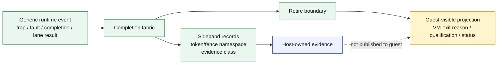

Publication is retire-owned.

Frontend cannot publish:

- VM-exit state;
- VMFail state;
- trace events;
- VMX counters;
- dirty logs;
- completion records.

Frontend can only request projection after retire commits.

---

## 17. Evidence visibility classes

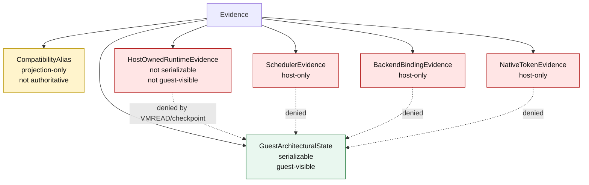

Host-owned evidence includes:

- decode cache;
- micro-op cache;
- typed-slot proof cache;
- scheduler placement;
- native DMA tokens;
- native accelerator handles;
- TLB/IOTLB entries;
- backend binding pointers.

It is never guest architectural state.

---

## 18. Migration / checkpoint / restore

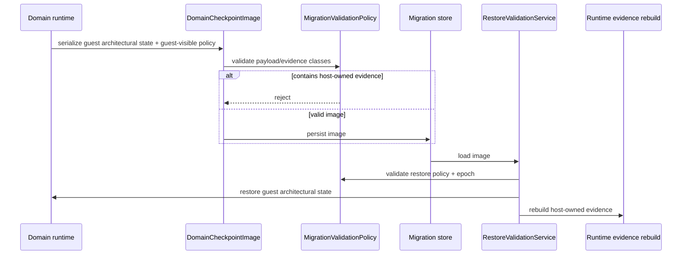

Checkpoint image may contain:

- guest architectural state;
- guest-visible domain policy;
- migratable descriptor state;
- virtual/domain-visible lane state.

Checkpoint image must not contain:

- host-owned evidence;
- TLB/IOTLB entries;
- native tokens;
- native backend handles;
- scheduler placement;
- decode/micro-op cache;
- VMCS projection state as authority.

---

## 19. Observability and CSR/root-runtime access

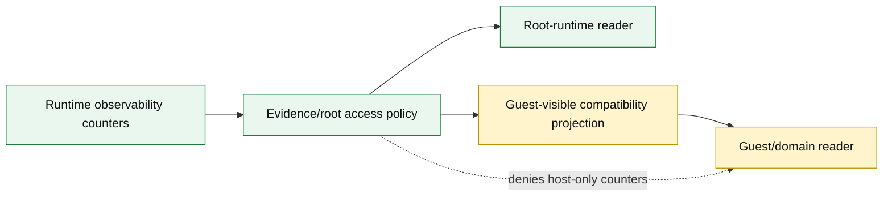

Observability rules:

- VMREAD cannot expose host evidence;
- CSR aliases are projection only;
- root-runtime access is policy-gated;
- counters do not become capability grants;
- trace data is never architectural guest state.

---

## 20. Directory and namespace ownership

Final layout principle:

```text
Core/VMX/
  Compatibility/
    FrozenAbi/
    Generated/
    Adapters/
  Conformance/
  Docs-facing projection contracts only

Core/Runtime/
  Domains/
  Capabilities/
  Evidence/
  Services/
  Completion/
  Migration/

Core/Memory/
  Translation/
  TLB/
  AddressSpaces/
  SecondStage/

Core/IO/
  Domains/
  DMA/
  IOMMU/
  IOTLB/

Core/Lanes/
  Lane6/
  Lane7/
  VectorStream/
```

`Core/VMX/Substrate` must not be the final home of generic substrate.

Acceptable in `Core/VMX`:

- ABI aliases;
- generated projection tables;
- compatibility adapters;
- conformance contracts that police VMX boundaries.

Not acceptable in `Core/VMX`:

- canonical capability authority;
- memory-domain authority;
- I/O/DMA authority;
- nested-domain composition;
- migration/checkpoint authority;
- native lane backend state;
- host-owned evidence stores.

---

## 21. Static boundary contracts

Required static contracts:

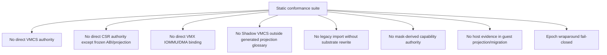

Static checks must be semantic enough to catch:

- renamed wrappers;
- facade authority;
- compatibility bridges becoming permanent;
- `Generated` path with handwritten authority;
- bitmap authority hidden under typed API names.

---

## 22. Negative conformance requirements

Before freeze, tests must prove:

1. missing typed grant is denied even if compatibility bit is present;
2. VmxCaps write is rejected or no-effect with no-emission proof;
3. VMREAD of host evidence is denied;
4. native token read is denied;
5. backend handle read is denied;
6. migration image with host evidence is denied;
7. restore rebuilds host evidence instead of trusting stale image data;
8. epoch wraparound is denied/fenced;
9. VMFUNC cannot bypass descriptor validation;
10. INVEPT/INVVPID route through generic memory-domain invalidation;
11. VMCS12/ShadowVMCS are projection-only;
12. compatibility adapter cannot call IOMMU/DMA backend directly;
13. completion publication is retire-owned;
14. dirty logging is descriptor/runtime-owned;
15. generated projection output matches schema source.

---

## 23. Freeze decision checklist

Architectural freeze is allowed only if all statements below are true:

| Requirement | Freeze status expectation |
|---|---|
| VMX frontend has no authoritative execution/memory/I/O/nested/lane state | required |
| VMCSv2 is generated projection, not state owner | required |
| VmxCaps is CSR alias/projection, not capability source | required |
| Typed grants are canonical source of capability authority | required |
| Memory identity is generic, not VMCS/EPT/VPID/NPT | required |
| IOMMU/IOTLB/DMA are generic system architecture | required |
| Lane6/Lane7 host evidence cannot leak to guest/migration | required |
| Nested uses generic nested-domain composition | required |
| VMCS12/VMCS02/ShadowVMCS are compatibility boundary only | required |
| Completion publication is retire-owned | required |
| Migration excludes host evidence and rebuilds it after restore | required |
| Generated artifacts are produced by executable/build-time generator | required |
| Static + negative conformance catches wrappers/renames/facades | required |
| `Core/VMX/Substrate` no longer owns generic substrate | required |

If any row is not proven, the system may be safe-by-quarantine or safe-by-fail-closed, but not architecturally frozen.

---

## 24. Final one-line model

```text
HybridCPU VMX =
  frozen compatibility ABI
  + generated projection surface
  + runtime-admitted generic domain operations
  + retire-owned publication
  - VMX-owned authority
  - VMCS-owned state
  - VmxCaps-owned capability
  - host-evidence leakage
```

VMX is a language spoken at the boundary.

HybridCPU runtime is the machine that owns truth.
