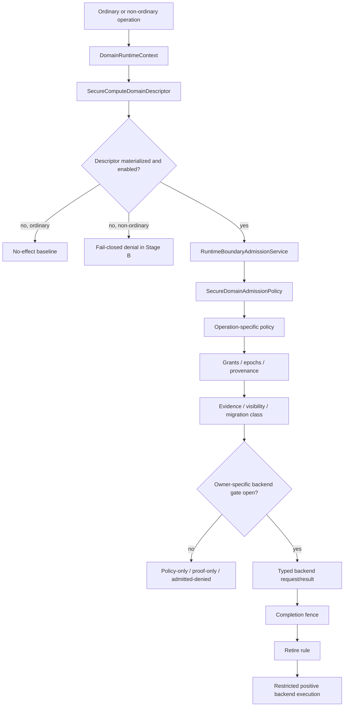

# Аудит роли, задачи и плана активации Secure Compute  для HybridCPU-v2

## Архитектурная модель и проверка инвариантов

Архитектурная ось SecureCompute в репозитории устроена так: `SecureComputeDomainDescriptor` — это корневой нейтральный descriptor; `DomainRuntimeContext` может нести optional SecureCompute и neutral `DomainTag`/`AddressSpaceTag`; `RuntimeBoundaryAdmissionService` остаётся центральной точкой Stage B; дальше срабатывают operation-specific policies, grant/evidence/migration discipline, а положительный backend path возможен только после отдельного owner-specific RFC/ADR, typed request/result model и explicit completion/retire fencing. Иначе admission остаётся либо policy-only, либо proof-only, либо admitted-denied. Именно такая последовательность источниками и отстаивается. citeturn25view0turn25view1turn26view0turn26view2turn27view0turn28view1

Проверка инвариантов даёт последовательный положительный результат для философии HybridCPU-v2. README называет проект native-VLIW-only runtime, с fixed 8-slot carrier, 4-way SMT, typed lanes, runtime-owned legality и без скрытого OoO/DBT; sideband metadata и typed-slot facts не должны сами по себе становиться execution/publication authority. SecureCompute WhiteBook воспроизводит ту же логику: descriptor ≠ execution, policy admission ≠ publication, evidence ≠ authority, VMX vocabulary ≠ owner, compatibility projection ≠ backend success. Это означает, что SecureCompute в текущем проектном состоянии философски совместим с общей моделью HybridCPU-v2. citeturn3view0turn25view1turn26view0turn27view1

Матрица полномочий в текущем состоянии выглядит так.

| Область | Текущий статус | Нейтральный владелец | Что разрешено сейчас | Что должно оставаться denied |
|---|---|---|---|---|
| Root descriptor | implemented baseline | `SecureComputeDomainDescriptor` | disabled/no-effect semantics, `None -> Disabled`, materialization as precondition | Любое трактование descriptor как backend execution | citeturn25view0turn25view2 |
| Ordinary no-effect | implemented | SecureCompute runtime policy | Ordinary operations остаются unchanged при absent/disabled/`None` descriptor | Over-denial ordinary path | citeturn25view2turn26view0 |
| Non-ordinary fail-closed | implemented | Stage B / `RuntimeBoundaryAdmissionService` | Denial при unmaterialized/missing/wrong-bound non-ordinary paths | Bypass вокруг Stage B | citeturn25view0turn26view0 |
| Grants / epochs / provenance | implemented runtime discipline | `SecureGrantAuthorityPolicy` | provenance/bounds/epoch/revocation/monotonic derivation | Guest-scalar materialization, projection-as-authority, CHERI-style interpretation | citeturn25view0turn27view0 |
| Measurement / evidence | implemented policy baseline | `DomainMeasurementDescriptor` + `SecureEvidencePolicy` | Measurement admission, evidence classes, fenced publication logic | Host-owned evidence as guest authority; completion≈retire | citeturn26view0turn26view1 |
| GuestCr0 / GuestCr4 owner proof | implemented proof gate | `PrivilegedExecutionStateOwnerPolicy` | Owner-proof only, subject to further gates | Projection/write/exec/publication by owner-proof alone | fileciteturn0file0 |
| GuestCr0 / GuestCr4 projection | narrow projection-only | `PrivilegedExecutionStateProjectionService` | Read-only field-specific compatibility projection after owner/visibility/migration/conformance gates | Any mutation, backend success, completion, retire | fileciteturn0file0 |
| Secure memory / private domains | implemented policy admission | `SecureMemoryDomainDescriptor` + `SecureMemoryAdmissionPolicy` | private/shared/measured/runtime-mutable classification and admission | hardware tags, CHERI/tagged memory, EPT/NPT authority | citeturn26view0turn26view1 |
| Secure I/O / shared buffers | implemented policy admission | `SecureIoDomainDescriptor` + `SecureIoHypercallAdmissionPolicy` | explicit shared-buffer-only DMA, typed grant checks | raw private pointers, arbitrary DMA, device-side effect as proof of success | citeturn26view1turn26view2 |
| Secure hypercall | admitted-denied | `SecureHypercallDescriptor` + admission policy | Recognition/admission with `AllowedAdmittedDenied` | Backend success/publication/retire | citeturn26view2 |
| Backend owner proof | proof-only | `SecureBackendOwnerAdmissionPolicy` | `AllowedProofOnlyNoExecution` | Treat proof-only as execution | citeturn25view2turn28view1 |
| Completion publication | fenced shell only | `SecureCompletionPublicationFence` | Fence semantics as necessary condition | Publication from proof-only/admitted-denied path | citeturn26view0turn26view1 |
| Retire publication | fenced shell only | explicit retire rule | Retire only after separate rule | Retire from proof-only/admitted-denied path | citeturn26view0turn26view1 |
| VMX / VMCS / `VmxCaps` boundary | implemented deny/projection boundary | Neutral runtime, not VMX | Read-only compatibility vocabulary in narrow cases | Activation, grants, state ownership, checkpoint authority, mutable secure state | citeturn27view0turn27view1turn31view1 |
| Nested secure | design fence only | `SecureNestedDomainAdmissionPolicy` | Design-fence admission and monotonic checks | Nested execution, mutable Shadow VMCS authority | citeturn27view0turn27view1 |
| Migration / checkpoint / restore | implemented fail-closed policy | `SecureMigrationAdmissionPolicy` | Explicit restore revalidation and policy classes | host evidence, backend bindings, native tokens, raw secrets, active host pointers, VMCS metadata | citeturn26view1turn26view2 |
| Compiler boundary | implemented no-emission boundary | `SecureComputeNoEmissionContract` | No-emission conformance and release guards | compiler-generated secure backend success / VMWRITE / lane passthrough | fileciteturn0file0 citeturn27view1turn31view1 |
| Lane/stream boundary | explicit non-authority boundary | Stream/lane docs remain separate | Boundary awareness | lane6/lane7/stream tokens as SecureCompute authority | citeturn3view0turn31view1 |

В сухом остатке инварианты проекта не нарушены. Сильнейшие доказанные разграничения таковы: `AllowedProofOnlyNoExecution` не является execution; `AllowedAdmittedDenied` не является secure hypercall success; `SecureMemoryDomainDescriptor` не является hardware tag; `SecureGrantHandle` не делает систему CHERI ISA; `PrivilegedExecutionStateOwnerPolicy` не даёт `VMREAD` по умолчанию; `GuestCr0`/`GuestCr4` projection остаётся read-only и field-specific; `VMWRITE` для SecureCompute — no-effect; `VMCS` и `VmxCaps` не становятся owner-источниками полномочий. citeturn26view0turn26view2turn27view0turn27view1turn31view1

## Пошаговый план активации Secure Compute в ZIP

Ниже — **не “магический переключатель”, а подробный безопасный план прохождения activation runway**, согласованный с фактической архитектурой репозитория: сначала воспроизводим build/test среду, затем подтверждаем no-effect и fail-closed baseline, затем проверяем policy-only/projection-only surfaces, затем запускаем source scans, и только после этого принимаем решение о readiness. Команды `git clone`, `dotnet restore`, `dotnet build`, `dotnet test` и логика `global.json` опираются на официальную документацию Git и .NET CLI. citeturn24view0turn23view0turn23view1turn23view2turn23view3

| Предпосылка | Принятое допущение | Почему это допущение важно |
|---|---|---|
| ОС | Linux x64, macOS или Windows 11/Server с Git и .NET SDK | Репозиторий .NET-ориентирован; команды ниже даны в shell- и PowerShell-совместимом виде |
| Версия SDK | Точная версия должна определяться из `global.json`; файл в корне есть, но его содержимое в этой сессии напрямую не прочитано | Без совпадения SDK возможны ложные build/test ошибки |
| Права доступа | Нужны права на clone, restore, build, test и local unzip | Это минимальный baseline для activation runway |
| Поиск по исходникам | Предпочтительно наличие `rg` (ripgrep); при его отсутствии допустимы `grep -R` или `findstr` | Static/source scans — обязательная часть gate-ов |
| Сетевой доступ | Нужен только для первичного clone и dependency restore | Сам ZIP не активирует SecureCompute без репозитория |

Сравнение допустимых режимов конфигурации:

| Вариант конфигурации | Что реально означает | Когда допустим | Вердикт |
|---|---|---|---|
| Readiness audit only | Сборка, тесты, scans, подтверждение no-effect / fail-closed / deny-projection | Всегда | Базовый и безопасный режим |
| Current bounded policy baseline | Descriptor materialization + Stage B + memory/evidence/migration/I/O admission + projection guards без backend success | Только как **policy/projection only** | Поддерживается текущим состоянием | 
| Restricted owner-specific pilot | Один строго ограниченный positive backend path с owner RFC/ADR, typed request/result и explicit publication fences | Только после Phase 13 + 14 + 20 + 21 + 22 | Пока не поддерживается |
| VMX/VMCS pseudo-activation | Попытка “включить SecureCompute через VMX/VMCS/VmxCaps/VMREAD/VMWRITE” | Никогда | Должно оставаться denied | citeturn25view0turn27view0turn28view1turn31view1 |

Поток активации и зависимости фаз удобно видеть так.

Рекомендуемый операционный runbook:

| Шаг | Цель | Команды | Ключевые файлы/зоны | Ожидаемый результат |
|---|---|---|---|---|
| Подготовить рабочее дерево | Получить репозиторий и ZIP-корпус в одном workspace | `git clone https://github.com/yuriyyak23/HybridCPU-v2.git`  \|  `unzip SecureComputeActivationPlan(3).zip -d ./activation-corpus` | repo root, ZIP corpus | Репозиторий и фазы доступны локально |
| Зафиксировать SDK | Сверить pinned SDK и локально установленный SDK | `cat global.json`  \|  `dotnet --list-sdks` | `global.json` | Совместимая SDK найдена или gap явно зафиксирован |
| Восстановить зависимости | Обеспечить воспроизводимую сборку | `dotnet restore "HybridCPU v2.slnx"` | `HybridCPU v2.slnx` | Restore завершается без ошибок |
| Собрать решение | Проверить компиляционную целостность baseline | `dotnet build "HybridCPU v2.slnx" -c Release` | solution + build props | Build green |
| Запустить release gates | Проверить current confirmed surfaces | `dotnet test "HybridCPU v2.slnx" -c Release --no-build --filter "SecureCompute|Vmx"` | `HybridCPU_ISE.Tests/SecureComputeRefactoring`, `HybridCPU_ISE.Tests/VmxRefactoring` | Green/Red карта фиксируется по Secure/Vmx tests |
| Подтвердить no-effect baseline | Доказать ordinary no-effect и отсутствие over-denial | `dotnet test ... --filter "NoEffect|DescriptorNoEffect|RuntimeBoundaryAdmission"` | `SecureComputeDomainDescriptor*`, Stage B hooks | Ordinary path unchanged; bypass не выявлен |
| Подтвердить Stage B fail-closed | Убедиться, что missing/disabled/unmaterialized descriptor не обходят deny-path для non-ordinary secure ops | `dotnet test ... --filter "Boundary|Admission|Denied"` | `RuntimeBoundaryAdmissionService.cs`, admission policies | Non-ordinary secure ops fail closed |
| Подтвердить projection-only GuestCr0/GuestCr4 | Проверить, что owner proof не превращается в write/exec/publication | `dotnet test ... --filter "GuestCr0|GuestCr4|Projection|VmRead|VmWrite"` | privileged state owner/projection services | Только read-only narrow projection, без mutation |
| Подтвердить secure memory / I/O / hypercall | Проверить policy-only behavior memory/I/O и admitted-denied hypercall | `dotnet test ... --filter "SecureMemory|Evidence|Migration|Io|Hypercall"` | memory/evidence/migration/I/O policies | Private DMA denied; raw ptr denied; hypercall не становится success |
| Выполнить source scans | Отловить forbidden regressions, перечисленные activation corpus | `rg -n "VmxCaps.*grant|SecureCompute.*VMX|VMX.*SecureCompute|VMCS.*SecureCompute" HybridCPU_ISE Documentation`  \|  `rg -n "VmcsManager|IVmcsManager|VmxExecutionUnit|ActiveVmcs|VMCS field store" HybridCPU_ISE --glob "*.cs" --glob "!*.Tests/*"`  \|  `rg -n "Emit.*VMCALL|Emit.*VMWRITE|SecureCompute.*Emit" HybridCPU_Compiler HybridCPU_ISE` | runtime, virtualization, compiler | Отсутствуют VMX-owned authority, hidden VMCS store и compiler shortcuts |
| Сформировать verdict | Отличить readiness от activation | Сводка results + denied shortcuts + release wording audit | WhiteBooks + ZIP plans | Claim ограничивается readiness/policy/projection only |
| Остановить активацию до будущих фаз | Не допустить overclaim | Не merge positive path без owner RFC/ADR и gated tests | phases 13/14/20/22 | Ограниченный production-путь остаётся закрыт |

Если требуется фазовая интерпретация 00–23, её следует читать так:

| Фаза | Что действительно открывает | Что не открывает |
|---|---|---|
| 00 | Индекс activation corpus и запрет overclaim | Любую активацию |
| 01 | Current-state / gap audit | Positive path |
| 02 | Forbidden regressions / release guards | Исключения для VMX/VMCS |
| 03 | Процесс owner-specific RFC/ADR | Исполнение “по процессу” |
| 04 | Теорему ordinary no-effect | Backend execution |
| 05 | Descriptor materialization | Activation claim |
| 06 | Единственную допустимую SecureCompute crossing point в Stage B | VMX shortcut / backend service |
| 07 | Grants / epochs / provenance discipline | CHERI ISA / capability registers |
| 08 | Measurement/evidence visibility discipline | Evidence-as-authority |
| 09 | Neutral owner proof для privileged execution state | Projection/write/exec/publication |
| 10 | Узкую read-only projection для `GuestCr0` / `GuestCr4` | Mutation / backend success / retire |
| 11 | Secure memory/private-domain policy admission | Tagged memory / hardware tags / EPT authority |
| 12 | Secure I/O/shared-buffer policy admission | Device-side effect как secure success |
| 13 | Требования к backend owner RFC для secure hypercall | Текущий positive hypercall path |
| 14 | Completion/retire fences и separation rules | Publication без backend success |
| 15 | Fail-closed migration/checkpoint/restore policy | Host evidence / raw secrets migration |
| 16 | Будущий debug/attestation API boundary | Authority via debug visibility |
| 17 | VMX zero-authority boundary | SecureCompute through VMX |
| 18 | Nested child-intent design fence | Nested secure execution |
| 19 | Compiler no-emission → controlled-emission gate | Current secure emission |
| 20 | Условия будущего positive secure runtime execution | Broad feature-complete activation |
| 21 | Negative/positive conformance matrix | Activation только по факту наличия тестов |
| 22 | Единственно допустимый смысл “limited SecureCompute activated” | Claim прямо сейчас |
| 23 | Карантин открытых решений | Автоматическую дорожную карту к production | fileciteturn0file0 citeturn25view1turn25view2turn28view1turn28view2 |

**Проверки успешности.** Успех текущего runbook — это не “SecureCompute activated”, а более узкий результат: build green, negative tests green, no-effect ordinary preserved, non-ordinary bypass closed, `GuestCr0/GuestCr4` projection остаётся read-only, private DMA denied, raw private pointers denied, `AllowedAdmittedDenied` не преобразуется в backend success, `AllowedProofOnlyNoExecution` не преобразуется в execution, а source scans не обнаруживают VMX/VMCS/compiler lane-stream shortcut-ов. Именно это и является корректным readiness outcome. citeturn26view0turn26view2turn27view1turn28view1turn29view0

**План отката.** Если хотя бы один из перечисленных deny-paths нарушен, откат должен быть немедленным и содержательным: убрать или revert-нуть положительный owner-path, вернуть no-emission boundary, закрыть compatibility advertisement, запретить release wording с формулировками “activated” и восстановить зелёное состояние negative tests и source scans. Так как WhiteBook прямо рассматривает overclaim как архитектурный риск, rollback должен включать не только код, но и документацию / product claims. citeturn25view1turn27view1turn28view2

**Меры безопасности.** На всём пути активации должны оставаться запрещёнными: VMX as authority owner, secure VMCS, VMCS-owned secure state, `VmxCaps` as grant source, raw host/device pointers, migration of host evidence/backend bindings/native tokens/raw keys/active host pointers, completion/retire publication без explicit backend success, compiler secure-emission shortcut и lane6/lane7/stream passthrough в authority chain. Это не “дополнительные пожелания”, а ядро архитектурной безопасности текущего дизайна. citeturn26view1turn27view0turn27view1turn31view1

## Итоговый вердикт и ограничения

Финальный вердикт — **A. production SecureCompute activation not supported; readiness/policy/projection only**. Основание строгое. Репозиторий сам разрешает claim-ить только то, что существуют SecureCompute descriptors и foundations policy admission; inactive SecureCompute остаётся no-effect; secure operation classes fail closed without required owners/subpolicies; Layer 2 grant/provenance/epoch discipline существует на runtime-descriptor уровне; VMX/VMCS/`VmxCaps` остаются non-authoritative compatibility surfaces; post-Phase10 owner/RFC gate допускает только proof evidence. Репозиторий столь же прямо запрещает claim-ить production readiness, feature completeness, positive secure backend runtime execution, secure VMCS, VMX-owned activation и CHERI/tagged-memory semantics. citeturn28view2turn29view0

Следовательно, **заявлять “limited SecureCompute activated” сейчас нельзя**. Точные блокирующие gates таковы: нет owner-specific positive backend execution path в production code; текущий верхний предел — `AllowedProofOnlyNoExecution`; current secure hypercall path остаётся `AllowedAdmittedDenied` при закрытом backend execution; completion publication и retire publication не могут вытекать из proof-only/admitted-denied paths; release gate для limited activation по смыслу future-gated до появления и независимого доказательства одного ограниченного owner-specific positive backend path. citeturn26view2turn28view1turn28view2turn29view0

Если формулировать самый важный итог одной фразой, то он таков: **в текущем плане есть корректный путь от secure descriptor / policy admission к ограниченной SecureCompute activation, но этот путь ещё не завершён и намеренно не разрешает перепрыгнуть от admission/projection/evidence к execution/publication authority**. Именно это и означает, что архитектура пока соблюдает собственную философию, а не нарушает её. citeturn25view1turn26view0turn28view1

Ограничения исследования коротко сводятся к следующему: точное содержимое `global.json`, `Directory.Build.props` и некоторых `.cs` файлов в этой сессии не было напрямую прочитано через веб-интерфейс, хотя сами артефакты в репозитории присутствуют; каталог `SecureComputeRefactoring` подтверждён на уровне directory presence и WhiteBook traceability, но не был детально пролистан по каждому файлу через GitHub UI; часть code anchors и phase-specific scan hints извлечена из приложенного ZIP-корпуса как из нормативной activation documentation, а не из прямого чтения каждого исходника. Эти ограничения не меняют главный вывод, потому что он опирается на совпадающие сигналы из README, SecureCompute WhiteBook, Virtualization WhiteBook, test inventory и activation corpus. citeturn3view0turn12view0turn13view1turn25view0turn31view1