# HybridCPU ISE

**Replay-stable SMT-VLIW instruction-set emulator/runtime with streaming-vector transport, typed-slot scheduling, runtime-owned legality, replay evidence, and compiler/runtime structural agreement.**

The central implementation is an instruction-set emulator/runtime with a fixed 8-slot VLIW carrier, 4-way SMT inside a core, class-aware lane topology, explicit legality decisions, bounded replay reuse, retire-visible evidence, and a staged compiler contract.

This README deliberately compresses the WhiteBook into the repository entry point. It keeps file references minimal; for deeper detail, start with:

- `Documentation/WhiteBook/0. chapter-index.md`
- `Documentation/operational-semantics.md`
- `Documentation/validation-baseline.md`
- `Documentation/evidence-matrix.md`

When this README, older notes, and code disagree, live code and the current proof/evidence surfaces are the authority. Historical material under old documentation paths is repository archaeology unless a current proof surface cites it.

## Evidence Discipline

The documentation method is fail-closed. Claims are included only when they are backed by current code, tests, or both.

The four evidence classes used throughout the WhiteBook are:

- confirmed in code: behavior directly expressed by the live implementation;
- confirmed by tests: behavior exercised by named test surfaces;
- current limitation: behavior explicitly absent, partial, guarded, or blocked by configuration;
- open question / future work: behavior suggested by scaffolding or research comments but not current mainline.

This repository implements a replay-stable SMT-VLIW emulator/runtime inside a bounded evidence envelope. It does not claim a universal determinism theorem, a complete precise-exception theorem, a global memory-order theorem, a production hardware-rooted attestation stack, or a mandatory compiler-facts runtime in the current mainline.

## Architectural Thesis

The current codebase implements:

- a native-VLIW-only active frontend;
- a fixed 8-slot bundle carrier;
- a fixed 4-way SMT core model;
- a heterogeneous typed-lane topology;
- two-stage typed-slot scheduling with class admission before lane materialization;
- replay-aware densification rather than free-form superscalar scheduling;
- explicit runtime legality through `LegalityDecision`;
- legality provenance through `LegalityAuthoritySource`;
- certificate identity as a replay/reuse seam;
- compiler/runtime structural agreement through typed-slot facts;
- telemetry and replay evidence as architecture-facing surfaces;
- explicit backend state with rename, commit, physical register, free-list, and retire coordination.

At the same time, the live repository is not:

- a hidden out-of-order superscalar design;
- a free-form "any operation in any lane" scheduler;
- a DBT-based compatibility frontend;
- a scalar-generalized frontend;
- a compiler-only micro-packer;
- a runtime where stale compiler metadata silently becomes correctness authority;
- a machine where all optional or historical opcode contours are active mainline decode.

## Runtime Shape

The live runtime is distributed across frontend decode, legality analysis, scheduling, pipeline execution, replay, assist handling, memory, backend state, diagnostics, and test evidence.

The operationally important split is between:

- architectural payload: the raw VLIW slot and bundle image;
- sideband metadata: slot and bundle annotations, typed-slot facts, replay anchors, and compiler transport;
- runtime legality evidence: descriptors, certificates, legality decisions, replay templates, guard state, and telemetry.

Correctness is not supposed to depend on retired policy bits in the raw slot payload. Modern scheduling policy lives in sideband/runtime structures, and runtime legality remains authoritative.

## Machine State

The repository-facing operational semantics uses this state tuple:

```text
MachineState =
  <ArchitecturalState,
   FrontendState,
   SchedulerState,
   PipelineState,
   ReplayState,
   BackendState,
   EvidenceState>
```

The tuple is intentionally explicit about backend state:

- `ArchitecturalState` covers visible registers, PC, memory, trap, and retire publication state.
- `FrontendState` covers fetch/decode inputs, canonical decoded-bundle transport, derived issue-plan state, and `BundleLegalityDescriptor`.
- `SchedulerState` covers nominations, class capacity, Stage A/Stage B admission, `LegalityDecision`, and issue-packet candidates.
- `PipelineState` covers IF/ID/EX/MEM/WB latches and cycle/stall control.
- `ReplayState` covers `LoopBuffer`, replay phase context, template reuse, legality cache reuse, and invalidation.
- `BackendState` covers `PhysicalRegisterFile`, `RenameMap`, `CommitMap`, `FreeList`, and `RetireCoordinator`.
- `EvidenceState` covers trace/timeline output, contour certificates, legality telemetry, replay evidence, and exported profiles.

The current runtime is therefore not renaming-free. Typed-slot legality constrains admission and publication; it does not erase backend ownership machinery.

## Cycle Relation

The main step relation is:

```text
Step(MachineState_t, Inputs_t) -> MachineState_t+1
```

The concrete cycle owner is `ExecutePipelineCycle()`.

The live pipeline exposes two top-level cycle outcomes:

- `STALL`: hazard or decode-local stall blocks forward progress, records a stall sample, increments stall counters, and does not advance fetch.
- `CYCLE`: the five-stage shell advances in reverse stage order, `WB -> MEM -> EX -> ID -> IF`, then records a cycle sample and closes replay-cycle bookkeeping.

Reverse stage advancement is part of the runtime contract: each stage observes prior-cycle state rather than the state that an earlier stage just wrote in the same cycle.

## VLIW Carrier

The base slot carrier is `VLIW_Instruction`, a packed fixed-width 32-byte struct represented as four 64-bit words. A bundle is `VLIW_Bundle`, an 8-slot aggregate serialized as 256 bytes.

The slot format is container-centric:

- `word0` carries opcode, data type, predicate mask, policy flags, and immediate;
- `word1` carries source/address transport fields;
- `word2` carries destination and vector-length transport;
- `word3` carries row stride, the retired policy-gap bit, virtual-thread transport hint, stream length, and stride.

The opcode is an opaque 16-bit field. Architectural classification comes from registry/classifier logic, not from ad hoc opcode bit slicing.

The active correctness-bearing policy bits in `word0` include reduction, 2D, indexed, tail agnostic, mask agnostic, acquire, release, and saturating behavior. Scheduling policy is not encoded in the architectural slot payload.

`word3[49:48]` stores `VirtualThreadId`, but current code treats it as a transport hint only. It is preserved for compatibility and diagnostics, but it does not bind final execution ownership. Runtime ownership, nomination state, owner context, and legality checks are the authority.

`word3[50]` is a retired legacy scheduling-policy bit. Production ingress and native decode reject it fail-closed. The current architecture should be read as "old scheduling-policy encodings are not silently tolerated."

At bundle decode, opcode zero is the canonical NOP/empty-slot sentinel.

## Fixed Topology

The current machine is a fixed typed `W=8`, `4-way SMT` runtime.

| Physical lane | Slot class |
|---:|---|
| `0..3` | `AluClass` |
| `4..5` | `LsuClass` |
| `6` | `DmaStreamClass` |
| `7` | `BranchControl` or `SystemSingleton` |

Lane 7 is intentionally aliased between branch/control and system-singleton work. This alias is an architectural scheduling constraint in the current runtime, not an accidental implementation detail.

"8-wide issue" therefore means 8 heterogeneous physical lanes with class-aware constraints. It does not mean 8 interchangeable scalar issue positions.

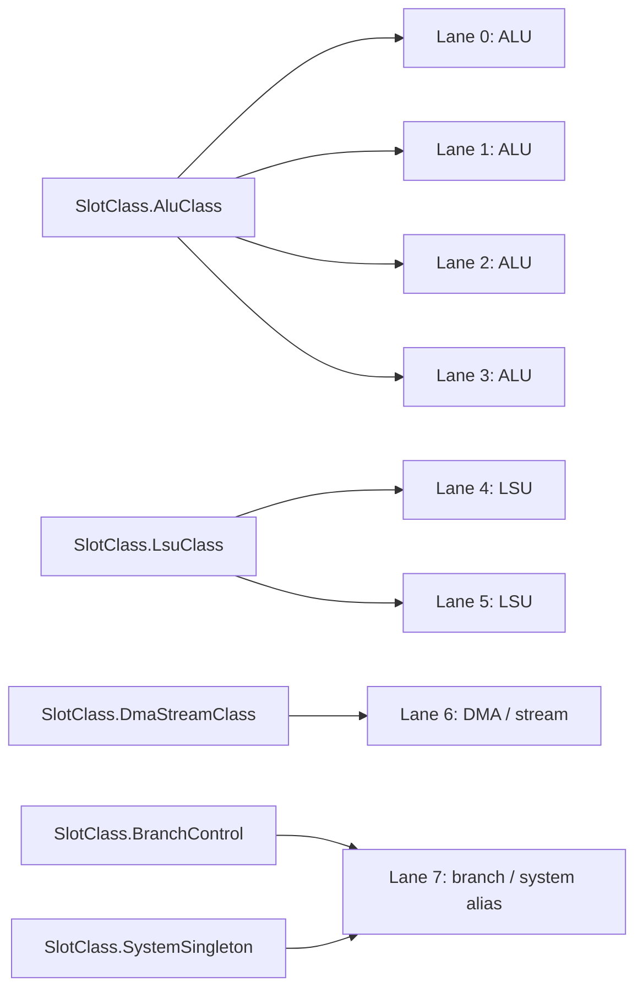

## Scalar, VLIW, and Streaming-Vector Layers

The runtime is best modeled as a compound architecture:

1. scalar control and state management;
2. fixed 8-slot VLIW bundle transport;
3. streaming/vector execution with memory-to-memory and RVV-influenced policy fields.

The scalar layer owns conventional control, CSR/system behavior, and retire-visible scalar work. The VLIW layer exposes explicit bundle structure. The vector side uses stream-oriented transport fields such as `VectorDataLength`, `Stride`, `StreamLength`, and `RowStride`.

The binary carrier contains streaming fields, but the runtime still distinguishes "container can carry stream parameters" from "every possible stream-control contour is wired as a live execution surface." Unsupported stream-control and VMX materialization paths are explicitly guarded.

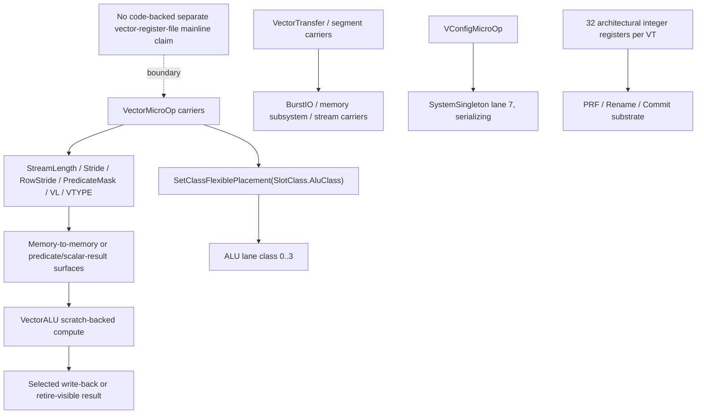

## Frontend Boundary

The active frontend is native VLIW only. Compatibility ingress remains quarantined to compatibility and diagnostic seams. DBT, scalar-generalized decode, and permissive legacy decode are not current proof surfaces.

Canonical decode is not a "try to guess old payload intent" shell. The native decoder rejects unknown or prohibited opcodes, retained compatibility contours, retired policy-gap usage, and unsupported residual scalar or matrix contours when those reach canonical decode.

Decode is full-bundle aware even when foreground issue later advances slot by slot. The runtime preserves canonical decoded-bundle state separately from derived issue-plan state, so densification does not mutate the architectural bundle description.

## Runtime Flow

The live path from bytes to retire-visible effects is:

1. Fetch a native 256-byte VLIW bundle, or reuse cached decoded slots through loop-buffer replay.
2. Decode raw slots into canonical instruction and bundle descriptors.
3. Build legality descriptors and typed-slot structural facts.
4. Derive a foreground issue plan, optionally through intra-core SMT densification.
5. Admit candidates by class and runtime legality.
6. Materialize admitted candidates into physical lanes.
7. Materialize issue-packet lanes into EX/MEM/WB stage state.
8. Execute, access memory, resolve writeback/fault candidates, and publish retire-visible effects.
9. Emit trace, telemetry, replay evidence, and retire contour evidence.

The key architectural separation is:

```text
canonical decoded bundle
  != derived issue plan
  != admitted class candidate
  != materialized lane
  != retire-visible architectural effect
```

This distinction prevents claims about "bundle contains a slot" from being misread as "slot executed and retired."

```mermaid
flowchart LR
    N["Native VLIW Bundle"] --> DEC["VliwDecoderV4 / DecodedInstructionBundle"]
    DEC --> DES["BundleLegalityAnalyzer -> BundleLegalityDescriptor"]
    DES --> FACTS["DecodedBundleTypedSlotFacts + DecodedSlotLegality"]
    FACTS --> EVID["Decoded legality evidence"]
    LIVE["Current bundle resources + owner/domain state"] --> PREP["PrepareSmt: certificate + metadata + boundary guard"]
    EVID -. informs checks / diagnostics .-> PREP
    PREP --> A["Stage A: TryClassAdmission"]
    A --> SVC["IRuntimeLegalityService"]
    SVC --> LD["LegalityDecision"]
    LD --> AV["Stage A verdict"]
    AV --> B["Stage B: TryMaterializeLane"]
    B --> MUT["Bundle-local mutation + RefreshSmtAfterMutation"]
    MUT --> EX["Execute / MEM / WB"]
    EX --> RET["RetireCoordinator / retire records"]
    RET --> TEL["Telemetry / Trace / Evidence profiles"]
    ASSIST["Assist plane"] --> A
    ASSIST --> B
    REPLAY["LoopBuffer / ReplayPhaseContext"] -. reuse or invalidation .-> SVC
```

## Typed-Slot Scheduling

The typed-slot runtime path is the strongest current architectural result in the repository.

The active slot-class vocabulary is:

- `AluClass`;
- `LsuClass`;
- `DmaStreamClass`;
- `BranchControl`;
- `SystemSingleton`;
- `Unclassified`.

Operations are either:

- `ClassFlexible`: admitted at class level, then bound to one legal free lane of that class;
- `HardPinned`: required to use a specific `PinnedLaneId`.

The scheduler is not an exact-slot compiler replay machine. It is a two-stage runtime admission system:

```text
Stage A: TryClassAdmission(...)
  A1. class-capacity availability
  A2. runtime legality through IRuntimeLegalityService.EvaluateSmtLegality(...)
  A3. outer-cap dynamic gates

Stage B: TryMaterializeLane(...)
  B1. honor hard-pinned lane if free
  B2. intersect class lane mask with current free lanes
  B3. narrow by replay stable-donor mask when applicable
  B4. select deterministic lane through DeterministicLaneChooser.SelectWithReplayHint(...)
```

Stage A decides whether a candidate may advance under the current legality and dynamic-state envelope. Stage B does not reopen legality and does not widen the admissible envelope. It only materializes one concrete lane for a candidate that Stage A already admitted.

The outer-cap gates include scoreboard pressure, bank-pending rejection, hardware memory budget, speculation budget, and assist-specific quota/backpressure for assists. Typed-slot scheduling is therefore runtime-state-sensitive, not merely a static per-class count.

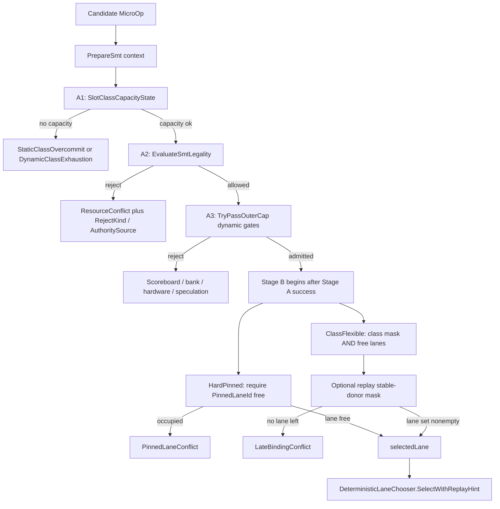

## Deterministic Lane Binding

For class-flexible candidates, lane selection is deterministic:

- replay-active previous-lane reuse is preferred when the previous lane is still legal;
- otherwise the lowest free legal lane is selected.

Determinism here does not mean "no runtime choice exists." It means runtime choice is constrained, classified, replay-aware, and inspectable.

## SMT Packing and Densification

The mainline intra-core SMT densification path starts from an owner bundle, computes current class occupancy, builds a 4-way bundle resource certificate, constructs boundary/metadata state, nominates sibling virtual-thread candidates, ranks candidates through fairness and pressure policy, and injects candidates through typed-slot admission plus lane materialization.

Packing is bounded by:

- class capacity;
- `BundleResourceCertificate4Way`;
- `LegalityDecision`;
- owner and domain guards;
- replay template constraints;
- memory and speculation budgets;
- assist quota/backpressure when assist injection is involved.

This is not "insert any ready operation into any hole." It is legality-witness-governed and topology-aware bundle composition.

The historical term `FSP` still appears in code, tests, counters, and retained compatibility names. In repository-facing architecture prose, read `FSP` as historical vocabulary for bundle-compositional SMT densification under legality/certificate constraints, not as the architecture-defining class name.

## Legality Authority

The top-level legality object is `LegalityDecision`. The scheduler consumes decisions from `IRuntimeLegalityService` instead of treating raw masks, lane masks, or ad hoc certificate peeks as the primary truth surface.

The active authority sources are:

- `GuardPlane`;
- `ReplayPhaseCertificate`;
- `StructuralCertificate`.

Compatibility-oriented or auxiliary sources such as detailed compatibility checks and admission metadata structural checks can exist, but they should not be presented as the mainline typed-slot SMT legality contract.

For active typed-slot SMT, the checker-owned Stage A legality order is:

1. boundary guard;
2. owner-context and domain guard checks;
3. replay-phase certificate reuse if the live template matches;
4. current structural witness fallback if replay reuse is not valid.

The guard plane is earlier than replay reuse. A stale or cross-domain replay witness is not allowed to outrank owner/domain guards.

Scheduler-visible typed-slot rejects may intentionally collapse checker-owned denials to `ResourceConflict`, while finer cause remains in `RejectKind`, `CertificateRejectDetail`, and `LegalityAuthoritySource` for diagnostics and telemetry.

## Certificate Semantics

`BundleResourceCertificate4Way` is the active SMT certificate substrate. It separates:

- shared non-register resource state;
- per-VT register-group hazard state;
- typed-slot class occupancy state;
- an opaque structural identity used for replay/template compatibility.

RAR is allowed. RAW, WAR, and WAW are the meaningful register-group hazard families.

The architecture should be described as:

```text
certificate identity is the replay/reuse seam
```

not as:

```text
the scheduler manually compares raw mask fragments everywhere
```

Raw masks remain implementation storage. The paper-facing semantics are descriptors, certificates, structural identity, `LegalityDecision`, Stage A admission, and Stage B lane materialization.

## Legality Evidence Chain

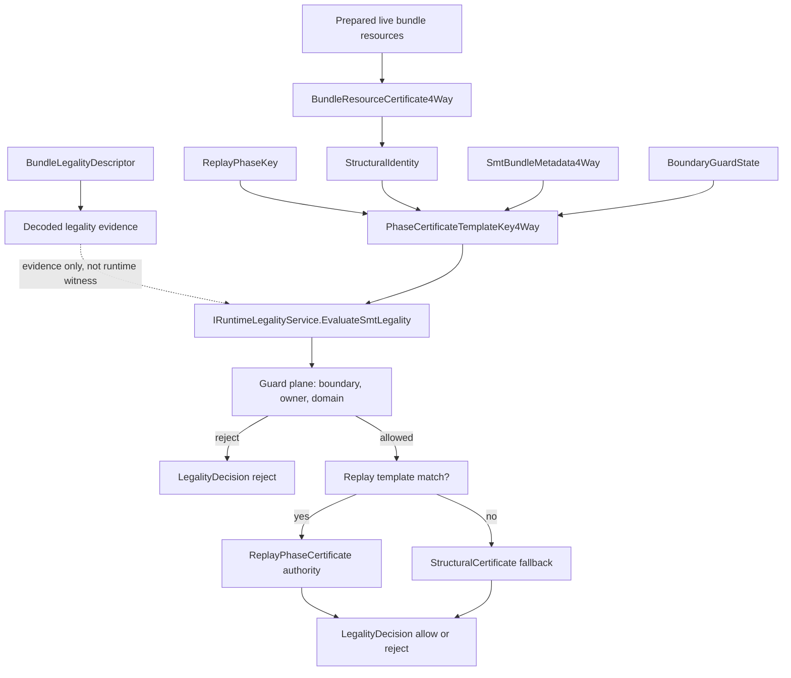

Decoded facts and descriptors are evidence. Certificates are runtime-local legality witnesses. `LegalityDecision` is the checker-owned verdict consumed by admission. Stage B only materializes a lane after Stage A succeeds.

## Reject Taxonomy

The reject model is intentionally multi-layered. The compiler, scheduler, verifier, and telemetry layers do not all use one flattened enum.

The main closure rules are:

- `StructurallyAdmissible` means compiler preflight passed; it is not a promise that runtime dynamic rejects cannot occur later.
- Static typed-slot class overcommit has a direct structural relation to `StaticClassOvercommit`.
- Dynamic class exhaustion, scoreboard pressure, bank pressure, hardware budget, speculation budget, assist quota, and assist backpressure are runtime-state outcomes after structural preflight can already have passed.
- Stage B lane failures are `PinnedLaneConflict` or `LateBindingConflict`, not a reopening of Stage A legality.
- Compile-time aliased-lane invalidity and invalid typed-slot facts are compiler/runtime agreement failures, not necessarily active runtime reject twins.
- Domain-related checker failures are preserved in legality diagnostics even when the scheduler-visible reject family is collapsed.

This taxonomy is important because "cannot inject" is not one opaque result.

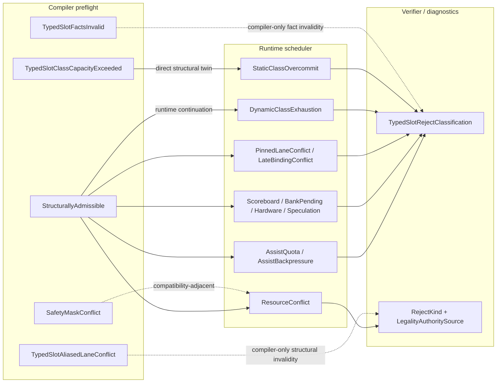

## Domain and Guard Model

The runtime distinguishes virtual thread identity, owner thread identity, owner context identity, domain tag, and optional core/pod identity for inter-core assist transport.

Legality and isolation are therefore execution-context-aware, not just opcode-aware.

The guard plane covers owner-context mismatch, domain mismatch, boundary guard rejection, inter-core domain guard rejection, ordering constraints, and non-stealable cases. Kernel-domain isolation is enabled by default in the current model.

Domain mismatch surfaces as explicit guard/legal rejection, not as a generic scheduler accident.

## Replay Envelope

Replay is centered on `LoopBuffer` and replay phase context. The loop buffer can reuse cached decoded micro-ops for a matching PC, enabling decode-once-replay-many behavior for loop-heavy or strip-mined execution.

Replay state records more than hit/miss:

- epoch count and epoch length;
- stable donor mask;
- class donor capacity;
- replay invalidation reason;
- certificate/template reuse state.

The current determinism claim is bounded:

```text
replay-stable placement and legality reuse inside the implemented replay/evidence envelope
```

It is not:

```text
global determinism over every hidden runtime state dimension
```

Within the envelope, the runtime tries to preserve stable donor structure, replay-aware lane reuse, replay certificate reuse, class-template reuse, and deterministic transition accounting. Outside the envelope, the runtime records invalidation, mismatch, or cache miss rather than pretending the phase is identical.

Serializing boundaries and replay-phase changes invalidate reuse state deliberately.

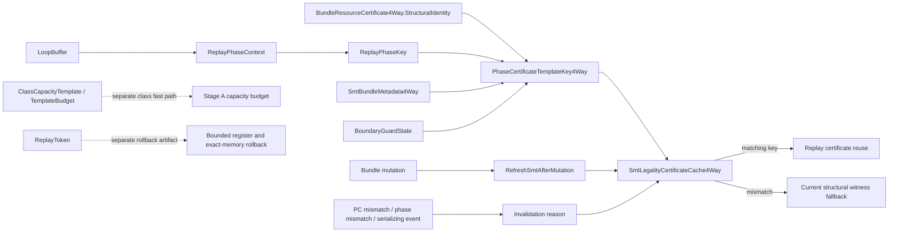

## Replay Token and Rollback Boundary

`ReplayToken` is a deterministic reproduction and rollback carrier. It captures vector configuration fields, random seed, trace hash, pre-execution register state, and pre-execution memory state.

The rollback claim is bounded and fail-closed:

- memory range materialization must be exact;
- partial snapshotting/restoration is rejected;
- restore happens through explicit register and memory write paths;
- replay token binding depends on the required memory materialization surface.

This is a correctness-sensitive replay/rollback substrate, not a universal rollback theorem.

## Assist Plane

The assist plane is explicit runtime machinery, not an informal prefetch heuristic.

`AssistMicroOp` assists are:

- architecturally invisible;
- non-retiring;
- replay-discardable;
- memory-oriented;
- placement-bound;
- legality-bound like ordinary micro-ops.

That invisibility claim is bounded. Assists are not retire-visible ISA features, but they remain observable through bounded carrier-memory effects, replay invalidation, quota/backpressure telemetry, and diagnostic evidence.

The implementation keeps three axes separate:

1. bundle densification: who gets a bundle slot this cycle;
2. donor taxonomy: where the assist's data contour comes from;
3. carrier plane: which physical class runs the assist.

Current assist vocabulary includes:

- `AssistKind`: `DonorPrefetch`, `Ldsa`, `Vdsa`;
- `AssistExecutionMode`: `CachePrefetch`, `StreamRegisterPrefetch`;
- `AssistCarrierKind`: `LsuHosted`, `Lane6Dma`.

Carrier mapping is explicit:

- `LsuHosted` maps to `LsuClass`;
- `Lane6Dma` maps to `DmaStreamClass`.

Lane 6 is therefore not a generic abstract assist lane. It is the DMA/stream carrier used for selected assist contours.

Assist injection is adjacent to SMT densification but not identical to it. Main SMT candidate packing happens first; assist injection is subject to separate quota and backpressure. Current code limits assist injection to at most one assist per bundle.

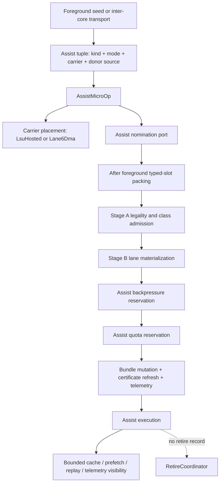

## Compiler Runtime Contract

The current compiler/runtime contract is versioned and fail-closed.

`CompilerContract.Version` is currently `6`. A stale producer version is rejected rather than accepted with degraded semantics.

The contract is layered:

1. architectural payload contract: raw VLIW slot/bundle bits;
2. sideband metadata contract: slot and bundle annotations;
3. structural agreement contract: typed-slot facts and runtime validation;
4. dynamic authority contract: runtime legality and placement remain authoritative.

The current version history explicitly records that:

- `word3[50]` legacy scheduling policy is retired from the correctness path;
- `VirtualThreadId` in `word3[49:48]` remains a transport hint only;
- scheduling policy belongs in sideband metadata rather than architectural slot bits;
- canonical opcodes must execute correctly with missing/default compiler metadata.

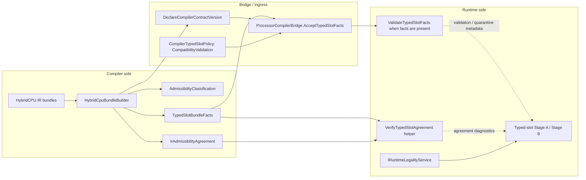

## Typed-Slot Facts

The compiler/runtime shared vocabulary is `TypedSlotBundleFacts`.

Those facts can carry:

- per-slot required class;
- pinning mask;
- per-class counts;
- pinned and flexible totals.

The current runtime validates typed-slot facts when present, checks agreement against live bundle truth, and exposes agreement failures as diagnostic/quarantine evidence.

The current normative staging is:

- `TypedSlotFactStaging.CurrentMode == ValidationOnly`;
- `CompilerContract.CurrentTypedSlotPolicy.Mode == CompatibilityValidation`.

This means:

- compiler and runtime may emit, transport, and validate facts;
- present facts participate in agreement checks and compiler preflight;
- missing or default facts remain compatible with canonical runtime execution;
- structural agreement failures can be recorded and quarantine-logged;
- runtime legality remains the final authority for Stage A admission;
- typed-slot facts are not yet mandatory correctness substrate.

Reserved stronger stages such as `WarnOnMissing` and `RequiredForAdmission` are future vocabulary, not current runtime behavior.

## Compiler Asymmetry

The compiler side can be stricter than the runtime staging surface.

Compiler preflight may classify a bundle as structurally inadmissible when emitted facts contradict typed-slot topology. That does not imply that runtime mainline already requires facts to execute canonical bundles.

This asymmetry is deliberate:

```text
compiler preflight can be fact-strict
runtime canonical execution remains ValidationOnly
runtime legality remains authoritative
```

The compiler may describe structure and intent, but it does not override live capacity, guard behavior, replay admissibility, lane choice, dynamic rejection, or legality decisions.

## Telemetry and Measurement

Telemetry is part of the architecture evidence surface. It is not merely debug output.

The runtime measures and exports:

- injections per slot class;
- rejects per slot class;
- rejects by typed-slot reason;
- assist quota and assist backpressure rejects;
- replay template hits and misses;
- replay invalidation causes;
- certificate reuse invalidations;
- fairness starvation events;
- per-VT injection and rejection counts;
- certificate-pressure breakdown;
- bank-pending rejects;
- hazard-type counts;
- cross-domain rejects;
- eligibility-mask telemetry;
- loop-phase class profiles;
- scalar and non-scalar retired lane counts;
- average retired width;
- NOP density and bundle utilization.

The telemetry schema preserves architectural vocabulary such as `SlotClass`, `TypedSlotRejectReason`, legality authority, replay phase profiles, and certificate pressure.

Compiler-side telemetry consumption uses the same vocabulary for heuristic feedback. Runtime evidence and compiler interpretation therefore have to remain aligned.

## Retire Semantics

Retirement is explicit and evidence-bearing.

The runtime resolves eligible writeback lanes, establishes stable retire order, chooses the current stage-aware exception/fault delivery decision for the retire window, publishes typed retire records, and applies retire-visible memory effects at the retire boundary.

This keeps the following distinct:

- stage-local execute/memory/writeback updates;
- retire eligibility;
- stable retire order;
- architectural register publication;
- scalar store visibility;
- atomic memory apply;
- trace and telemetry publication.

Assists remain non-retiring and retire-invisible.

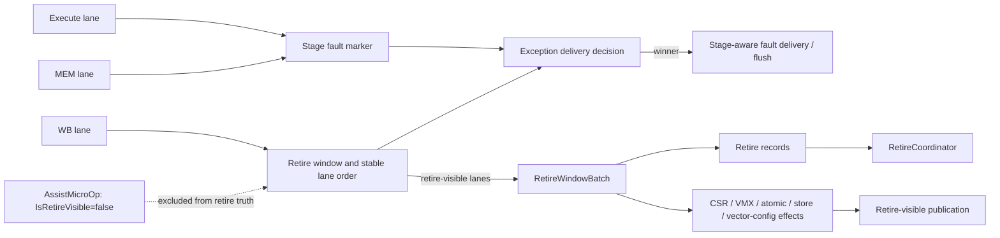

## Memory, Exception, and Rollback Boundaries

The current memory model is bounded by retire-time visibility. It is not a global memory-order theorem.

The exception model is stage-aware and retire-window-aware. It is not a blanket "full precise exceptions" theorem for every possible configuration and contour.

The rollback model is bounded by explicit replay-token capture/restore limits. It is not universal rollback.

These boundaries are part of the architecture. They are not footnotes.

## Backend Truthfulness

The active backend substrate includes:

- `PhysicalRegisterFile`;
- `RenameMap`;
- `CommitMap`;
- `FreeList`;
- `RetireCoordinator`.

Therefore, the correct claim is not "renaming eliminated." The correct claim is that typed-slot legality, certificate-governed admission, replay reuse, and retire publication are made explicit and analyzable while coexisting with backend rename/commit state.

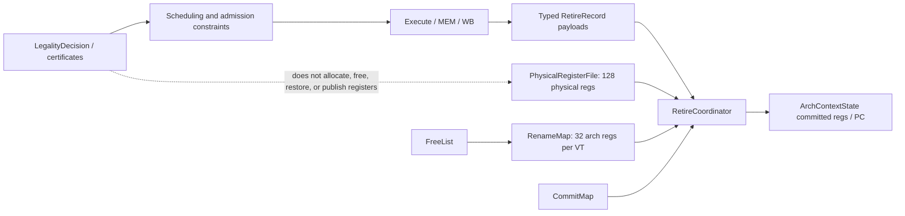

## Validation State

The current validation posture is evidence-oriented rather than pass-count marketing.

A local recount on 2026-04-24 reported:

| Surface | Count |
|---|---:|
| `HybridCPU_ISE` source files | `365` |
| `HybridCPU_Compiler` source files | `145` |
| test files under the main tests directory | `265` |
| `[Fact]` / `[Theory]` declarations under the main tests directory | `2180` |
| full test-tree source files | `373` |
| full test-tree `[Fact]` / `[Theory]` declarations | `3699` |

These are live-tree counts, not a fresh full-suite pass total.

The reproducible smoke baseline is the Phase 06 proof subset:

```powershell
powershell -ExecutionPolicy Bypass -File .\build\run-validation-baseline.ps1 -NoRestore
```

The same smoke command passed locally on 2026-04-24:

| Smoke result | Count |
|---|---:|
| Failed | `0` |
| Passed | `52` |
| Skipped | `0` |
| Total | `52` |

The broader recount command is:

```powershell
powershell -ExecutionPolicy Bypass -File .\build\recount-validation-evidence.ps1 -NoRestore
```

Use the smoke baseline for reproducible architecture-proof seams. Use the recount script for live source/test declaration counts. Do not read either as a coverage percentage.

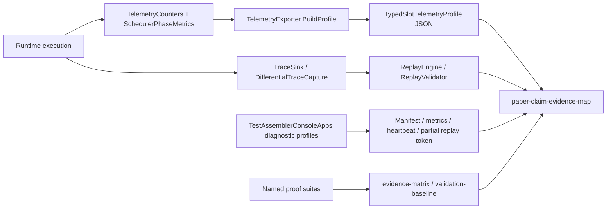

## Runtime Harness Sanity

The repository also keeps a runtime harness sanity surface through the assembler console app:

```powershell
dotnet run --project .\TestAssemblerConsoleApps\TestAssemblerConsoleApps.csproj --no-restore --no-build
```

The documented harness matrix tracks IPC, retired count, cycles, last reject kind, legality authority, slack reclaim ratio, and replay success for representative modes. Treat those values as runtime-drift evidence, not as a universal performance claim.

## Current Strong Claims

The following claims are safe repository-facing statements for the current codebase:

- native VLIW is the active frontend;
- VLIW bundles are fixed 8-slot, 256-byte carriers;
- the typed lane map is fixed and heterogeneous;
- class admission happens before lane materialization on the typed-slot path;
- runtime legality is consumed through explicit `LegalityDecision` values;
- guard-plane checks precede replay/certificate reuse;
- certificate structural identity is the replay/template compatibility seam;
- replay-stable behavior is bounded by the replay/evidence envelope;
- typed-slot facts are active agreement evidence but currently `ValidationOnly`;
- compiler contract version mismatch is fail-closed;
- assists are runtime-explicit but architecturally non-retiring;
- telemetry is a first-class evidence surface;
- backend rename/commit state remains live.

## Current Non-Claims

Do not read the live repository as claiming:

- universal deterministic scheduling;
- blanket precise exceptions;
- global memory ordering;
- mandatory compiler facts for canonical execution;
- compiler hints outranking runtime legality;
- active DBT frontend;
- active scalar-generalized frontend;
- all historical opcode contours accepted by canonical decode;
- production hardware-rooted attestation;
- renaming-free execution;
- full cross-core shared-bundle issue as the mainline SMT model.

## Current Limitations

The following limitations are explicit:

- typed-slot facts are validated and transported, but not required for canonical runtime execution;
- some inter-core and compatibility legality surfaces still exist and must not be confused with active typed-slot SMT mainline;
- stream-control and VMX surfaces are guarded when not wired;
- proof signing is simulated ISE scaffolding, not a production root-of-trust path;
- telemetry schema is rich but source-defined rather than frozen as a long-term external compatibility contract;
- the documented validation baseline is a smoke subset, not a repository-wide green total;
- historical names such as `FSP` remain in retained counters and tests.

## Practical Reading Order

For a short technical pass, read this README first, then the WhiteBook index, then the operational semantics artifact, then the validation baseline and evidence matrix.

For implementation work, map claims back to the live scheduler, safety, compiler-contract, replay, diagnostics, and pipeline code before strengthening any README or paper statement.

For paper writing, keep the claims bounded:

- "runtime-owned legality" rather than "compiler-proved correctness";
- "replay-stable inside the evidence envelope" rather than "globally deterministic";
- "retire-time visibility boundary" rather than "complete memory theorem";
- "stage-aware fault ordering" rather than "blanket precise exceptions";
- "ValidationOnly typed-slot facts" rather than "mandatory compiler certificates";
- "simulated proof signing" rather than "hardware-rooted attestation."

## Working Commands

```powershell
powershell -ExecutionPolicy Bypass -File .\build\run-validation-baseline.ps1 -NoRestore
powershell -ExecutionPolicy Bypass -File .\build\recount-validation-evidence.ps1 -NoRestore
dotnet run --project .\TestAssemblerConsoleApps\TestAssemblerConsoleApps.csproj --no-restore --no-build
```

These commands are the current repository-facing entry points for smoke validation, evidence recount, and runtime harness sanity. They do not replace code review, full test execution, or architecture-specific proof inspection.
