# HybridCPU ISE

**Replay-stable SMT-VLIW instruction-set emulator/runtime with streaming-vector transport, typed-slot scheduling, runtime-owned legality, replay evidence, and compiler/runtime structural agreement.**

The central implementation is an instruction-set emulator/runtime with a fixed 8-slot VLIW carrier, 4-way SMT inside a core, class-aware lane topology, explicit legality decisions, bounded replay reuse, retire-visible evidence, and a staged compiler contract.

This README deliberately compresses the WhiteBook into the repository entry point. It keeps file references minimal; for deeper detail, start with:

- `Documentation/WhiteBook/0. chapter-index.md`
- `Documentation/operational-semantics.md`
- `Documentation/validation-baseline.md`
- `Documentation/evidence-matrix.md`
- [StreamEngine and DmaStreamCompute summary pack](Documentation/Stream%20WhiteBook/StreamEngine%20DmaStreamCompute/00_README.md)
- [lane6 DmaStreamCompute current contract](Documentation/Stream%20WhiteBook/DmaStreamCompute/00_README.md)
- [lane7 L7-SDC external accelerator WhiteBook](Documentation/Stream%20WhiteBook/ExternalAccelerators/00_README.md)
- [Stream WhiteBook diagram index](Documentation/Stream%20WhiteBook/ExternalAccelerators/Diagrams/00_Diagram_Index.md)

When this README, older notes, and code disagree, live code and the current proof/evidence surfaces are the authority. Historical material under old documentation paths is repository archaeology unless a current proof surface cites it.

## Stream WhiteBook Entry Points

The Stream WhiteBook paths are current architecture records for stream/vector, lane6 DSC, and lane7 L7-SDC surfaces. They are entry points, not implementation approvals for future features.

| Area | Start here | Claim boundary |
|---|---|---|
| StreamEngine / VectorALU / SRF / BurstIO | [StreamEngine, SFR/SRF, And VectorALU](Documentation/Stream%20WhiteBook/StreamEngine%20DmaStreamCompute/01_StreamEngine_SFR_SRF_VectorALU.md) | Live StreamEngine stream/vector behavior plus helper/data-ingress caveats; not DSC or L7 evidence. |
| Lane6 DSC | [DmaStreamCompute current contract](Documentation/Stream%20WhiteBook/DmaStreamCompute/01_Current_Contract.md) | Current descriptor/decode carrier, fail-closed direct execution, DSC1 strict ABI, DSC2 parser-only, helper/token model. |
| Lane7 L7-SDC | [L7-SDC executive summary](Documentation/Stream%20WhiteBook/ExternalAccelerators/01_L7_SDC_Executive_Summary.md) | Current fail-closed `ACCEL_*` carriers plus model/helper/test APIs for token, backend, commit, conflict, and telemetry. |
| Diagrams | [diagram index](Documentation/Stream%20WhiteBook/ExternalAccelerators/Diagrams/00_Diagram_Index.md) | Explanatory diagrams only; not approval for executable DSC/L7, async overlap, coherent DMA/cache, or production lowering. |

## Evidence Discipline

The documentation method is fail-closed. Claims are included only when their evidence class is visible and does not invert authority. Parser, helper, model, fake-backend, telemetry, token, certificate, and capability evidence is not executable evidence by itself.

The evidence classes used throughout the WhiteBook are:

- current implemented behavior: behavior directly expressed by the live implementation;
- confirmed by tests: behavior exercised by named test surfaces, without becoming a broader theorem;
- model/helper behavior: runtime helper, model API, queue, token, fence, backend, telemetry, or commit contour outside canonical execution;
- parser-only behavior: parser, descriptor, capability, sideband, or normalized-footprint acceptance without execution;
- future-gated behavior: planned behavior blocked by ADR, implementation, positive/negative tests, compiler conformance, and documentation migration;
- rejected/not allowed behavior: unsafe interpretation that must remain a non-claim.

This repository implements a replay-stable SMT-VLIW emulator/runtime inside a bounded evidence envelope. It does not claim a universal determinism theorem, a complete precise-exception theorem, a global memory-order theorem, a production hardware-rooted attestation stack, a mandatory compiler-facts runtime, executable lane6 DSC, executable L7 `ACCEL_*`, coherent DMA/cache, async DMA overlap, or production compiler/backend lowering in the current mainline.

## Architectural Thesis

The current codebase implements:

- a native-VLIW-only active frontend;
- a fixed 8-slot bundle carrier;
- a fixed 4-way SMT core model;
- a heterogeneous typed-lane topology;
- two-stage typed-slot scheduling with class admission before lane materialization;
- replay-aware densification rather than free-form superscalar scheduling;
- explicit runtime legality through `LegalityDecision`;
- legality provenance through `LegalityAuthoritySource`;
- certificate identity as a replay/reuse seam;
- compiler/runtime structural agreement through typed-slot facts;
- live StreamEngine raw stream/vector execution through validated ingress, VectorALU, SRF, and BurstIO surfaces;
- lane6 `DmaStreamCompute` as a descriptor/decode carrier with fail-closed direct execution and explicit model/helper token APIs;
- lane7 L7-SDC as `SystemSingleton` external accelerator command carriers with fail-closed direct execution and model/helper APIs;
- telemetry and replay evidence as architecture-facing surfaces;
- explicit backend state with rename, commit, physical register, free-list, and retire coordination.

At the same time, the live repository is not:

- a hidden out-of-order superscalar design;
- a free-form "any operation in any lane" scheduler;
- a DBT-based compatibility frontend;
- a scalar-generalized frontend;
- a compiler-only micro-packer;
- a runtime where stale compiler metadata silently becomes correctness authority;
- a machine where all optional or historical opcode contours are active mainline decode;
- a hidden fallback between StreamEngine, lane6 DSC, lane7 L7-SDC, DMAController, custom accelerators, or fake/test backends;
- a current executable DSC/DSC2/L7 accelerator ISA, coherent DMA/cache hierarchy, or production compiler/backend lowering target.

## Runtime Shape

The live runtime is distributed across frontend decode, legality analysis, scheduling, pipeline execution, replay, assist handling, memory, backend state, diagnostics, and test evidence.

The operationally important split is between:

- architectural payload: the raw VLIW slot and bundle image;
- sideband metadata: slot and bundle annotations, typed-slot facts, DSC/L7 descriptors, replay anchors, and compiler transport;
- runtime legality evidence: descriptors, certificates, legality decisions, replay templates, guard state, and telemetry.

Correctness is not supposed to depend on retired policy bits in the raw slot payload. Modern scheduling policy lives in sideband/runtime structures, and runtime legality remains authoritative.
Typed-slot facts are runtime authority only after the live guard/admission path accepts them; they are not yet a mandatory correctness substrate by themselves.
Descriptor sideband preservation and carrier projection are transport and validation facts. They are not execution, token allocation, memory publication, `rd` writeback, or production lowering by themselves.

## Machine State

The repository-facing operational semantics uses this state tuple:

```text
MachineState =
  <ArchitecturalState,
   FrontendState,
   SchedulerState,
   PipelineState,
   ReplayState,
   BackendState,
   EvidenceState>
```

The tuple is intentionally explicit about backend state:

- `ArchitecturalState` covers the visible integer register file, PC, memory, trap, and retire publication state.
- `FrontendState` covers fetch/decode inputs, canonical decoded-bundle transport, derived issue-plan state, and `BundleLegalityDescriptor`.
- `SchedulerState` covers nominations, class capacity, Stage A/Stage B admission, `LegalityDecision`, and issue-packet candidates.
- `PipelineState` covers IF/ID/EX/MEM/WB latches and cycle/stall control.
- `ReplayState` covers `LoopBuffer`, replay phase context, template reuse, legality cache reuse, and invalidation.
- `BackendState` covers `PhysicalRegisterFile`, `RenameMap`, `CommitMap`, `FreeList`, and `RetireCoordinator`.
- `EvidenceState` covers trace/timeline output, contour certificates, legality telemetry, replay evidence, and exported profiles.

The current runtime is therefore not renaming-free. Typed-slot legality constrains admission and publication; it does not erase backend ownership machinery.

## Architectural Register File

The ISA-visible integer architectural register file is deliberately small and conventional: each virtual thread exposes `32 x 64-bit` integer architectural registers, `x0..x31`. Four-way SMT gives separate per-VT contexts; it does not make 128 integer registers visible to one architectural thread.

Do not read the backend `PhysicalRegisterFile` as an expanded architectural register file. The current backend has a shared 128-entry physical register substrate plus `RenameMap`, `CommitMap`, and `FreeList`, but those structures are internal machinery for execution, rollback, and retire publication. They do not give the ISA a hidden wide general-purpose register file.

The streaming/vector side also should not be described as a vector-register machine. Stream-oriented fields in the VLIW carrier name memory addresses, lengths, strides, masks, and policy bits. When those forms execute, decode/runtime materializes memory-oriented micro-ops and selected scalar/predicate results; it does not expose a separate code-backed vector register file as ISA-visible state.

## Cycle Relation

The main step relation is:

```text
Step(MachineState_t, Inputs_t) -> MachineState_t+1
```

The concrete cycle owner is `ExecutePipelineCycle()`.

The live pipeline exposes two top-level cycle outcomes:

- `STALL`: hazard or decode-local stall blocks forward progress, records a stall sample, increments stall counters, and does not advance fetch.
- `CYCLE`: the five-stage shell advances in reverse stage order, `WB -> MEM -> EX -> ID -> IF`, then records a cycle sample and closes replay-cycle bookkeeping.

Reverse stage advancement is part of the runtime contract: each stage observes prior-cycle state rather than the state that an earlier stage just wrote in the same cycle.

## VLIW Carrier

The base slot carrier is `VLIW_Instruction`, a packed fixed-width 32-byte struct represented as four 64-bit words. A bundle is `VLIW_Bundle`, an 8-slot aggregate serialized as 256 bytes.

The slot format is container-centric:

- `word0` carries opcode, data type, predicate mask, policy flags, and immediate;
- `word1` carries source/address transport fields;
- `word2` carries destination and vector-length transport;
- `word3` carries row stride, the retired policy-gap bit, virtual-thread transport hint, stream length, and stride.

The opcode is an opaque 16-bit field. Architectural classification comes from registry/classifier logic, not from ad hoc opcode bit slicing.

The active correctness-bearing policy bits in `word0` include reduction, 2D, indexed, tail agnostic, mask agnostic, acquire, release, and saturating behavior. Scheduling policy is not encoded in the architectural slot payload.

`word3[49:48]` stores `VirtualThreadId`, but current code treats it as a transport hint only. It is preserved for compatibility and diagnostics, but it does not bind final execution ownership. Runtime ownership, nomination state, owner context, and legality checks are the authority.

`word3[50]` is a retired legacy scheduling-policy bit. Production ingress and native decode reject it fail-closed. The current architecture should be read as "old scheduling-policy encodings are not silently tolerated."

At bundle decode, opcode zero is the canonical NOP/empty-slot sentinel.

## Fixed Topology

The current machine is a fixed typed `W=8`, `4-way SMT` runtime.

| Physical lane | Slot class |
|---:|---|
| `0..3` | `AluClass` |
| `4..5` | `LsuClass` |
| `6` | `DmaStreamClass` |
| `7` | `BranchControl` or `SystemSingleton` |

Lane 7 is intentionally aliased between branch/control and system-singleton work. This alias is an architectural scheduling constraint in the current runtime, not an accidental implementation detail.

Lane 6 and lane 7 have separate Stream WhiteBook roles:

- lane 6 hosts `DmaStreamClass` carriers, including lane6 assist/SRF ingress and the `DmaStreamCompute` descriptor carrier;
- lane 7 hosts `BranchControl` or `SystemSingleton`; L7-SDC uses only the hard-pinned `SystemSingleton` side for `ACCEL_*` carriers.

That topology does not create fallback authority. A rejected lane6 DSC command does not become StreamEngine, VectorALU, DMAController, or L7 work; a rejected L7 command does not move into lane6 or StreamEngine.

"8-wide issue" therefore means 8 heterogeneous physical lanes with class-aware constraints. It does not mean 8 interchangeable scalar issue positions.

`W=8` is the physical typed-lane topology of the carrier and scheduler. It is not a promise of eight independent useful retiring IPC slots, and it is not a global peak-throughput theorem.

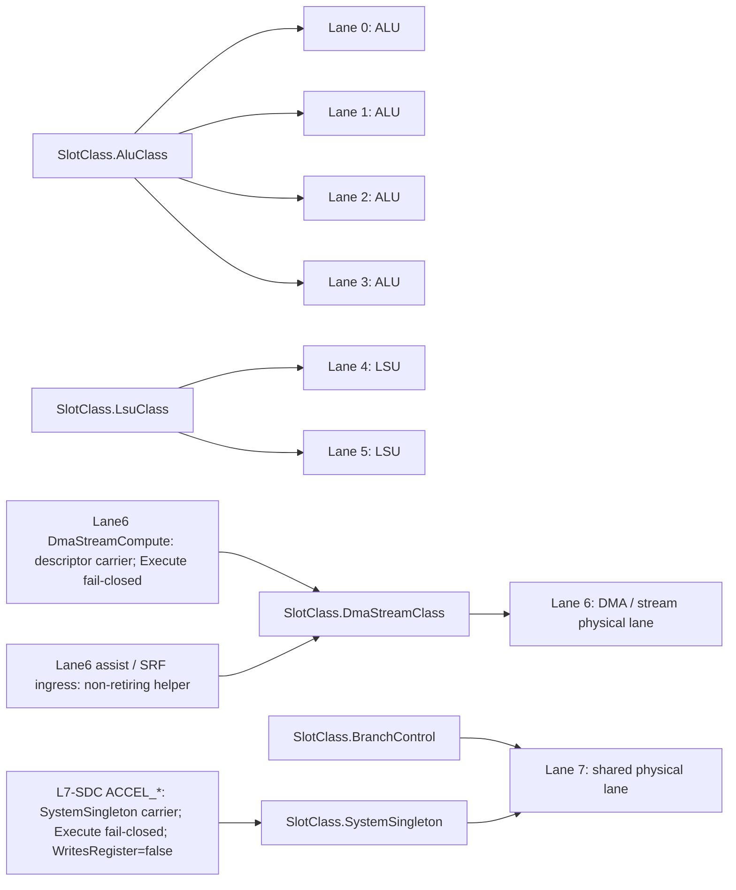

## Scalar, VLIW, and Streaming-Vector Layers

The runtime is best modeled as a compound architecture:

1. scalar control and state management;
2. fixed 8-slot VLIW bundle transport;
3. streaming/vector execution with memory-to-memory and RVV-influenced policy fields.

The scalar layer owns conventional control, CSR/system behavior, and retire-visible scalar work. The VLIW layer exposes explicit bundle structure. The vector side uses stream-oriented transport fields such as `VectorDataLength`, `Stride`, `StreamLength`, and `RowStride`.

The binary carrier contains streaming fields, but the runtime still distinguishes "container can carry stream parameters" from "every possible stream-control contour is wired as a live execution surface." Unsupported stream-control and VMX materialization paths are explicitly guarded.

Memory-to-memory here means memory-oriented execution, not a bypass around the lane model. A stream/vector form is decomposed by decode/runtime into micro-ops and carrier work that still consumes typed resources. ALU-class compute consumes `AluClass` lanes. Load/store movement, DMA/stream movement, assists, and control/system work consume their corresponding `LsuClass`, `DmaStreamClass`, carrier, or aliased lane-7 resources when that contour is active in the current model.

The current StreamEngine stack is the live raw stream/vector executor. Lane6 `DmaStreamCompute` and lane7 L7-SDC are separate descriptor-backed carrier/model surfaces: their current direct carrier execution is fail-closed, and their helper/parser/model evidence must not be read as StreamEngine execution.

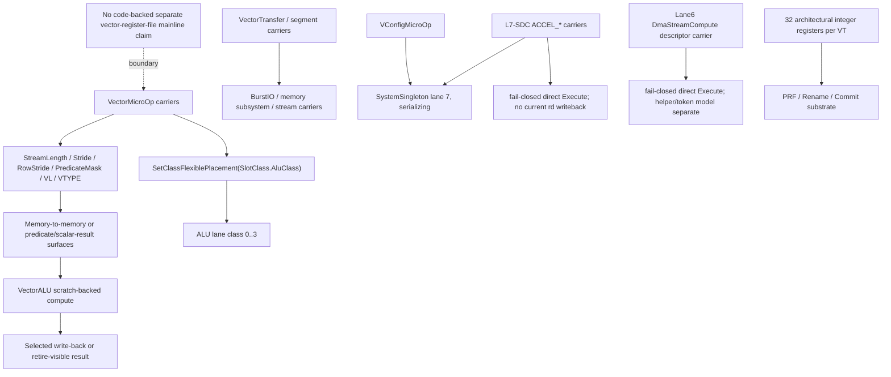

## Frontend Boundary

The active frontend is native VLIW only. Compatibility ingress remains quarantined to compatibility and diagnostic seams. DBT, scalar-generalized decode, and permissive legacy decode are not current proof surfaces.

Canonical decode is not a "try to guess old payload intent" shell. The native decoder rejects unknown or prohibited opcodes, retained compatibility contours, retired policy-gap usage, and unsupported residual scalar or matrix contours when those reach canonical decode.

Decode is full-bundle aware even when foreground issue later advances slot by slot. The runtime preserves canonical decoded-bundle state separately from derived issue-plan state, so densification does not mutate the architectural bundle description.

## Runtime Flow

The live path from bytes to retire-visible effects is:

1. Fetch a native 256-byte VLIW bundle, or reuse cached decoded slots through loop-buffer replay.
2. Decode raw slots into canonical instruction and bundle descriptors.
3. Build legality descriptors, typed-slot structural facts, and memory-oriented micro-op carriers where the opcode contour requires decomposition.
4. Derive a foreground issue plan, optionally through intra-core SMT densification.
5. Admit candidates by class and runtime legality.
6. Materialize admitted candidates into physical lanes.
7. Materialize issue-packet lanes into EX/MEM/WB stage state.
8. Execute, access memory, resolve writeback/fault candidates, and publish retire-visible effects.
9. Emit trace, telemetry, replay evidence, and retire contour evidence.

The key architectural separation is:

```text
canonical decoded bundle
  != derived issue plan
  != admitted class candidate
  != materialized lane
  != retire-visible architectural effect
```

This distinction prevents claims about "bundle contains a slot" from being misread as "slot executed and retired."

For Stream WhiteBook contours, it also prevents three common overclaims:

- a lane6 `DmaStreamCompute` sideband descriptor or projected carrier is not current executable DSC;
- a lane7 `ACCEL_*` sideband descriptor or projected carrier is not current executable L7 and does not write architectural `rd`;
- a helper token, model queue, parser accept, telemetry record, or fake backend completion is not pipeline execution or memory publication.

```mermaid
flowchart LR
    N["Native VLIW Bundle"] --> DEC["VliwDecoderV4 / DecodedInstructionBundle"]
    DEC --> DES["BundleLegalityAnalyzer -> BundleLegalityDescriptor"]
    DEC --> DSCDEC["Lane6 DSC sideband/projector"]
    DSCDEC --> DSCCLOSED["DmaStreamCompute carrier; Execute fail-closed"]
    DEC --> L7DEC["Lane7 L7-SDC ACCEL_* sideband/projector"]
    L7DEC --> L7CLOSED["SystemSingleton carrier; Execute fail-closed; WritesRegister=false"]
    DES --> FACTS["DecodedBundleTypedSlotFacts + DecodedSlotLegality"]
    FACTS --> EVID["Decoded legality evidence"]
    LIVE["Current bundle resources + owner/domain state"] --> PREP["PrepareSmt: certificate + metadata + boundary guard"]
    EVID -. informs checks / diagnostics .-> PREP
    PREP --> A["Stage A: TryClassAdmission"]
    A --> SVC["IRuntimeLegalityService"]
    SVC --> LD["LegalityDecision"]
    LD --> AV["Stage A verdict"]
    AV --> B["Stage B: TryMaterializeLane"]
    B --> MUT["Bundle-local mutation + RefreshSmtAfterMutation"]
    MUT --> EX["Execute / MEM / WB"]
    EX --> RET["RetireCoordinator / retire records"]
    RET --> TEL["Telemetry / Trace / Evidence profiles"]
    ASSIST["Assist plane"] --> A
    ASSIST --> B
    REPLAY["LoopBuffer / ReplayPhaseContext"] -. reuse or invalidation .-> SVC
```

## Current Stream And Accelerator Claim Partition

This partition is the short form of the Stream WhiteBook evidence map.

| Surface | Current implemented behavior | Confirmed by tests | Model/helper behavior | Parser-only behavior | Future-gated behavior | Rejected / not allowed behavior |
|---|---|---|---|---|---|---|
| StreamEngine | Validated `StreamExecutionRequest` ingress, `StreamEngine.Execute(...)`, supported StreamEngine contours, VectorALU compute, SRF exact warm/bypass and invalidation. | Stream ingress warmup, memory-subsystem binding, vector addressing closure, and SRF bypass tests confirm named seams only. | BurstIO DMA route is synchronous helper behavior; SRF/prefetch/VDSA assist are data-ingress helpers with telemetry. | Not the main StreamEngine claim. | Async overlap and coherent DMA/cache remain gated. | StreamEngine, VectorALU, or DMAController as fallback for rejected DSC/L7. |
| Lane6 DSC | Lane6 descriptor/decode carrier; direct `DmaStreamComputeMicroOp.Execute(...)` disabled/fail-closed; `ExecutionEnabled == false`; `WritesRegister == false`. | `DmaStreamCompute*` and compiler contract tests confirm fail-closed, descriptor, helper, token, and sideband boundaries under their filters. | `DmaStreamComputeRuntime`, token lifecycle, `CommitPending`, explicit commit, retire-style helper results, and progress diagnostics. | DSC2 descriptor/capability/footprint parsing is parser-only and non-executable. | Executable lane6 DSC, async queue/completion, IOMMU-backed memory, coherent cache, partial success, production lowering. | Hidden StreamEngine/DMAController fallback, direct destination commit, parser/decode/normal issue token allocation as current behavior. |
| Lane7 L7-SDC | `ACCEL_*` lane7 `SystemSingleton` carriers; direct `SystemDeviceCommandMicroOp.Execute(...)` fail-closed; `WritesRegister=false`; no current architectural `rd`. | `L7Sdc*`, Phase10 gate, compiler Phase12, and documentation claim-safety tests confirm named model/fail-closed seams. | Token, queue, poll, wait, cancel, fence, register ABI, backend, commit, rollback, conflict, and telemetry APIs are model/helper/test surfaces. | SDC1 descriptor parsing and carrier cleanliness are parser/model evidence. | Executable `ACCEL_*`, `rd`/CSR publication, production backend dispatch, IOMMU-backed executable memory. | Fake/test backend as production protocol, capability registry as authority, fallback to DSC/StreamEngine/custom accelerator execution. |
| Memory / DMA / cache / conflict | Retire-time memory boundary, explicit physical helper paths, explicit SRF/cache invalidation surfaces where routed. | Phase05 conflict, Phase06 addressing/backend, Phase09 cache, and L7 conflict/commit tests confirm model/foundation seams only. | External accelerator conflict manager is model-local/passive; non-coherent invalidation fan-out is model/helper evidence. | Address-space and footprint parsing is not executable memory. | `GlobalMemoryConflictService`, coherent DMA/cache, dirty-line writeback, executable IOMMU-backed DSC/L7 memory. | Progress, poll, wait, fence, telemetry, token, certificate, or capability evidence publishing memory. |
| Compiler / backend | Typed-slot facts are `ValidationOnly`; compiler contract mismatch rejects; descriptor sideband can be preserved and validated. | Compiler backend Phase11, DSC compiler contract, and L7 compiler Phase12 tests confirm preservation and prohibition boundaries. | Capability planning and model/test helper use must be labeled. | DSC/L7 sideband descriptor preservation is parser/transport evidence. | Production executable DSC/L7 lowering after executable runtime, ordering, cache, backend, conformance, and docs gates close. | Sideband emission, carrier projection, fake backend, or parser acceptance as production lowering proof. |

## StreamEngine, VectorALU, SRF, And BurstIO

StreamEngine is the current raw stream/vector execution surface. Its details live in [StreamEngine, SFR/SRF, And VectorALU](Documentation/Stream%20WhiteBook/StreamEngine%20DmaStreamCompute/01_StreamEngine_SFR_SRF_VectorALU.md) and [VDSA Assist, Warming, Prefetch, SRF, And Data Ingress](Documentation/Stream%20WhiteBook/StreamEngine%20DmaStreamCompute/03_VDSA_Assist_Warming_Prefetch_SRF_DataIngress.md).

Current behavior:

- `StreamExecutionRequest` is the validated ingress projection for live StreamEngine execution.
- `StreamEngine.Execute(...)` dispatches supported stream/vector contours; `Execute1D` and execution modes are StreamEngine behavior, not DSC descriptor execution.
- `VectorALU` performs typed element compute over StreamEngine spans, including predication, tail/mask policy handling, compute families, and exception counters.
- `StreamRegisterFile` / `SRF` is bounded warm/bypass storage with exact source, element-size, and byte-coverage checks; overlapping StreamEngine writes invalidate warmed windows.
- `PrefetchToStreamRegister(...)`, `TryPrefetchToAssistStreamRegister(...)`, and `ScheduleLane6AssistPrefetch(...)` are explicit warm/data-ingress seams.

Helper and non-claim boundaries:

- BurstIO is the StreamEngine memory movement substrate. Its DMA helper configures/starts DMA and loops `DMAController.ExecuteCycle()` until completion or a safety limit; this is synchronous helper behavior, not architectural async DMA overlap.
- SRF/prefetch/cache invalidation is explicit non-coherent invalidation, not coherent DMA/cache.
- VDSA assist is architecturally invisible, non-retiring, replay-discardable, telemetry-visible data ingress. It does not execute VectorALU operations, commit memory, publish registers, or accept DSC descriptors.
- StreamEngine, SRF, VectorALU, BurstIO, DMAController, and assist evidence do not close executable DSC/L7/DSC2, IOMMU-backed execution, coherent DMA/cache, or production compiler/backend gates.

## Lane6 DmaStreamCompute

Lane6 `DmaStreamCompute` is the descriptor/decode carrier plus explicit helper/token model documented in [DmaStreamCompute current contract](Documentation/Stream%20WhiteBook/DmaStreamCompute/01_Current_Contract.md) and [DmaStreamCompute summary](Documentation/Stream%20WhiteBook/StreamEngine%20DmaStreamCompute/02_DmaStreamCompute.md).

Current implemented boundary:

- `DmaStreamComputeMicroOp` is the lane6 typed-slot descriptor carrier.
- `DmaStreamComputeMicroOp.Execute(...)` is disabled and must fail closed.
- `DmaStreamComputeDescriptorParser.ExecutionEnabled == false`.
- `DmaStreamComputeMicroOp.WritesRegister == false`; the carrier has no current architectural read/write register contract.
- Native carrier cleanliness requires descriptor sideband, slot index `6`, zero retired policy gap and reserved bits, zero raw VT hint, and guard-accepted owner/domain evidence.

DSC1 is strict/current-only: magic `DSC1`, ABI version `1`, header size `128`, range entry size `16`, operations `Copy`, `Add`, `Mul`, `Fma`, `Reduce`, element types `UInt8`, `UInt16`, `UInt32`, `UInt64`, `Float32`, `Float64`, shapes `Contiguous1D` and `FixedReduce` only for reduce, `InlineContiguous` ranges, and `AllOrNone` as the only successful completion policy.

Model/helper behavior is separate: `DmaStreamComputeRuntime.ExecuteToCommitPending(...)` can create a token, read exact physical ranges, compute output bytes, stage destination bytes, transition to `CommitPending`, and publish bytes only through explicit token commit after fresh owner/domain guard and exact staged coverage. Helper/runtime tokens, retire-style observations, progress diagnostics, poll/wait/fence style observations, and commit-pending state do not publish memory by themselves.

DSC2 is parser-only/non-executable. Address-space, strided, tile/2D, scatter-gather, capability-profile, and footprint-summary parsing can produce exact or conservative footprint evidence, but it does not allocate pipeline tokens, call the runtime helper, publish memory, prove IOMMU-backed execution, authorize partial success, or permit production lowering.

Future executable lane6 DSC is gated by ADR approval, token store and issue/admission, precise retire faults, ordering/conflict service, explicit physical/IOMMU backend selection with no fallback, DSC2 executable-use gates, all-or-none/progress decisions, non-coherent cache protocol, compiler/backend contract, conformance, and documentation migration. Phase13 records dependency order only; it is not implementation approval.

## Lane7 L7-SDC External Accelerator Model

L7-SDC is the lane7 `SystemSingleton` system-device command carrier/model surface for external accelerators. Start with [L7-SDC executive summary](Documentation/Stream%20WhiteBook/ExternalAccelerators/01_L7_SDC_Executive_Summary.md), [topology and ISA placement](Documentation/Stream%20WhiteBook/ExternalAccelerators/02_Topology_And_ISA_Placement.md), and [descriptor ABI and carrier cleanliness](Documentation/Stream%20WhiteBook/ExternalAccelerators/03_Descriptor_ABI_And_Carrier_Cleanliness.md).

Current carrier set:

| Carrier | Current pipeline behavior |
|---|---|
| `ACCEL_QUERY_CAPS` | Lane7 carrier/model surface; direct execute fail-closed; no architectural `rd`. |
| `ACCEL_SUBMIT` | Requires typed descriptor sideband when projected; direct execute fail-closed; no backend dispatch. |
| `ACCEL_POLL` | Model observation API only; carrier does not write architectural registers. |
| `ACCEL_WAIT` | Model wait API only; wait observations do not publish memory. |
| `ACCEL_CANCEL` | Model cancel API only; carrier does not execute cancellation in the pipeline. |
| `ACCEL_FENCE` | Model fence API only; no executable fence semantics in current pipeline. |

Direct `SystemDeviceCommandMicroOp.Execute(...)` throws fail-closed for every `ACCEL_*` carrier. Current `ACCEL_*` carriers have `WritesRegister=false`, empty architectural write metadata, and no current architectural `rd` writeback. `AcceleratorRegisterAbi` is a model result helper only.

SDC1 descriptor evidence is sideband/model evidence: magic `SDC1`, ABI version `1`, header size `128`, range entry size `16`, matrix `ReferenceMatMul` / `MatMul` model envelope, datatypes `Float32`, `Float64`, `Int32`, rank-2 `Matrix2D`, `AllOrNone`, owner binding, and normalized footprint hash. SDC1 is not a universal external accelerator protocol.

Authority roots are owner/domain guard evidence plus mapping and IOMMU-domain epoch validation. Token handles, telemetry, replay/certificate identity, descriptor hashes, capability registry metadata, and status words are evidence or lookup material, not authority. Model token states, queue/poll/wait/cancel/fence/register/backend/commit APIs, fake MatMul surfaces, and fake/test backends remain model/helper/test-only evidence and not production protocol.

Diagram caveat: the compact carrier flow below is explanatory evidence for placement and fail-closed projection only. It is not backend dispatch, `rd` writeback, or implementation approval. Full source: [Lane Placement And Carrier Flow](Documentation/Stream%20WhiteBook/ExternalAccelerators/Diagrams/01_Lane_Placement_And_Carrier_Flow.md).

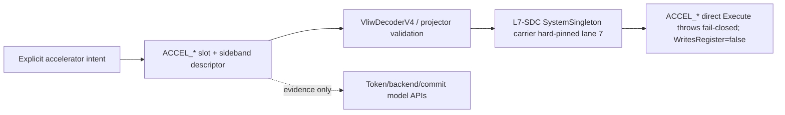

## Memory, DMA, IOMMU, Conflict, And Cache Boundaries

Memory-related Stream WhiteBook claims are deliberately narrow.

- DSC helper/runtime memory is exact physical main memory: sources are read through exact physical ranges, destination bytes are token-owned until explicit commit, commit requires `CommitPending`, fresh owner/domain guard, and exact staged coverage, and all-or-none rollback restores partial physical write failures.
- StreamEngine BurstIO prefers an explicit `MemorySubsystem` and has legacy active/global memory fallback only for StreamEngine entry points. That legacy fallback is not generalized to DSC or L7.
- IOMMU warm paths, IOMMU burst backends, backend resolvers, and no-fallback resolver tests are infrastructure/model evidence. They do not prove current executable DSC/L7 IOMMU-backed memory execution.
- L7 owner/domain plus mapping and IOMMU-domain epoch validation is current model admission/commit authority, not current executable L7 memory execution.
- `ExternalAcceleratorConflictManager` is model-local/passive unless explicitly passed to model helpers. It is not a global CPU load/store authority.
- `GlobalMemoryConflictService` is a future foundation for CPU load/store/atomic, DSC, DMA, StreamEngine/SRF, assist, L7, fence/wait/poll, cache, and cancellation hook points. It is not currently installed as the global CPU load/store authority.
- Explicit SRF/cache invalidation fan-out after StreamEngine writes or L7/DSC model commits is non-coherent invalidation. Dirty-line/writeback and coherent DMA/cache remain future-gated, and coherent DMA requires a separate ADR.
- Progress diagnostics, poll/wait/fence observations, telemetry snapshots, token handles, and certificates do not publish memory.

Detailed sources: [DSC memory, ordering, commit, and fault semantics](Documentation/Stream%20WhiteBook/DmaStreamCompute/01_Current_Contract.md), [L7 backend staging and commit](Documentation/Stream%20WhiteBook/ExternalAccelerators/06_Backend_Staging_Commit_And_Rollback.md), [L7 memory conflict model](Documentation/Stream%20WhiteBook/ExternalAccelerators/07_Memory_Conflict_Model.md), and [Ex1 cache non-coherent protocol](Documentation/Refactoring/Phases%20Ex1/09_Cache_Prefetch_And_NonCoherent_Protocol.md).

## Compiler, Sideband, And Production Lowering Gates

Typed-slot facts remain current validation/transport evidence:

- `TypedSlotFactStaging.CurrentMode == ValidationOnly`;
- `CompilerContract.CurrentTypedSlotPolicy.Mode == CompatibilityValidation`;
- runtime legality remains the final Stage A authority.

Compiler sideband transport is explicit but non-executing. DSC descriptors travel through `InstructionSlotMetadata.DmaStreamComputeDescriptor`; L7 descriptors travel through `InstructionSlotMetadata.AcceleratorCommandDescriptor`. `DecodedBundleTransportProjector` may create lane6 or lane7 carriers only when required clean sideband is present; projection is not execution.

The compiler may select CPU/non-accelerator lowering, lane6 DSC contour, or compile-time rejection before native `ACCEL_SUBMIT` emission. Once an `ACCEL_SUBMIT` carrier is emitted and rejected, there is no post-submit hidden alternate execution promise.

`CompilerBackendLoweringContract` blocks production executable DSC and `ACCEL_*` lowering under the current contract. Future lowering requires executable implementation, result publication, backend/addressing semantics, ordering/conflict semantics, cache protocol, positive and negative tests, compiler conformance, and Phase12 documentation migration.

Diagram caveat: this compact transport diagram is sideband preservation evidence only. It is not production executable lowering. Full source: [Compiler To ISE Transport](Documentation/Stream%20WhiteBook/ExternalAccelerators/Diagrams/06_Compiler_To_ISE_Transport.md).

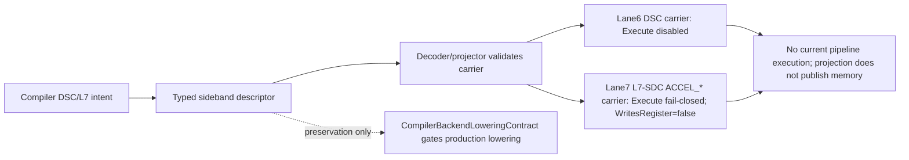

## Stream WhiteBook Diagrams

Diagrams below are explanatory evidence/model aids. They are not implementation approval for executable lane6 DSC, executable DSC2, executable L7 `ACCEL_*`, async DMA overlap, IOMMU-backed executable memory, coherent DMA/cache, or production compiler/backend lowering.

| Diagram | README handling | Nearby caveat |
|---|---|---|
| [Diagram index](Documentation/Stream%20WhiteBook/ExternalAccelerators/Diagrams/00_Diagram_Index.md) | Link only. | Index of explanatory diagrams, not an approval surface. |
| [Lane placement and carrier flow](Documentation/Stream%20WhiteBook/ExternalAccelerators/Diagrams/01_Lane_Placement_And_Carrier_Flow.md) | Compact version included in the L7 section. | Terminal state is fail-closed direct execute, not backend dispatch or writeback. |
| [Descriptor authority admission](Documentation/Stream%20WhiteBook/ExternalAccelerators/Diagrams/02_Descriptor_Authority_Admission.md) | Link from this table and authority prose. | Token creation is model admission, not `ACCEL_SUBMIT` instruction execution or memory publication. |
| [Token lifecycle](Documentation/Stream%20WhiteBook/ExternalAccelerators/Diagrams/03_Token_Lifecycle.md) | Link to full state machine. | `DeviceComplete`, `CommitPending`, poll/wait/fence observations do not publish memory or registers. |
| [Backend staging commit](Documentation/Stream%20WhiteBook/ExternalAccelerators/Diagrams/04_Backend_Staging_Commit.md) | Link to full detailed flow. | Fake/test backend completion and staged data are model evidence, not production protocol. |
| [Conflict manager](Documentation/Stream%20WhiteBook/ExternalAccelerators/Diagrams/05_Conflict_Manager.md) | Link to full model-local flow. | Model-local/passive conflict manager is not global CPU load/store authority. |
| [Compiler to ISE transport](Documentation/Stream%20WhiteBook/ExternalAccelerators/Diagrams/06_Compiler_To_ISE_Transport.md) | Compact version included in the compiler section. | Sideband preservation is not production executable lowering; projected carrier still fail-closes. |
| [Telemetry evidence not authority](Documentation/Stream%20WhiteBook/ExternalAccelerators/Diagrams/07_Telemetry_Evidence_Not_Authority.md) | Compact version included below. | Evidence can explain or bind model decisions, but cannot satisfy upstream execution gates. |

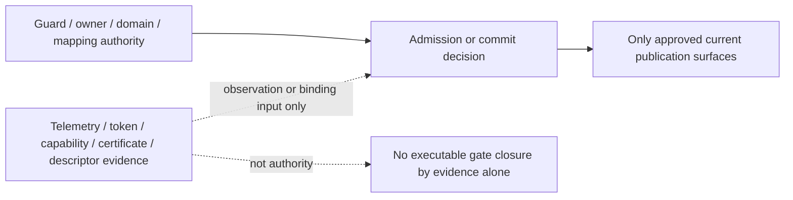

## Typed-Slot Scheduling

The typed-slot runtime path is the strongest current architectural result in the repository.

The active slot-class vocabulary is:

- `AluClass`;
- `LsuClass`;
- `DmaStreamClass`;
- `BranchControl`;
- `SystemSingleton`;
- `Unclassified`.

Operations are either:

- `ClassFlexible`: admitted at class level, then bound to one legal free lane of that class;
- `HardPinned`: required to use a specific `PinnedLaneId`.

The scheduler is not an exact-slot compiler replay machine. It is a two-stage runtime admission system:

```text
Stage A: TryClassAdmission(...)
  A1. class-capacity availability
  A2. runtime legality through IRuntimeLegalityService.EvaluateSmtLegality(...)
  A3. outer-cap dynamic gates

Stage B: TryMaterializeLane(...)
  B1. honor hard-pinned lane if free
  B2. intersect class lane mask with current free lanes
  B3. narrow by replay stable-donor mask when applicable
  B4. select deterministic lane through DeterministicLaneChooser.SelectWithReplayHint(...)
```

Stage A decides whether a candidate may advance under the current legality and dynamic-state envelope. Stage B does not reopen legality and does not widen the admissible envelope. It only materializes one concrete lane for a candidate that Stage A already admitted.

The outer-cap gates include scoreboard pressure, bank-pending rejection, hardware memory budget, speculation budget, and assist-specific quota/backpressure for assists. Typed-slot scheduling is therefore runtime-state-sensitive, not merely a static per-class count.

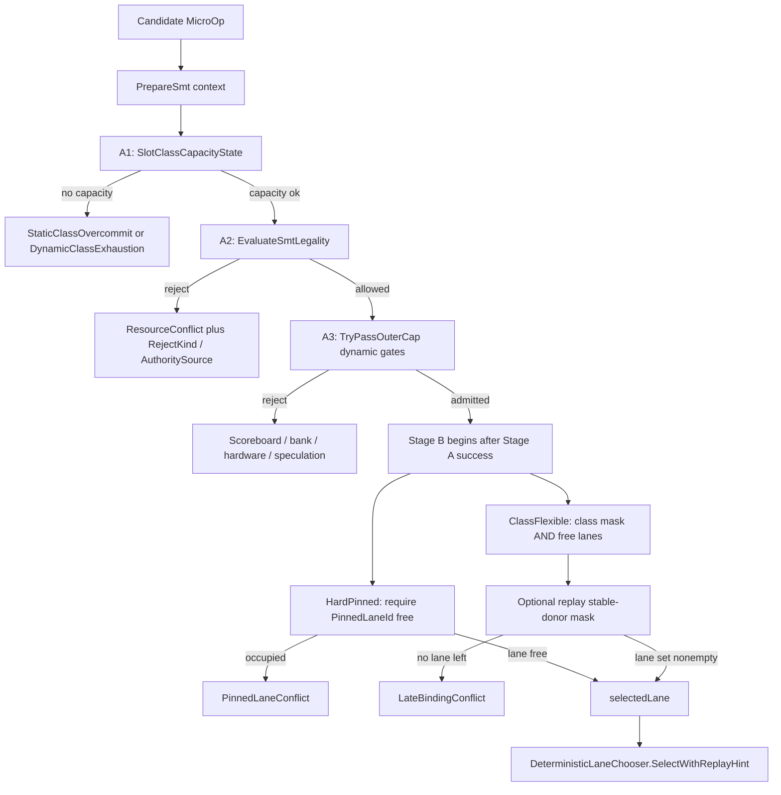

## Deterministic Lane Binding

For class-flexible candidates, lane selection is deterministic:

- replay-active previous-lane reuse is preferred when the previous lane is still legal;
- otherwise the lowest free legal lane is selected.

Determinism here does not mean "no runtime choice exists." It means runtime choice is constrained, classified, replay-aware, and inspectable.

## SMT Packing and Densification

The mainline intra-core SMT densification path starts from an owner bundle, computes current class occupancy, builds a 4-way bundle resource certificate, constructs boundary/metadata state, nominates sibling virtual-thread candidates, ranks candidates through fairness and pressure policy, and injects candidates through typed-slot admission plus lane materialization.

Packing is bounded by:

- class capacity;
- `BundleResourceCertificate4Way`;
- `LegalityDecision`;
- owner and domain guards;
- replay template constraints;
- memory and speculation budgets;
- assist quota/backpressure when assist injection is involved.

This is not "insert any ready operation into any hole." It is legality-witness-governed and topology-aware bundle composition.

The historical term `FSP` still appears in code, tests, counters, and retained compatibility names. In repository-facing architecture prose, read `FSP` as historical vocabulary for bundle-compositional SMT densification under legality/certificate constraints, not as the architecture-defining class name.

## Legality Authority

The top-level legality object is `LegalityDecision`. The scheduler consumes decisions from `IRuntimeLegalityService` instead of treating raw masks, lane masks, or ad hoc certificate peeks as the primary truth surface.

The active authority sources are:

- `GuardPlane`;
- `ReplayPhaseCertificate`;
- `StructuralCertificate`.

Compatibility-oriented or auxiliary sources such as detailed compatibility checks and admission metadata structural checks can exist, but they should not be presented as the mainline typed-slot SMT legality contract.

For active typed-slot SMT, the checker-owned Stage A legality order is:

1. boundary guard;
2. owner-context and domain guard checks;
3. replay-phase certificate reuse if the live template matches;
4. current structural witness fallback if replay reuse is not valid.

The guard plane is earlier than replay reuse. A stale or cross-domain replay witness is not allowed to outrank owner/domain guards.

Scheduler-visible typed-slot rejects may intentionally collapse checker-owned denials to `ResourceConflict`, while finer cause remains in `RejectKind`, `CertificateRejectDetail`, and `LegalityAuthoritySource` for diagnostics and telemetry.

## Certificate Semantics

`BundleResourceCertificate4Way` is the active SMT certificate substrate. It separates:

- shared non-register resource state;
- per-VT register-group hazard state;
- typed-slot class occupancy state;
- an opaque structural identity used for replay/template compatibility.

RAR is allowed. RAW, WAR, and WAW are the meaningful register-group hazard families.

The architecture should be described as:

```text
certificate identity is the replay/reuse seam
```

not as:

```text
the scheduler manually compares raw mask fragments everywhere
```

Raw masks remain implementation storage. The paper-facing semantics are descriptors, certificates, structural identity, `LegalityDecision`, Stage A admission, and Stage B lane materialization.

## Legality Evidence Chain

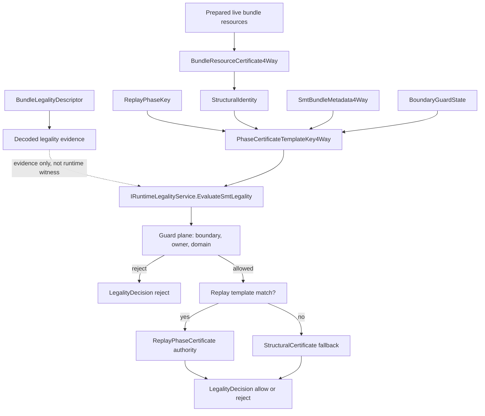

Decoded facts and descriptors are evidence. Certificates are runtime-local legality witnesses. `LegalityDecision` is the checker-owned verdict consumed by admission. Stage B only materializes a lane after Stage A succeeds.

## Reject Taxonomy

The reject model is intentionally multi-layered. The compiler, scheduler, verifier, and telemetry layers do not all use one flattened enum.

The main closure rules are:

- `StructurallyAdmissible` means compiler preflight passed; it is not a promise that runtime dynamic rejects cannot occur later.
- Static typed-slot class overcommit has a direct structural relation to `StaticClassOvercommit`.
- Dynamic class exhaustion, scoreboard pressure, bank pressure, hardware budget, speculation budget, assist quota, and assist backpressure are runtime-state outcomes after structural preflight can already have passed.
- Stage B lane failures are `PinnedLaneConflict` or `LateBindingConflict`, not a reopening of Stage A legality.
- Compile-time aliased-lane invalidity and invalid typed-slot facts are compiler/runtime agreement failures, not necessarily active runtime reject twins.
- Domain-related checker failures are preserved in legality diagnostics even when the scheduler-visible reject family is collapsed.

This taxonomy is important because "cannot inject" is not one opaque result.

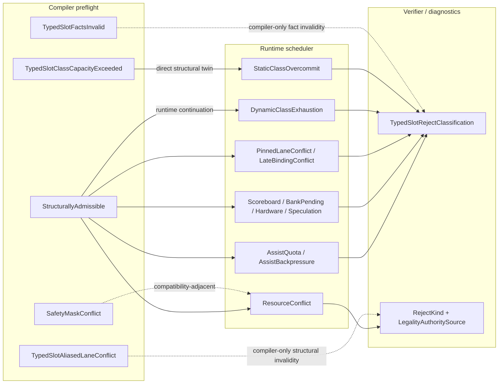

## Domain and Guard Model

The runtime distinguishes virtual thread identity, owner thread identity, owner context identity, domain tag, and optional core/pod identity for inter-core assist transport.

Legality and isolation are therefore execution-context-aware, not just opcode-aware.

The guard plane covers owner-context mismatch, domain mismatch, boundary guard rejection, inter-core domain guard rejection, ordering constraints, and non-stealable cases. Kernel-domain isolation is enabled by default in the current model.

Domain mismatch surfaces as explicit guard/legal rejection, not as a generic scheduler accident.

## Replay Envelope

Replay is centered on `LoopBuffer` and replay phase context. The loop buffer can reuse cached decoded micro-ops for a matching PC, enabling decode-once-replay-many behavior for loop-heavy or strip-mined execution.

Replay state records more than hit/miss:

- epoch count and epoch length;
- stable donor mask;
- class donor capacity;
- replay invalidation reason;
- certificate/template reuse state.

The current determinism claim is bounded:

```text
replay-stable placement and legality reuse inside the implemented replay/evidence envelope
```

It is not:

```text
global determinism over every hidden runtime state dimension
```

Within the envelope, the runtime tries to preserve stable donor structure, replay-aware lane reuse, replay certificate reuse, class-template reuse, and deterministic transition accounting. Outside the envelope, the runtime records invalidation, mismatch, or cache miss rather than pretending the phase is identical.

Serializing boundaries and replay-phase changes invalidate reuse state deliberately.

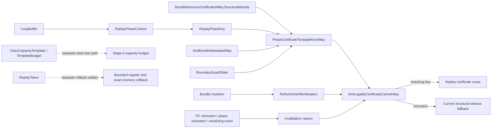

## Replay Token and Rollback Boundary

`ReplayToken` is a deterministic reproduction and rollback carrier. It captures vector configuration fields, random seed, trace hash, pre-execution register state, and pre-execution memory state.

The rollback claim is bounded and fail-closed:

- memory range materialization must be exact;
- partial snapshotting/restoration is rejected;
- restore happens through explicit register and memory write paths;
- replay token binding depends on the required memory materialization surface.

This is a correctness-sensitive replay/rollback substrate, not a universal rollback theorem.

## Assist Plane

The assist plane is explicit runtime machinery, not an informal prefetch heuristic.

`AssistMicroOp` assists are:

- architecturally invisible;
- non-retiring;
- replay-discardable;
- memory-oriented;
- placement-bound;
- legality-bound like ordinary micro-ops.

That invisibility claim is bounded. Assists are not retire-visible ISA features, but they remain observable through bounded carrier-memory effects, replay invalidation, quota/backpressure telemetry, and diagnostic evidence.

The implementation keeps three axes separate:

1. bundle densification: who gets a bundle slot this cycle;
2. donor taxonomy: where the assist's data contour comes from;
3. carrier plane: which physical class runs the assist.

Current assist vocabulary includes:

- `AssistKind`: `DonorPrefetch`, `Ldsa`, `Vdsa`;
- `AssistExecutionMode`: `CachePrefetch`, `StreamRegisterPrefetch`;
- `AssistCarrierKind`: `LsuHosted`, `Lane6Dma`.

Carrier mapping is explicit:

- `LsuHosted` maps to `LsuClass`;
- `Lane6Dma` maps to `DmaStreamClass`.

Lane 6 is therefore not a generic abstract assist lane. It is the DMA/stream carrier used for selected assist contours.

Assist injection is adjacent to SMT densification but not identical to it. Main SMT candidate packing happens first; assist injection is subject to separate quota and backpressure. Current code limits assist injection to at most one assist per bundle.

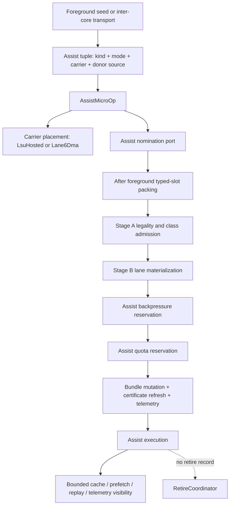

## Compiler Runtime Contract

The current compiler/runtime contract is versioned and fail-closed.

`CompilerContract.Version` is currently `6`. A stale producer version is rejected rather than accepted with degraded semantics.

The contract is layered:

1. architectural payload contract: raw VLIW slot/bundle bits;
2. sideband metadata contract: slot and bundle annotations;
3. structural agreement contract: typed-slot facts and runtime validation;
4. dynamic authority contract: runtime legality and placement remain authoritative.

The current version history explicitly records that:

- `word3[50]` legacy scheduling policy is retired from the correctness path;
- `VirtualThreadId` in `word3[49:48]` remains a transport hint only;
- scheduling policy belongs in sideband metadata rather than architectural slot bits;
- canonical opcodes must execute correctly with missing/default compiler metadata.

For Stream WhiteBook surfaces, the compiler/runtime contract also records a negative boundary: DSC and L7 sideband descriptor emission/preservation is not production executable lowering. `CompilerBackendLoweringContract` keeps production executable DSC and `ACCEL_*` lowering blocked until executable runtime semantics, backend/addressing, ordering/conflict, cache protocol, positive/negative tests, compiler conformance, and documentation migration are complete.

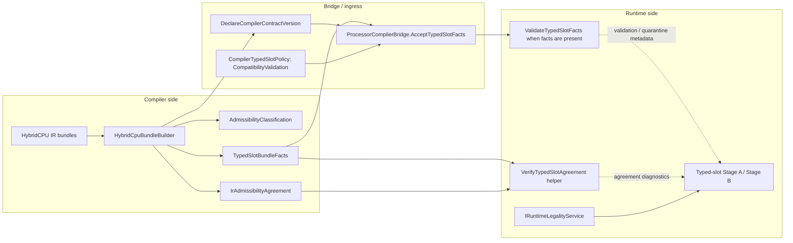

## Typed-Slot Facts

The compiler/runtime shared vocabulary is `TypedSlotBundleFacts`.

Those facts can carry:

- per-slot required class;
- pinning mask;
- per-class counts;
- pinned and flexible totals.

The current runtime validates typed-slot facts when present, checks agreement against live bundle truth, and exposes agreement failures as diagnostic/quarantine evidence.

The current normative staging is:

- `TypedSlotFactStaging.CurrentMode == ValidationOnly`;
- `CompilerContract.CurrentTypedSlotPolicy.Mode == CompatibilityValidation`.

This means:

- compiler and runtime may emit, transport, and validate facts;
- present facts participate in agreement checks and compiler preflight;
- missing or default facts remain compatible with canonical runtime execution;
- structural agreement failures can be recorded and quarantine-logged;
- runtime legality remains the final authority for Stage A admission;
- typed-slot facts are not yet mandatory correctness substrate.

Reserved stronger stages such as `WarnOnMissing` and `RequiredForAdmission` are future vocabulary, not current runtime behavior.

Typed-slot placement facts do identify lane6 as `SlotClass.DmaStreamClass` and lane7 L7-SDC as `SlotClass.SystemSingleton` hard-pinned to physical lane 7 when the corresponding clean carrier exists. Those facts do not authorize DSC/L7 execution, token allocation, or register writeback.

## Compiler Asymmetry

The compiler side can be stricter than the runtime staging surface.

Compiler preflight may classify a bundle as structurally inadmissible when emitted facts contradict typed-slot topology. That does not imply that runtime mainline already requires facts to execute canonical bundles.

This asymmetry is deliberate:

```text
compiler preflight can be fact-strict
runtime canonical execution remains ValidationOnly
runtime legality remains authoritative
```

The compiler may describe structure and intent, but it does not override live capacity, guard behavior, replay admissibility, lane choice, dynamic rejection, or legality decisions.

## Telemetry and Measurement

Telemetry is part of the architecture evidence surface. It is not merely debug output.

The runtime measures and exports:

- injections per slot class;
- rejects per slot class;
- rejects by typed-slot reason;
- assist quota and assist backpressure rejects;
- replay template hits and misses;
- replay invalidation causes;
- certificate reuse invalidations;
- fairness starvation events;
- per-VT injection and rejection counts;
- certificate-pressure breakdown;
- bank-pending rejects;
- hazard-type counts;
- cross-domain rejects;
- eligibility-mask telemetry;
- loop-phase class profiles;
- scalar and non-scalar retired lane counts;
- average retired width;
- NOP density and bundle utilization.

The telemetry schema preserves architectural vocabulary such as `SlotClass`, `TypedSlotRejectReason`, legality authority, replay phase profiles, and certificate pressure.

Compiler-side telemetry consumption uses the same vocabulary for heuristic feedback. Runtime evidence and compiler interpretation therefore have to remain aligned.

Telemetry, replay evidence, certificates, descriptor identity, token handles, capability metadata, conflict records, and status words are observations or binding evidence only. They are not owner/domain authority and cannot close executable DSC/L7, async overlap, coherent DMA/cache, IOMMU-backed execution, or production lowering gates.

## Retire Semantics

Retirement is explicit and evidence-bearing.

The runtime resolves eligible writeback lanes, establishes stable retire order, chooses the current stage-aware exception/fault delivery decision for the retire window, publishes typed retire records, and applies retire-visible memory effects at the retire boundary.

This keeps the following distinct:

- stage-local execute/memory/writeback updates;
- retire eligibility;
- stable retire order;
- architectural register publication;
- scalar store visibility;
- atomic memory apply;
- trace and telemetry publication.

Assists remain non-retiring and retire-invisible.

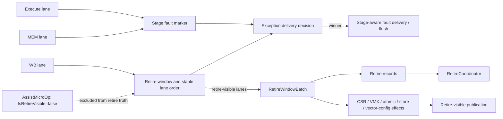

## Memory, Exception, and Rollback Boundaries

The current memory model is bounded by retire-time visibility. It is not a global memory-order theorem.

The exception model is stage-aware and retire-window-aware. It is not a blanket "full precise exceptions" theorem for every possible configuration and contour.

The rollback model is bounded by explicit replay-token capture/restore limits. It is not universal rollback.

These boundaries are part of the architecture. They are not footnotes.

DSC helper commits and L7 model commits use explicit token/coordinator publication contours. Commit-pending state, progress diagnostics, poll/wait/fence observations, backend completion, telemetry, and conflict records do not publish memory by themselves. Explicit SRF/cache invalidation is non-coherent invalidation, not a coherent DMA/cache hierarchy.

## Backend Truthfulness

The active backend substrate includes:

- `PhysicalRegisterFile`;
- `RenameMap`;
- `CommitMap`;
- `FreeList`;
- `RetireCoordinator`.

Therefore, the correct claim is not "renaming eliminated." The correct claim is that typed-slot legality, certificate-governed admission, replay reuse, and retire publication are made explicit and analyzable while coexisting with backend rename/commit state.

For external accelerator wording, backend truthfulness also means that fake/test L7 backends, fake MatMul surfaces, capability registry metadata, and model commit helpers are test/model evidence only. They are not production protocol, direct `ACCEL_*` execution, architectural `rd` writeback, or retire exception publication.

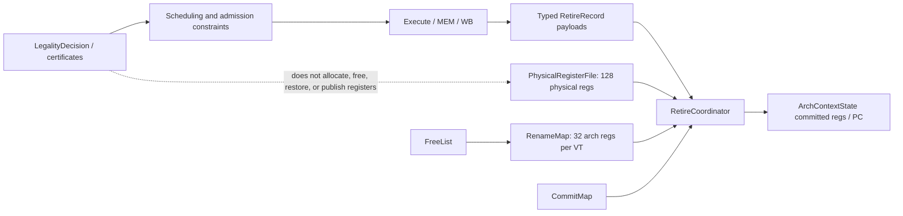

## Validation State

The current validation posture is evidence-oriented rather than pass-count marketing.

A local recount on 2026-04-24 reported:

| Surface | Count |
|---|---:|
| `HybridCPU_ISE` source files | `365` |
| `HybridCPU_Compiler` source files | `145` |
| test files under the main tests directory | `265` |
| `[Fact]` / `[Theory]` declarations under the main tests directory | `2180` |
| full test-tree source files | `373` |
| full test-tree `[Fact]` / `[Theory]` declarations | `3699` |

These are live-tree counts, not a fresh full-suite pass total.

The reproducible smoke baseline is the Phase 06 proof subset:

```powershell
powershell -ExecutionPolicy Bypass -File .\build\run-validation-baseline.ps1 -NoRestore
```

The same smoke command passed locally on 2026-04-24:

| Smoke result | Count |
|---|---:|
| Failed | `0` |
| Passed | `52` |
| Skipped | `0` |
| Total | `52` |

The broader recount command is:

```powershell
powershell -ExecutionPolicy Bypass -File .\build\recount-validation-evidence.ps1 -NoRestore
```

Use the smoke baseline for reproducible architecture-proof seams. Use the recount script for live source/test declaration counts. Do not read either as a coverage percentage.

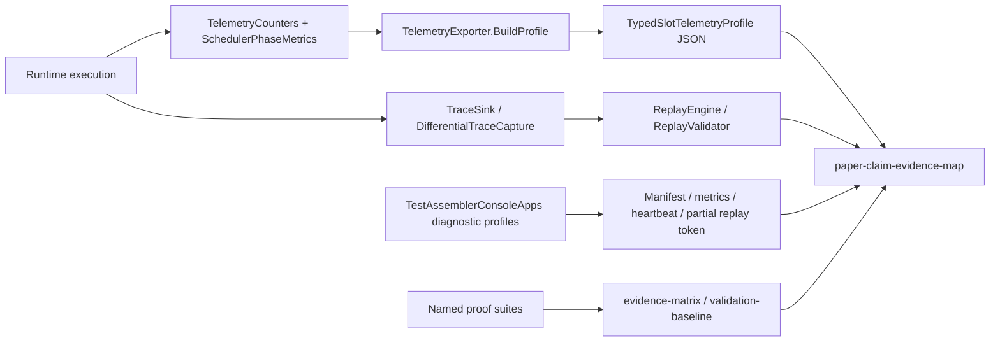

## Runtime Harness Sanity

The repository also keeps a runtime harness sanity surface through the assembler console app:

```powershell
dotnet run --project .\TestAssemblerConsoleApps\TestAssemblerConsoleApps.csproj --no-restore --no-build
```

The documented harness matrix tracks IPC, retired count, cycles, last reject kind, legality authority, slack reclaim ratio, and replay success for representative modes. Treat those values as runtime-drift evidence, not as a universal performance claim.

Throughput wording in this repository should therefore stay bounded: harness IPC and effective surface measurements are diagnostic-envelope evidence for named workloads, not a global peak theorem for every program shape or lane mix.

## Current Strong Claims

The following claims are safe repository-facing statements for the current codebase:

- native VLIW is the active frontend;
- the ISA-visible integer register file is `32 x 64-bit` architectural registers per virtual thread;
- VLIW bundles are fixed 8-slot, 256-byte carriers;
- the typed lane map is fixed and heterogeneous;
- memory-memory forms are runtime/decode-decomposed through typed micro-op machinery rather than a hidden large register surface;
- class admission happens before lane materialization on the typed-slot path;
- ALU-class micro-ops consume `AluClass` lane capacity, and data movement/control work consumes the corresponding typed resources;
- runtime legality is consumed through explicit `LegalityDecision` values;
- guard-plane checks precede replay/certificate reuse;
- certificate structural identity is the replay/template compatibility seam;
- replay-stable behavior is bounded by the replay/evidence envelope;
- typed-slot facts are active agreement evidence but currently `ValidationOnly`;
- compiler contract version mismatch is fail-closed;
- StreamEngine is the current raw stream/vector execution surface for supported contours;
- VectorALU, SRF exact warm/bypass, and explicit SRF invalidation are current StreamEngine-side behavior within their documented bounds;
- BurstIO DMA use in StreamEngine is synchronous helper behavior, not async overlap;
- assists are runtime-explicit but architecturally non-retiring;
- lane6 `DmaStreamCompute` is a current descriptor/decode carrier whose direct `Execute(...)` path is disabled and fail-closed;
- `DmaStreamComputeDescriptorParser.ExecutionEnabled == false`;
- DSC1 is the strict current descriptor ABI, while DSC2 is parser-only/non-executable;
- lane7 L7-SDC `ACCEL_*` carriers are current lane7 `SystemSingleton` carriers whose direct `Execute(...)` path is fail-closed;
- current `ACCEL_*` carriers have `WritesRegister=false` and no current architectural `rd` writeback;
- explicit owner/domain guard evidence outranks descriptor identity, telemetry, token handles, capability metadata, and certificate/replay identity;
- telemetry is a first-class evidence surface;
- backend rename/commit state remains live.

## Current Non-Claims

Do not read the live repository as claiming:

- universal deterministic scheduling;
- blanket precise exceptions;
- global memory ordering;
- mandatory compiler facts for canonical execution;
- compiler hints outranking runtime legality;
- active DBT frontend;
- active scalar-generalized frontend;
- all historical opcode contours accepted by canonical decode;
- production hardware-rooted attestation;
- renaming-free execution;
- a hidden wide architectural integer register file;
- a hidden vector register file as a mainline ISA-visible state claim;
- `W=8` or "8-wide issue" as an `IPC=8` theorem;
- independent branch and system physical lanes;
- full cross-core shared-bundle issue as the mainline SMT model;
- executable lane6 `DmaStreamCompute` or executable DSC2;
- parser/decode/normal issue token allocation as current DSC behavior;
- StreamEngine, VectorALU, DMAController, custom accelerator, or fake backend fallback for rejected DSC/L7;
- executable L7 `ACCEL_*`, executable `ACCEL_FENCE`, production backend dispatch, or current architectural `rd` writeback;
- fake/test L7 backend behavior as production protocol;
- capability registry, telemetry, token, certificate, replay, descriptor identity, or status words as authority;
- async DMA overlap, coherent DMA/cache, dirty-line writeback, or automatic snooping;
- IOMMU-backed executable DSC/L7 memory integration;
- `GlobalMemoryConflictService` as an already installed global CPU load/store authority;
- progress, poll, wait, fence, or telemetry diagnostics publishing memory;
- compiler sideband descriptor emission as production executable lowering;
- Phase13 dependency order as implementation approval.

## Current Limitations

The following limitations are explicit:

- typed-slot facts are validated and transported, but not required for canonical runtime execution;
- some inter-core and compatibility legality surfaces still exist and must not be confused with active typed-slot SMT mainline;
- stream-control and VMX surfaces are guarded when not wired;
- lane6 DSC is currently fail-closed carrier plus helper/token model, not executable lane6 DMA;
- DSC2, address-space, strided/tile/scatter-gather, and capability-profile surfaces are parser-only/model-only unless future executable gates close;
- L7-SDC queue, poll, wait, cancel, fence, register ABI, backend, commit, rollback, conflict, and telemetry surfaces are model/helper/test-only unless future executable gates close;
- current DSC helper memory is physical helper/model memory, and current L7 mapping/IOMMU epoch validation is model authority rather than executable IOMMU-backed memory;
- the installed conflict/cache surfaces are explicit and non-coherent; global conflict authority, dirty-line/writeback, coherent DMA/cache, and async overlap remain future-gated;
- production compiler/backend lowering to executable DSC/L7 is blocked by `CompilerBackendLoweringContract`;
- proof signing is simulated ISE scaffolding, not a production root-of-trust path;
- telemetry schema is rich but source-defined rather than frozen as a long-term external compatibility contract;
- the documented validation baseline is a smoke subset, not a repository-wide green total;
- historical names such as `FSP` remain in retained counters and tests.

## Practical Reading Order

For a short technical pass, read this README first, then the WhiteBook index, then the operational semantics artifact, then the validation baseline and evidence matrix.

For Stream WhiteBook work, read in dependency order:

1. [StreamEngine and DmaStreamCompute summary pack](Documentation/Stream%20WhiteBook/StreamEngine%20DmaStreamCompute/00_README.md).
2. [lane6 DmaStreamCompute current contract](Documentation/Stream%20WhiteBook/DmaStreamCompute/01_Current_Contract.md).
3. [L7-SDC external accelerator WhiteBook](Documentation/Stream%20WhiteBook/ExternalAccelerators/00_README.md).
4. [Stream WhiteBook diagrams](Documentation/Stream%20WhiteBook/ExternalAccelerators/Diagrams/00_Diagram_Index.md).
5. Ex1 gates for memory/conflict/cache/compiler/backend changes, especially [Phase11](Documentation/Refactoring/Phases%20Ex1/11_Compiler_Backend_Lowering_Contract.md), [Phase12](Documentation/Refactoring/Phases%20Ex1/12_Testing_Conformance_And_Documentation_Migration.md), and [Phase13](Documentation/Refactoring/Phases%20Ex1/13_Dependency_Graph_And_Execution_Order.md).

For implementation work, map claims back to the live scheduler, safety, compiler-contract, replay, diagnostics, and pipeline code before strengthening any README or paper statement.

For paper writing, keep the claims bounded:

- "runtime-owned legality" rather than "compiler-proved correctness";
- "replay-stable inside the evidence envelope" rather than "globally deterministic";
- "retire-time visibility boundary" rather than "complete memory theorem";
- "stage-aware fault ordering" rather than "blanket precise exceptions";
- "ValidationOnly typed-slot facts" rather than "mandatory compiler certificates";
- "simulated proof signing" rather than "hardware-rooted attestation."

## Working Commands

```powershell
powershell -ExecutionPolicy Bypass -File .\build\run-validation-baseline.ps1 -NoRestore
powershell -ExecutionPolicy Bypass -File .\build\recount-validation-evidence.ps1 -NoRestore
dotnet run --project .\TestAssemblerConsoleApps\TestAssemblerConsoleApps.csproj --no-restore --no-build
```

These commands are the current repository-facing entry points for smoke validation, evidence recount, and runtime harness sanity. They do not replace code review, full test execution, or architecture-specific proof inspection.
